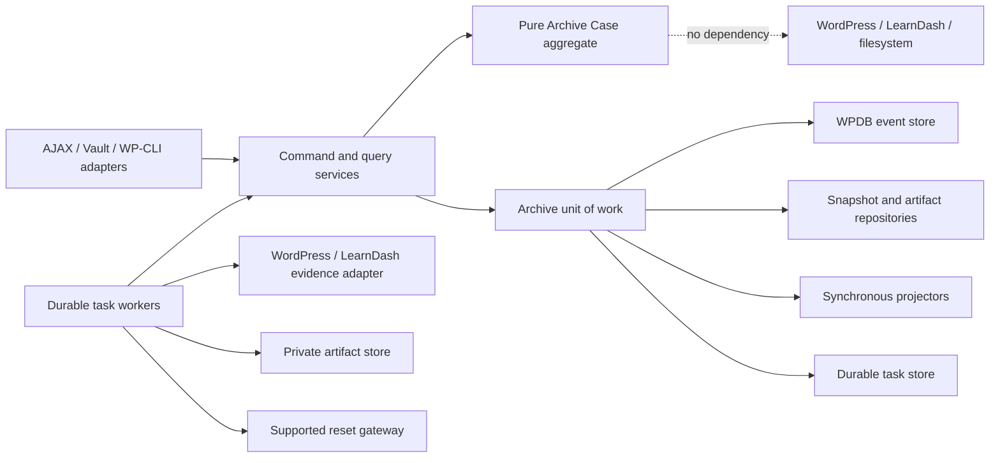
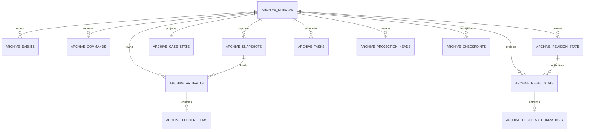

# Technical Design: Dual-Layer Archive Event-Sourcing Implementation

**Status:** Proposed technical design for approval  
**Date:** 2026-07-13  
**Plugin:** Gridhouse Admin Compliance Dashboard  
**Parent architecture:** `PRD-Dual-Layer-Archive-State-Machine-Event-Log.md`  
**Related product documents:** `PRD-Dual-Layer-Archive.md` and `2026-07-10-dual-layer-archive-system.md`  
**Implementation status:** Design only. No feature code or database migration is authorized by this document alone.

## 1. Purpose

This document translates the approved state-machine and immutable-event-log architecture into a concrete WordPress/PHP/MySQL design. It defines:

- the exact module and PHP class boundaries;
- the event-store append and transaction algorithm;
- the custom tables, columns, keys, and indexes;
- the immutable snapshot, ledger, and artifact representations;
- synchronous projection and durable background-task behavior;
- reset authorization, execution-claim, and reconciliation mechanics;
- installation, migration, testing, rollout, and operational requirements; and
- the remaining decisions that must be approved before implementation begins.

This design intentionally replaces the earlier proposal for mutable `wp_ghca_archives.status` and `superseded_by_archive_id` columns. Lifecycle truth shall come from immutable events; status columns exist only in rebuildable projections.

## 2. Repository-grounded constraints

The design fits the current plugin rather than introducing a foreign application framework.

| Current fact | Design consequence |
|---|---|
| The plugin is a manually loaded, non-namespaced modular monolith using global `final GHCA_*` classes. | Add a self-contained `includes/archive/` module with a static compatibility bootstrap and instance-based services behind it. Do not require Composer or refactor unrelated modules. |
| The activation hook currently registers roles only. | Add a schema installer, schema-version option, migration runner, capability installer, and runtime upgrade check. |
| “Mark Reviewed” currently overwrites `ghca_acd_reviewed_at` and `ghca_acd_reviewed_by` user meta. | Replace the write with `RequestArchive`; derive reviewed/locked status from projections. Legacy meta is never promoted into a finalized archive. |
| Record editing writes directly to WordPress, LearnDash activity, completion meta, and Uncanny timer meta, sometimes without LearnDash hooks. | A shared authoritative mutation guard must execute inside every supported write path before its first mutation. Hook-only protection is insufficient. |
| The audit calculator reads live data, options, user meta, and the current clock. | Split live evidence acquisition from a pure deterministic archive calculator with a fixed capture time and captured policy. |
| Dashboard and audit code currently calculate cycles differently. | Introduce one authoritative archive-cycle resolver; persist the resolved boundaries and policy identity in the case and snapshot. |
| The packet merge re-reads live audit context. | The official packet renderer consumes only the sealed snapshot and captured certificate artifacts. |
| The PDF job store is a one-hour transient plus temporary files driven by browser AJAX. | Keep it for ad-hoc live reports only. Official archival work uses durable database tasks and server-side workers. |
| Current PDF certificate fetches forward browser cookies and disable TLS verification. | The archive worker must use a dedicated server-side certificate adapter with verified TLS or direct trusted generation; browser cookies are prohibited. |
| The dashboard data provider is a transient-cached live read model. | It may feed UI only. It cannot authorize reset, enforce locks, or determine authoritative archive state. |

### 2.1 Existing integration seams

The implementation shall change or wrap these existing seams:

- `gridhouse-admin-compliance-dashboard.php`: load and initialize the archive module; install schema and capabilities on activation.
- `GHCA_ACD_AJAX::ajax_mark_reviewed()`: become a thin delivery adapter to `GHCA_ACD_Archive_Command_Bus`.
- `GHCA_ACD_AJAX::ajax_save_employee_records()`: invoke `GHCA_ACD_Archive_Mutation_Guard` after authentication/scope validation and before registration or course writes.
- `GHCA_ACD_Audit_UI` audit-date/exclusion writes: invoke the same mutation guard.
- employee identity and LearnDash-group changes: classify affected fields and invoke the mutation guard when they can change case identity, evidence, or scope.
- `GHCA_Audit_PDF`: extract only low-level TCPDF/FPDI setup and page-import primitives for the new deterministic packet renderer.
- `GHCA_Audit_PDF_Jobs`: remain unchanged as an ephemeral live-report subsystem and never store official lifecycle or artifact state.

## 3. Design baseline and operating envelope

These are recommended sizing and reliability assumptions. They make the design testable but remain approval gates; a materially different deployment requires design re-review.

| Dimension | Proposed baseline |
|---|---|
| Workload | Read-heavy, approximately 100 projection/history reads per lifecycle write. Design validation at 100 read requests/second and 5 lifecycle writes/second per WordPress site. |
| One-year scale | Up to 25,000 employees, 250,000 retained Archive Cases, 5 million events, and five concurrent artifact workers per site before a partitioning/external-service review. |
| Tenancy | One operational tenant per WordPress site/blog. LearnDash groups are authorization scopes, not tenants. A generated immutable tenant UUID and `site_id` are still captured for portable identity. |
| Processing model | Synchronous command decision, event append, idempotency receipt, safety projection, and task enqueue; asynchronous evidence capture, certificate acquisition, ledger/PDF materialization, verification, and reset side effects. |
| Architecture | A modular monolith inside the plugin. No broker or microservice is required for the baseline. |
| Data tier | Employment/training PII and compliance evidence. The design assumes no patient PHI or PCI data. If PHI is introduced, encryption, access, retention, and incident controls require a separate review. |
| PHP/WordPress | Preserve the plugin's documented WordPress 6.0+ and PHP 7.4+ compatibility. Do not use PHP enums, readonly properties, or language features above PHP 7.4. |
| Database portability | InnoDB is mandatory. Use portable `DATETIME`, `LONGTEXT` canonical JSON, `VARCHAR` state codes, and application validation; do not depend on native JSON, `ENUM`, `CHECK`, triggers, partial indexes, or foreign keys. |

### 3.1 Verifiable service objectives

| Objective | Target |
|---|---|
| Projection/history read latency | p50 <= 100 ms, p95 <= 250 ms, p99 <= 500 ms at the application-service boundary. |
| Lifecycle command acceptance | p50 <= 150 ms, p95 <= 500 ms, p99 <= 1,000 ms, excluding asynchronous artifact work. |
| Archive completion | 99% of complete, locally available evidence sets finalize within 5 minutes under the baseline worker envelope. External certificate-source unavailability is reported separately. |
| Lifecycle API availability | 99.9% monthly, excluding approved maintenance. Fail-closed rejection during database or integrity outage counts as unavailable, not successful degradation. |
| Primary transaction RPO | Zero for acknowledged committed events: a success response is not sent before commit. |
| Disaster-recovery RPO | At most 15 minutes for event database and finalized artifacts, subject to verified hosting backups/replication. |
| RTO | At most 4 hours to restore event reads, integrity verification, private artifacts, and projection rebuild capability. |
| Error-budget consumers | Gridhouse Compliance Product Owner for business trade-offs; Site Operations Owner for database, storage, queue, backup, and recovery work. Named people must be assigned before production enablement. |

If hosting cannot meet the artifact and database RPO/RTO together, the feature must not be described as audit-ready.

## 4. Core technical decisions

### `TD-01` One event stream per Archive Case

One stream represents one immutable case key:

`tenant UUID + WordPress site ID + employee user ID + program key + normalized cycle key`

The database stores both the canonical constituents and their SHA-256 digest. A digest match must be followed by exact constituent comparison before an existing stream is accepted.

### `TD-02` Event stream is lifecycle authority

- `archive_events` is append-only lifecycle truth.
- `archive_snapshots`, `archive_artifacts`, and `archive_ledger_items` are append-only evidence truth.
- case, revision, reset, course-history, lock, and eligibility states are rebuildable projections.
- command receipts, reset-authorization enforcement state, projector cursors, and task leases are operational records, not lifecycle truth.

### `TD-03` Synchronous safety projections

Case, revision, reset, and projector-cursor updates are applied in the same transaction as each event batch. Queryable ledger rows are immutable evidence side records, not projections. This makes edit/reset guards immediately consistent and avoids using a global auto-increment position as a potentially unsafe cross-transaction replay watermark.

Projection failure rolls back the command. Availability is reduced, but lifecycle state is never committed without the guard projection required by this plugin.

### `TD-04` Durable task table is both transactional outbox and queue

The baseline does not create a separate message broker. A deduplicated task row is inserted in the same transaction as its causal event. WP-Cron, Action Scheduler, AJAX polling, or WP-CLI may wake workers, but none is the task source of truth.

### `TD-05` No database transaction spans external I/O

Database locks are never held while querying remote certificates, rendering PDFs, writing large files, or calling reset integrations. External work follows a claim/work/record pattern with staged immutable artifacts and orphan reconciliation.

### `TD-06` Official artifacts use private storage abstraction

Database rows store a storage-adapter name and relative immutable key, never an absolute path or public URL. Production requires storage outside the public document root or a private object store. An uploads directory protected only by `.htaccess` is not sufficient for Nginx or misconfigured hosts.

### `TD-07` Canonical JSON and integer measurements

Events, snapshots, commands, and ledgers use versioned canonical JSON:

- object keys are unique strings sorted by unsigned UTF-8 byte sequence;
- list order is preserved and explicitly defined;
- input is valid UTF-8 and strings preserve their exact Unicode code-point sequence; v1 performs no NFC/NFD normalization;
- output has no insignificant whitespace, leaves `/` and non-ASCII UTF-8 unescaped, and uses standard JSON escapes only for quote, backslash, and required control characters;
- integers are base-10 with no leading zero, booleans/null use lowercase JSON literals, and duplicate object keys are rejected before ordinary PHP decoding can collapse them;
- UTC timestamps serialized in one fixed format;
- no PHP serialized objects;
- no floating-point evidence values; percentages use integer basis points;
- absent evidence is explicit `null`, never silently replaced with the current time; and
- the canonical-format version participates in every digest.

### `TD-08` Application append-only plus documented trust boundary

Repositories expose insert/read operations only for events, snapshots, artifacts, and ledger items. No normal plugin code may update or delete them. SHA-256 chains and optional signed checkpoints are tamper-evident within their documented administrative boundary; they are not claimed as independent legal proof.

## 5. Module and dependency architecture



Dependency direction is:

`controllers and workers -> application services -> pure domain`

Infrastructure implements application/domain contracts. The aggregate does not call WordPress functions, `$wpdb`, LearnDash, TCPDF, filesystem APIs, or the current dashboard data provider.

## 6. Proposed file and PHP class map

Add one main include:

`require_once __DIR__ . '/includes/archive/bootstrap.php';`

The bootstrap manually loads the files below and exposes a single static compatibility bridge.

### 6.1 Bootstrap, installation, and health

| File | Class | Responsibility |
|---|---|---|
| `includes/archive/class-archive-module.php` | `GHCA_ACD_Archive_Module` | Composition root. Constructs services, registers controllers/workers/cron hooks, and exposes no business-state mutators. |
| `includes/archive/class-archive-schema.php` | `GHCA_ACD_Archive_Schema` | Table definitions, schema-version constant, fresh install, engine/collation verification, and non-destructive health checks. |
| `includes/archive/class-archive-migrator.php` | `GHCA_ACD_Archive_Migrator` | Runs explicit numbered, idempotent, expand/contract migrations when the stored schema version lags. |
| `includes/archive/class-archive-capabilities.php` | `GHCA_ACD_Archive_Capabilities` | Installs and upgrades dedicated capabilities without treating dashboard view permission as destructive authority. |
| `includes/archive/class-archive-health.php` | `GHCA_ACD_Archive_Health` | Verifies InnoDB, tables/indexes, private storage, worker wake-up, backup acknowledgment, hash-chain health, and stuck tasks. |

### 6.2 Pure domain

| File | Class | Responsibility |
|---|---|---|
| `domain/class-archive-case-key.php` | `GHCA_ACD_Archive_Case_Key` | Immutable tenant/site/employee/program/cycle identity; canonical representation and digest. |
| `domain/class-archive-cycle.php` | `GHCA_ACD_Archive_Cycle` | Immutable start/end, inclusivity, timezone, display label, and policy key/version. |
| `domain/class-archive-actor.php` | `GHCA_ACD_Archive_Actor` | Actor, initiating principal, source, delegation, and effective authorization context. |
| `domain/class-archive-command.php` | `GHCA_ACD_Archive_Command` | Immutable validated command envelope. Externally invocable command factories must require command ID, idempotency scope/key, actor, expected version, and typed payload. |
| `domain/class-archive-event.php` | `GHCA_ACD_Archive_Event` | Immutable versioned event envelope and payload before/after sequence/hash assignment. |
| `domain/class-archive-event-types.php` | `GHCA_ACD_Archive_Event_Types` | Constants for every approved event name; PHP constants are used instead of PHP 8.1 enums. |
| `domain/class-archive-event-catalog.php` | `GHCA_ACD_Archive_Event_Catalog` | Payload schema/version validation, factory routing, and upcasters used only in memory. Stored events are never rewritten. |
| `domain/class-archive-case.php` | `GHCA_ACD_Archive_Case` | Rehydrates one stream, applies events, enforces the approved multidimensional state machine, and emits complete uncommitted event batches. No I/O. |
| `domain/class-archive-reset-scope.php` | `GHCA_ACD_Archive_Reset_Scope` | Exact employee/program/cycle/course scope and canonical scope digest. |
| `domain/class-archive-transition-exception.php` | `GHCA_ACD_Archive_Transition_Exception` | Stable domain rejection code plus safe user/operator context. |

`GHCA_ACD_Archive_Case` shall expose domain operations corresponding to the approved commands, including archive request/start/capture/materialize/verify/finalize/fail/retry/cancel; correction/revocation/replacement; reset request/defer/reject/authorize/invalidate/claim/complete/reconcile; source-drift; unprotected-reset; and integrity-incident disposition.

It returns events only. It never returns “success” for external work that has not occurred.

### 6.3 Application services and contracts

| File | Class or interface | Responsibility |
|---|---|---|
| `application/class-archive-command-bus.php` | `GHCA_ACD_Archive_Command_Bus` | Routes validated command DTOs to the single application handler. |
| `application/class-archive-command-handler.php` | `GHCA_ACD_Archive_Command_Handler` | Authorizes, loads/rehydrates, invokes the aggregate, and commits events through the unit of work. Maps domain failures to stable results. |
| `application/class-archive-unit-of-work.php` | `GHCA_ACD_Archive_Unit_Of_Work` | Owns the only lifecycle transaction: expected-version lock, command receipt, immutable side records, event batch, stream head, projections, tasks, commit/rollback. |
| `application/class-archive-authorization.php` | `GHCA_ACD_Archive_Authorization` | Dedicated capability plus subject/group-scope checks for every command and download. |
| `application/class-archive-cycle-resolver.php` | `GHCA_ACD_Archive_Cycle_Resolver` | Sole resolver for calendar-year or anniversary policy; eliminates the two current cycle algorithms. |
| `application/class-archive-query-service.php` | `GHCA_ACD_Archive_Query_Service` | Reads current state, Vault history, ledger analytics, task status, and projection sequence from projections. |
| `application/class-archive-authoritative-reader.php` | `GHCA_ACD_Archive_Authoritative_Reader` | Rehydrates and verifies the stream for destructive authorization/claim; reset never trusts a projection alone. |
| `application/class-archive-mutation-guard.php` | `GHCA_ACD_Archive_Mutation_Guard` | Fail-closed pre-write guard used by every supported evidence, identity, audit-date, and reset mutation path. |
| `application/class-archive-source-mutation-uow.php` | `GHCA_ACD_Archive_Source_Mutation_UOW` | Resolves current/proposed affected cases, locks their stream rows in digest order, rechecks the guard, and keeps those locks through one approved database-only WordPress/LearnDash mutation transaction. |
| `application/class-archive-build-coordinator.php` | `GHCA_ACD_Archive_Build_Coordinator` | Converts task outcomes into lifecycle commands without embedding domain transitions in workers. |
| `application/class-archive-reset-coordinator.php` | `GHCA_ACD_Archive_Reset_Coordinator` | Requests, authorizes, invalidates, claims, and records reset outcomes; commits claim before gateway invocation. |
| `application/class-archive-reset-reconciler.php` | `GHCA_ACD_Archive_Reset_Reconciler` | Uses gateway-specific evidence to distinguish completed, no-change, uncertain, partial/remediation, and restored outcomes. |
| `contracts/interface-archive-event-store.php` | `GHCA_ACD_Archive_Event_Store` | Load stream/head and append an atomic event batch at an expected version. |
| `contracts/interface-archive-evidence-source.php` | `GHCA_ACD_Archive_Evidence_Source` | Capture live evidence and certificate descriptors exactly once. |
| `contracts/interface-archive-artifact-store.php` | `GHCA_ACD_Archive_Artifact_Store` | Stage, commit immutably, open, verify, and quarantine artifacts by relative key. |
| `contracts/interface-archive-reset-gateway.php` | `GHCA_ACD_Archive_Reset_Gateway` | One explicitly supported reset integration with stable operation identity and reconciliation probes. |
| `contracts/interface-archive-clock.php` | `GHCA_ACD_Archive_Clock` | Fixed UTC time source for deterministic tests and commands. |
| `contracts/interface-archive-id-generator.php` | `GHCA_ACD_Archive_Id_Generator` | Generates 32-character lowercase hexadecimal identifiers from 16 cryptographically random bytes. |

### 6.4 Infrastructure, materialization, workers, and delivery

| File | Class | Responsibility |
|---|---|---|
| `infrastructure/class-wpdb-archive-event-store.php` | `GHCA_ACD_WPDB_Archive_Event_Store` | `$wpdb` stream/event persistence, row locking, expected-version enforcement, append-only inserts, and rollback-safe error handling. |
| `infrastructure/class-wpdb-archive-command-store.php` | `GHCA_ACD_WPDB_Archive_Command_Store` | Insert-once command/idempotency receipts and deterministic duplicate/conflict results. |
| `infrastructure/class-wpdb-archive-snapshot-store.php` | `GHCA_ACD_WPDB_Archive_Snapshot_Store` | Immutable snapshot insertion/read/digest verification. |
| `infrastructure/class-wpdb-archive-artifact-repository.php` | `GHCA_ACD_WPDB_Archive_Artifact_Repository` | Immutable artifact descriptor and ledger-item insertion/read. |
| `infrastructure/class-wpdb-archive-projection-repository.php` | `GHCA_ACD_WPDB_Archive_Projection_Repository` | Rebuildable case/revision/reset/course projection persistence with exact next-sequence checks. |
| `infrastructure/class-wpdb-archive-evidence-read-session.php` | `GHCA_ACD_WPDB_Archive_Evidence_Read_Session` | Runs a bounded InnoDB `REPEATABLE READ` consistent snapshot for WordPress/LearnDash source facts and commits before certificate, filesystem, or other external I/O. |
| `infrastructure/class-wpdb-archive-task-store.php` | `GHCA_ACD_WPDB_Archive_Task_Store` | Durable enqueue, dedupe, portable `SELECT ... FOR UPDATE` leasing, retry, completion, and dead-task state. |
| `infrastructure/class-archive-canonical-json.php` | `GHCA_ACD_Archive_Canonical_JSON` | Canonical UTF-8 JSON encoding/decoding and size/depth/type limits. |
| `infrastructure/class-archive-digester.php` | `GHCA_ACD_Archive_Digester` | Event predecessor/current SHA-256, case key, command, source, snapshot, scope, artifact, and item digests. |
| `infrastructure/class-archive-integrity-verifier.php` | `GHCA_ACD_Archive_Integrity_Verifier` | Verifies stream continuity, legal transitions, event hashes, snapshot/artifact bindings, and optional checkpoints. |
| `infrastructure/class-learndash-archive-evidence-source.php` | `GHCA_ACD_LearnDash_Archive_Evidence_Source` | Reads WordPress users, LearnDash progress/activity, Uncanny time values, quiz evidence, mapping/settings, and certificate descriptors during capture only. |
| `infrastructure/class-archive-snapshot-factory.php` | `GHCA_ACD_Archive_Snapshot_Factory` | Normalizes captured source facts, runs completeness checks, executes the pure calculator, and seals snapshot/source/policy digests. |
| `infrastructure/class-archive-compliance-calculator.php` | `GHCA_ACD_Archive_Compliance_Calculator` | Pure archive calculation using captured facts, policy, cycle, and fixed `captured_at`; never calls `time()` or WordPress. |
| `infrastructure/class-private-archive-artifact-store.php` | `GHCA_ACD_Private_Archive_Artifact_Store` | Local private storage adapter with staged writes, read-back hashing, atomic same-volume rename, non-overwrite keys, and download streams. |
| `infrastructure/class-archive-certificate-collector.php` | `GHCA_ACD_Archive_Certificate_Collector` | Captures certificate bytes through an approved server-side path with TLS verification and allowlisting; no browser cookies. |
| `infrastructure/class-archive-ledger-materializer.php` | `GHCA_ACD_Archive_Ledger_Materializer` | Produces canonical machine ledger plus normalized ledger items from the sealed snapshot only. |
| `infrastructure/class-archive-packet-materializer.php` | `GHCA_ACD_Archive_Packet_Materializer` | Produces the official PDF only from the sealed snapshot and captured certificate artifacts. |
| `infrastructure/class-archive-projector.php` | `GHCA_ACD_Archive_Projector` | Applies event batches synchronously and rebuilds projections per stream. |
| `infrastructure/class-archive-build-worker.php` | `GHCA_ACD_Archive_Build_Worker` | Claims durable tasks, performs one external phase, and reports a command outcome. Does not decide transitions. |
| `infrastructure/class-archive-worker-runner.php` | `GHCA_ACD_Archive_Worker_Runner` | Bounded WP-Cron/Action Scheduler/WP-CLI wake-up adapter and watchdog for expired leases/claims. |
| `infrastructure/class-learndash-reset-gateway.php` | `GHCA_ACD_LearnDash_Reset_Gateway` | Supported reset adapter; applies the exact authorized scope with the stable reset-operation ID. |
| `infrastructure/class-archive-orphan-reconciler.php` | `GHCA_ACD_Archive_Orphan_Reconciler` | Quarantines/removes unreferenced staged blobs after a safety window; never deletes authoritative artifacts. |
| `delivery/class-archive-ajax-controller.php` | `GHCA_ACD_Archive_AJAX_Controller` | Nonce/input/HTTP mapping for commands and status. Returns `202` for accepted asynchronous archive work. |
| `delivery/class-archive-download-controller.php` | `GHCA_ACD_Archive_Download_Controller` | Re-authorizes scope, verifies active/historical access, streams by artifact descriptor, and never exposes storage keys. |
| `delivery/class-archive-admin-tools.php` | `GHCA_ACD_Archive_Admin_Tools` | Health, replay, integrity scan, stuck-case inspection, and safe operator commands. Destructive repair is excluded. |

## 7. Dedicated capabilities

The archive module shall add WordPress capabilities rather than reusing the broad dashboard-view permission:

| Capability | Permits |
|---|---|
| `ghca_archive_view` | View Vault metadata and download permitted finalized artifacts. |
| `ghca_archive_create` | Request archive for an in-scope employee/cycle. |
| `ghca_archive_correct` | Request correction, invalidate pre-claim reset work, and revoke an active archive. |
| `ghca_archive_reset` | Request and, where policy allows, authorize a scoped reset. |
| `ghca_archive_reconcile` | Record reset/integrity/unprotected-reset reconciliation outcomes. |
| `ghca_archive_admin` | Run projection rebuild, integrity verification, schema/worker health, and incident inspection. |

Recommended initial mapping requires product approval:

- administrators: all capabilities;
- compliance leads: view, create, correct;
- HR/training managers: view and create;
- reset and reconcile: explicitly assigned, never inherited from dashboard view;
- group leaders: no capability by default; if granted, employee/group scope is still enforced.

Every command checks both capability and `GHCA_ACD_User_Report::can_view_user()`-equivalent subject scope. The event records the effective authority and scope digest used at decision time.

## 8. Command transaction and append algorithm

### 8.1 Authoritative command path

For a command, `GHCA_ACD_Archive_Unit_Of_Work` performs:

1. validate command schema, authenticated actor, capability, subject scope, case identity, payload limits, canonical client-intent digest, and scoped dedupe digest;
2. read the command receipt by dedupe digest before concurrency validation:
   - same client-intent digest: return the already committed result without recomputing current source-derived command fields;
   - different client-intent digest: reject as idempotency conflict;
3. `START TRANSACTION` on the current `$wpdb` connection;
4. load or insert the stream row, then `SELECT ... FOR UPDATE`;
5. re-read the receipt under the transaction to close a concurrent first-delivery race:
   - same client-intent digest: commit/rollback the no-op transaction and return the stored result even if the caller's expected version is now stale;
   - different client-intent digest: reject as idempotency conflict;
6. only for a new dedupe key, compare the command's expected stream sequence and head digest;
7. for a new request/finalization decision that depends on live database evidence, capture its fingerprint while the same stream/source-mutation lock is held, then calculate the full canonical command digest;
8. rehydrate the aggregate exclusively from ordered authoritative events; the v1 baseline defines no aggregate-snapshot shortcut;
9. invoke one domain command and receive a complete event batch;
10. assign consecutive stream sequences, stable server times, predecessor digests, and event digests;
11. insert immutable snapshot/artifact/ledger side records required by the represented facts;
12. insert the complete event batch;
13. synchronously apply every event to projector cursors and case/revision/reset projections;
14. insert deduplicated durable tasks caused by the events;
15. advance the stream head sequence and digest;
16. insert the immutable command receipt and stable result;
17. `COMMIT`; then return success; or
18. `ROLLBACK` on any error and return no successful transition.

No WordPress hook is fired and no external/filesystem work occurs inside this transaction.

### 8.2 First-stream creation race

The first command calculates the case-key digest and attempts the stream insert. In the same transaction it initializes the case projection and every synchronous projector head at sequence `0` with a null event digest and explicit initial state. These are technical zero-state rows, not lifecycle facts. The unique case digest is the final race guard. If another request wins, the transaction retries its receipt/stream-lock decision from a clean transaction:

- reload the existing row under lock;
- compare every stored case-key constituent;
- treat an exact match as the same stream; and
- treat any mismatch as a canonicalization/collision integrity incident.

The receipt lookup still precedes expected-version validation on this retry. A lost-response retry with expected version `0` therefore returns its original committed response instead of becoming a false stream conflict.

### 8.3 Multi-event decisions

Correction entry plus reset invalidation and revocation is one event batch and one commit. Replacement finalization and predecessor supersession are represented by the same `ArchiveFinalized` payload and projection application. Callers never observe half of either decision.

### 8.4 Error mapping

The handler returns stable categories, not raw SQL or filesystem details:

- `invalid_command`;
- `permission_denied`;
- `subject_out_of_scope`;
- `stream_conflict`;
- `idempotency_conflict`;
- `invalid_transition`;
- `source_drift`;
- `integrity_blocked`;
- `reset_not_eligible`;
- `storage_unavailable`; and
- `internal_persistence_failure`.

Detailed errors go to protected operational logs with correlation, command, stream, revision, and attempt IDs.

## 9. Database schema

### 9.1 Naming and compatibility rules

All tables use the active site's `$wpdb->prefix` and the `ghca_acd_archive_` namespace. For example, a default installation creates `wp_ghca_acd_archive_events`.

- Engine: `InnoDB`, verified after installation and every migration.
- Table charset/collation: exactly `$wpdb->get_charset_collate()` for every table; do not inherit a different server default.
- IDs: `CHAR(32) CHARACTER SET ascii COLLATE ascii_bin`, lowercase hexadecimal, generated from `random_bytes(16)`.
- SHA-256 values: `CHAR(64) CHARACTER SET ascii COLLATE ascii_bin`, lowercase hexadecimal.
- Machine keys and state/event/task/reason codes: `VARCHAR` with `CHARACTER SET ascii COLLATE ascii_bin`, validated against PHP constants. Human text retains the table's WordPress charset/collation.
- Canonical documents: `LONGTEXT`, validated as UTF-8 canonical JSON in PHP.
- Time: UTC `DATETIME`; stream sequence, not timestamp, establishes business order.
- A type shown without `NULL` means `NOT NULL`; a type shown with `NULL` uses `DEFAULT NULL`. Non-null insert fields are always supplied by the repository rather than relying on server implicit defaults. Explicit zero defaults are limited to technical counters such as a new stream/projector head and task attempt count; zero dates are prohibited.
- No database foreign keys or cascades. Relationships are enforced by the unit of work, unique keys, replay verification, and integration tests. Historical evidence must survive WordPress-user deletion.
- No `ENUM`, native JSON, generated columns, `CHECK`, trigger, or `SKIP LOCKED` dependency.
- Authoritative tables have no `updated_at` column because their rows are never updated.
- No required index includes a full human/cycle `utf8mb4` string. Indexed identity uses fixed-size ASCII digests so installation does not silently depend on a 3,072-byte InnoDB key budget. The installer still verifies every required index after `dbDelta()`.

Non-event digests are also immutable versioned contracts:

- `ghca-case-key-v1` hashes the domain prefix plus canonical `{tenant_id, site_id_decimal, employee_user_id_decimal, program_key, cycle_key}`; display labels and cycle dates are comparison facts but not alternate identity inputs.
- `ghca-idempotency-v1` hashes its domain prefix plus the canonical scope digest and caller-key digest. Scope v1 is `{tenant_id, site_id, command_type, case_key_digest_or_global_scope, actor_or_integration_namespace}`.
- `ghca-command-v1` separates caller-controlled `client_intent_digest` from the accepted full `command_digest`, whose schema includes server-resolved fingerprint/policy fields.
- Format/schema versions are persisted beside their digests. A new writer version never reinterprets old rows. Lookup computes every still-retained historical case/idempotency format, exact-compares canonical constituents/scope, and refuses to create a new stream or receipt until cross-version duplicate checks complete. Historical encoders/verifiers cannot be removed while their rows remain.

### 9.2 Entity relationship diagram



### 9.3 `{$wpdb->prefix}ghca_acd_archive_streams`

Purpose: immutable Archive Case identity plus the mutable technical serialization head.

| Column | SQL type | Rules |
|---|---|---|
| `stream_id` | `CHAR(32)` | Primary key; immutable. |
| `case_key_digest` | `CHAR(64)` | Unique SHA-256 of canonical case constituents. |
| `case_key_format_version` | `SMALLINT UNSIGNED` | `1` for `ghca-case-key-v1`; immutable. |
| `tenant_id` | `CHAR(32)` | Immutable per-site tenant UUID generated and stored in `ghca_acd_archive_tenant_id`. |
| `site_id` | `BIGINT UNSIGNED` | `get_current_blog_id()` at creation. |
| `employee_user_id` | `BIGINT UNSIGNED` | WordPress user ID captured as identity, without FK. |
| `program_key` | `VARCHAR(64)` | Stable code such as `annual` or `orientation`; not a display label. |
| `cycle_key` | `VARCHAR(191)` | Canonical normalized cycle key, never an arbitrary editable label. |
| `cycle_key_digest` | `CHAR(64)` | SHA-256 of the canonical cycle key; indexed instead of the full `utf8mb4` value. |
| `cycle_start_gmt` | `DATETIME` | Inclusive normalized start. |
| `cycle_end_gmt` | `DATETIME` | End according to the captured inclusivity rule. |
| `cycle_timezone` | `VARCHAR(64)` | IANA timezone used to resolve boundaries. |
| `cycle_policy_key` | `VARCHAR(64)` | Resolver policy name/version. |
| `head_sequence` | `BIGINT UNSIGNED` | Last committed stream sequence; default `0`. |
| `head_event_digest` | `CHAR(64) NULL` | Digest of last event; null for an empty stream only. |
| `created_at_gmt` | `DATETIME` | Immutable creation time. |
| `updated_at_gmt` | `DATETIME` | Technical head-update time only. |

Required keys:

- `PRIMARY KEY (stream_id)`;
- `UNIQUE KEY case_key_digest (case_key_digest)`;
- `KEY employee_program (site_id, employee_user_id, program_key)`;
- `KEY tenant_cycle (tenant_id, cycle_key_digest)`; and
- `KEY updated_at_gmt (updated_at_gmt)`.

Only `head_sequence`, `head_event_digest`, and `updated_at_gmt` may be updated. Case-key columns are application-immutable.

### 9.4 `{$wpdb->prefix}ghca_acd_archive_events`

Purpose: authoritative append-only lifecycle log.

| Column | SQL type | Rules |
|---|---|---|
| `event_row_id` | `BIGINT UNSIGNED AUTO_INCREMENT` | Physical primary key for diagnostics, never business ordering or sole replay cursor. |
| `event_id` | `CHAR(32)` | Globally unique event identifier. |
| `stream_id` | `CHAR(32)` | Archive Case stream. |
| `case_key_digest` | `CHAR(64)` | Immutable case identity digest copied into every event and verified against stream constituents. |
| `case_key_format_version` | `SMALLINT UNSIGNED` | Case-key encoder version copied from the stream. |
| `stream_sequence` | `BIGINT UNSIGNED` | Strictly increasing order within the stream. |
| `event_type` | `VARCHAR(64)` | Approved past-tense event constant. |
| `event_schema_version` | `SMALLINT UNSIGNED` | Payload schema version. |
| `canonical_format_version` | `SMALLINT UNSIGNED` | Digest serialization version. |
| `archive_id` | `CHAR(32) NULL` | Archive revision identity when applicable. |
| `build_attempt_id` | `CHAR(32) NULL` | Attempt identity when applicable. |
| `reset_operation_id` | `CHAR(32) NULL` | Reset-operation identity when applicable. |
| `actor_kind` | `VARCHAR(32)` | `wp_user`, `system`, `worker`, or approved integration. |
| `actor_user_id` | `BIGINT UNSIGNED NULL` | Authenticated WordPress actor when applicable. |
| `initiating_user_id` | `BIGINT UNSIGNED NULL` | Human principal behind delegated/system work. |
| `source_channel` | `VARCHAR(32)` | AJAX, WP-CLI, worker, cron, or named integration. |
| `authority_code` | `VARCHAR(64)` | Capability/policy decision used at action time. |
| `authority_context_json` | `LONGTEXT` | Canonical delegation/scope context without raw tokens. |
| `occurred_at_gmt` | `DATETIME` | Server-recorded event/decision time. |
| `effective_at_gmt` | `DATETIME NULL` | Distinct business-effective time only when justified. |
| `correlation_id` | `CHAR(32)` | End-to-end operation correlation. |
| `causation_event_id` | `CHAR(32) NULL` | Direct causal event. |
| `command_id` | `CHAR(32) NULL` | Originating command receipt. |
| `upstream_operation_id` | `VARCHAR(191) NULL` | Stable external integration operation identity. |
| `idempotency_scope_digest` | `CHAR(64) NULL` | Canonical command uniqueness scope digest. |
| `idempotency_key_digest` | `CHAR(64) NULL` | Hash of caller idempotency key. |
| `command_digest` | `CHAR(64) NULL` | Canonical command content digest. |
| `reason_code` | `VARCHAR(64) NULL` | Structured reason where required. |
| `reason_text` | `TEXT NULL` | Sanitized human explanation; payload size limited. |
| `previous_event_digest` | `CHAR(64) NULL` | Null only at sequence `1`. |
| `event_digest` | `CHAR(64)` | SHA-256 over canonical immutable envelope excluding this field, plus payload/metadata. |
| `payload_json` | `LONGTEXT` | Canonical event payload. |
| `metadata_json` | `LONGTEXT` | Canonical non-domain provenance required for replay/verification. |
| `recorded_at_gmt` | `DATETIME` | Database-record time, normally equal to occurrence time. |

Required keys:

- `PRIMARY KEY (event_row_id)`;
- `UNIQUE KEY event_id (event_id)`;
- `UNIQUE KEY stream_sequence (stream_id, stream_sequence)`;
- `KEY stream_row (stream_id, event_row_id)`;
- `KEY archive_id (archive_id)`;
- `KEY reset_operation_id (reset_operation_id)`;
- `KEY command_id (command_id)`;
- `KEY correlation_id (correlation_id)`; and
- `KEY type_time (event_type, recorded_at_gmt)`.

There is no supported `UPDATE` or `DELETE`. Event upcasting happens in memory through the event catalog.

### 9.5 `{$wpdb->prefix}ghca_acd_archive_commands`

Purpose: insert-once command/idempotency receipt and stable response. It is transport enforcement, not lifecycle authority.

| Column | SQL type | Rules |
|---|---|---|
| `command_id` | `CHAR(32)` | Primary key. |
| `stream_id` | `CHAR(32) NULL` | Null only when rejected before stream resolution or for an approved authenticated global operator command. |
| `command_type` | `VARCHAR(64)` | Validated command constant. |
| `command_schema_version` | `SMALLINT UNSIGNED` | Canonical client/full-command contract version. |
| `canonical_format_version` | `SMALLINT UNSIGNED` | Canonical JSON format used by scope/intent/command documents. |
| `idempotency_format_version` | `SMALLINT UNSIGNED` | `1` for `ghca-idempotency-v1`; retained lookup contract. |
| `dedupe_digest` | `CHAR(64)` | Unique digest of explicit idempotency scope plus key. |
| `idempotency_scope_digest` | `CHAR(64)` | Scope digest stored separately for diagnosis. |
| `idempotency_scope_json` | `LONGTEXT` | Canonical tenant/site, command type, case-or-global scope, and caller/integration namespace; exact-match collision check. |
| `idempotency_key_digest` | `CHAR(64)` | Raw key is not stored. |
| `client_intent_digest` | `CHAR(64)` | Canonical caller-controlled intent, compared before any live fingerprint is recomputed. |
| `command_digest` | `CHAR(64)` | Canonical command body digest. |
| `actor_user_id` | `BIGINT UNSIGNED NULL` | Authenticated caller. |
| `decision` | `VARCHAR(16)` | `accepted` or material authenticated `rejected`. |
| `result_code` | `VARCHAR(64)` | Stable outcome category. |
| `first_stream_sequence` | `BIGINT UNSIGNED NULL` | First event in committed batch. |
| `last_stream_sequence` | `BIGINT UNSIGNED NULL` | Last event in committed batch. |
| `first_event_id` | `CHAR(32) NULL` | First committed event. |
| `last_event_id` | `CHAR(32) NULL` | Last committed event. |
| `response_schema_version` | `SMALLINT UNSIGNED` | Stable response contract version. |
| `response_json` | `LONGTEXT` | Stable replay-safe response; no secret reset token. |
| `created_at_gmt` | `DATETIME` | Server decision time. |

Required keys:

- `PRIMARY KEY (command_id)`;
- `UNIQUE KEY dedupe_digest (dedupe_digest)`;
- `KEY stream_created (stream_id, created_at_gmt)`; and
- `KEY actor_created (actor_user_id, created_at_gmt)`.

The same dedupe digest plus the same client-intent digest returns the stored result before current source-derived fields are recalculated. The same dedupe digest plus a different client-intent digest is an idempotency conflict. `command_digest` remains the immutable digest of the full accepted command, including server-resolved fingerprint/policy fields.

`dedupe_digest = SHA-256(idempotency_scope_digest || idempotency_key_digest)` with a domain/version prefix. Before accepting a receipt match, the canonical stored scope is compared exactly. Case commands scope by tenant, site, command type, case-key digest, and authenticated actor/integration namespace; approved global commands use an explicit global scope instead of omitting scope.

### 9.6 `{$wpdb->prefix}ghca_acd_archive_snapshots`

Purpose: immutable canonical evidence captured once per archive revision.

| Column | SQL type | Rules |
|---|---|---|
| `snapshot_id` | `CHAR(32)` | Primary key. |
| `stream_id` | `CHAR(32)` | Case stream. |
| `archive_id` | `CHAR(32)` | Unique archive revision identity. |
| `revision_number` | `INT UNSIGNED` | Monotonic revision number within stream. |
| `source_event_id` | `CHAR(32)` | `EvidenceSnapshotCaptured` event. |
| `snapshot_schema_version` | `SMALLINT UNSIGNED` | Snapshot document version. |
| `canonical_format_version` | `SMALLINT UNSIGNED` | JSON/digest format. |
| `source_fingerprint_version` | `SMALLINT UNSIGNED` | `1` for the frozen `ghca-source-fingerprint-v1` subset. |
| `reviewed_source_fingerprint` | `CHAR(64)` | Fingerprint recorded when archive/replacement was requested. |
| `captured_source_fingerprint` | `CHAR(64)` | Must equal reviewed fingerprint for successful capture. |
| `policy_digest` | `CHAR(64)` | Captured cycle/mapping/completeness policy. |
| `completeness_policy` | `VARCHAR(64)` | Versioned policy code. |
| `completeness_result` | `VARCHAR(16)` | `complete` only for a successful snapshot event. |
| `snapshot_digest` | `CHAR(64)` | SHA-256 of canonical snapshot JSON. |
| `snapshot_json` | `LONGTEXT` | Canonical evidence document. |
| `byte_count` | `BIGINT UNSIGNED` | Canonical byte length. |
| `item_count` | `INT UNSIGNED` | Evidence/course item count. |
| `captured_by_user_id` | `BIGINT UNSIGNED NULL` | Human initiator where applicable. |
| `captured_at_gmt` | `DATETIME` | Fixed capture time used by pure calculation. |

Required keys:

- `PRIMARY KEY (snapshot_id)`;
- `UNIQUE KEY archive_id (archive_id)`;
- `UNIQUE KEY stream_revision (stream_id, revision_number)`;
- `KEY source_event_id (source_event_id)`; and
- `KEY captured_at_gmt (captured_at_gmt)`.

Snapshot insertion, every certificate descriptor named by its manifest, and `EvidenceSnapshotCaptured` append occur in one database transaction after external source acquisition and canonicalization complete.

### 9.7 `{$wpdb->prefix}ghca_acd_archive_artifacts`

Purpose: append-only descriptors for captured certificate bytes, ledger manifests, packet PDFs, and other immutable build outputs.

| Column | SQL type | Rules |
|---|---|---|
| `artifact_id` | `CHAR(32)` | Primary key. |
| `stream_id` | `CHAR(32)` | Case stream. |
| `archive_id` | `CHAR(32)` | Archive revision. |
| `snapshot_id` | `CHAR(32)` | Bound evidence snapshot. |
| `build_attempt_id` | `CHAR(32)` | Attempt that produced the artifact. |
| `artifact_kind` | `VARCHAR(32)` | `certificate`, `ledger`, `packet`, or approved extension. |
| `artifact_schema_version` | `SMALLINT UNSIGNED` | Content/descriptor contract version for this artifact kind. |
| `producer_key` | `VARCHAR(64)` | Approved collector/materializer/renderer implementation key. |
| `producer_version` | `VARCHAR(64)` | Implementation/template version used to produce the bytes. |
| `role_key` | `VARCHAR(191)` | Stable role such as `course:123`; no employee name. |
| `dedupe_digest` | `CHAR(64)` | Unique digest of revision, attempt, kind, and role. |
| `storage_adapter` | `VARCHAR(32)` | `private_local` or approved private object-store adapter. |
| `storage_key` | `VARCHAR(512)` | Relative immutable key; never public URL or absolute filesystem path. |
| `filename` | `VARCHAR(255)` | Sanitized download name; not storage identity. |
| `media_type` | `VARCHAR(100)` | Expected MIME type. |
| `byte_count` | `BIGINT UNSIGNED` | Verified byte length. |
| `content_digest_algorithm` | `VARCHAR(32)` | `sha256` for v1; verifier dispatch key. |
| `content_digest` | `CHAR(64)` | SHA-256 of committed bytes. |
| `snapshot_digest` | `CHAR(64)` | Snapshot binding copied for integrity verification. |
| `created_at_gmt` | `DATETIME` | Immutable creation time. |

Required keys:

- `PRIMARY KEY (artifact_id)`;
- `UNIQUE KEY dedupe_digest (dedupe_digest)`;
- `KEY revision_kind (archive_id, artifact_kind)`;
- `KEY snapshot_id (snapshot_id)`; and
- `KEY build_attempt_id (build_attempt_id)`.

Candidate, verified, and official status is derived from events/projections; the artifact row is never status-mutated.

### 9.8 `{$wpdb->prefix}ghca_acd_archive_ledger_items`

Purpose: immutable, queryable Layer-1 course evidence materialized only from the snapshot. It supports historical reports without querying JSON or LearnDash.

| Column | SQL type | Rules |
|---|---|---|
| `ledger_item_id` | `BIGINT UNSIGNED AUTO_INCREMENT` | Physical primary key. |
| `ledger_artifact_id` | `CHAR(32)` | Ledger manifest artifact. |
| `stream_id` | `CHAR(32)` | Case stream. |
| `archive_id` | `CHAR(32)` | Revision identity. |
| `snapshot_id` | `CHAR(32)` | Source snapshot. |
| `item_ordinal` | `INT UNSIGNED` | Canonical ledger order. |
| `employee_user_id` | `BIGINT UNSIGNED` | Captured subject ID. |
| `program_key` | `VARCHAR(64)` | Program/tracker. |
| `cycle_key` | `VARCHAR(191)` | Normalized cycle. |
| `cycle_key_digest` | `CHAR(64)` | Digest of the normalized cycle key for portable indexing. |
| `course_id` | `BIGINT UNSIGNED` | LearnDash course ID at capture. |
| `course_stable_key` | `VARCHAR(191) NULL` | Optional external/stable mapping key. |
| `course_title` | `VARCHAR(255)` | Title frozen at capture. |
| `completion_status` | `VARCHAR(32)` | Versioned ledger code. |
| `started_at_gmt` | `DATETIME NULL` | Explicit null when unavailable. |
| `completed_at_gmt` | `DATETIME NULL` | Explicit null when unavailable. |
| `time_spent_seconds` | `BIGINT UNSIGNED` | Integer duration. |
| `quiz_score_basis_points` | `INT UNSIGNED NULL` | 0-10000; no float. |
| `certificate_artifact_id` | `CHAR(32) NULL` | Captured certificate bytes when required. |
| `item_digest` | `CHAR(64)` | Canonical item digest. |
| `item_schema_version` | `SMALLINT UNSIGNED` | Ledger item contract version. |
| `item_json` | `LONGTEXT` | Versioned extension evidence. |

Required keys:

- `PRIMARY KEY (ledger_item_id)`;
- `UNIQUE KEY ledger_ordinal (ledger_artifact_id, item_ordinal)`;
- `KEY revision_course (archive_id, course_id)`;
- `KEY employee_cycle (employee_user_id, program_key, cycle_key_digest)`; and
- `KEY completion_time (completed_at_gmt)`.

The ledger manifest digest covers the ordered item digests. Rows are never edited to correct history; a correction creates a new revision and ledger.

### 9.9 `{$wpdb->prefix}ghca_acd_archive_tasks`

Purpose: mutable durable task delivery, leasing, retry, and dead-letter state. It is the transactional outbox and baseline queue.

| Column | SQL type | Rules |
|---|---|---|
| `task_row_id` | `BIGINT UNSIGNED AUTO_INCREMENT` | Physical primary key. |
| `task_id` | `CHAR(32)` | Unique external task identifier. |
| `trigger_kind` | `VARCHAR(16)` | `event`, `command`, or `operator`; determines which causal references are required. |
| `trigger_event_id` | `CHAR(32) NULL` | Required for event-caused work. |
| `trigger_command_id` | `CHAR(32) NULL` | Required for command-caused work without a causal event. |
| `stream_id` | `CHAR(32) NULL` | Required for case-scoped tasks; null only for approved global operator maintenance. |
| `archive_id` | `CHAR(32) NULL` | Revision when applicable. |
| `build_attempt_id` | `CHAR(32) NULL` | Attempt when applicable. |
| `reset_operation_id` | `CHAR(32) NULL` | Reset operation when applicable. |
| `task_type` | `VARCHAR(64)` | Approved task constant. |
| `task_schema_version` | `SMALLINT UNSIGNED` | Persisted payload contract version; required for every queued task. |
| `dedupe_digest` | `CHAR(64)` | Unique causal task identity. |
| `payload_json` | `LONGTEXT` | IDs and bounded operational parameters only. |
| `task_state` | `VARCHAR(16)` | `pending`, `leased`, `retry`, `completed`, or `dead`. |
| `attempt_count` | `INT UNSIGNED` | Incremented on claim/failure. |
| `max_attempts` | `INT UNSIGNED` | Task-policy limit. |
| `available_at_gmt` | `DATETIME` | Retry/backoff availability. |
| `lease_owner` | `CHAR(32) NULL` | Worker instance. |
| `lease_token` | `CHAR(32) NULL` | Random fencing token replaced on every successful claim/reclaim. |
| `lease_until_gmt` | `DATETIME NULL` | Operational lease only; expiry does not infer lifecycle state. |
| `last_error_code` | `VARCHAR(64) NULL` | Stable diagnostic code. |
| `last_error_text` | `TEXT NULL` | Sanitized bounded detail. |
| `created_at_gmt` | `DATETIME` | Enqueue time. |
| `updated_at_gmt` | `DATETIME` | Operational update time. |
| `completed_at_gmt` | `DATETIME NULL` | Delivery completion time. |

Required keys:

- `PRIMARY KEY (task_row_id)`;
- `UNIQUE KEY task_id (task_id)`;
- `UNIQUE KEY dedupe_digest (dedupe_digest)`;
- `KEY claimable (task_state, available_at_gmt, lease_until_gmt)`;
- `KEY stream_state (stream_id, task_state)`; and
- `KEY trigger_event_id (trigger_event_id)`; and
- `KEY trigger_command_id (trigger_command_id)`.

Portable claiming uses a short transaction with a deterministic `SELECT ... FOR UPDATE ... ORDER BY available_at_gmt, task_row_id LIMIT 1`, updates the lease, and commits before work. Reclaiming expired leases and claiming pending/retry work are separate bounded queries to avoid a broad `OR`. The baseline does not require MySQL 8 `SKIP LOCKED`.

`task_schema_version` is stored with every task. Workers upcast through an explicit task catalog or move an unknown/unsupported version to `dead` without invoking side effects. A deployment may not remove a decoder while retained pending, retry, or leased tasks still need it.

Every heartbeat, retry, completion, and dead-letter update is compare-and-set on `task_id + task_state='leased' + lease_owner + lease_token`; a stale worker changes zero rows and may not report success. Each lifecycle outcome command derives a stable idempotency scope/key from `task_id + task_schema_version + logical outcome`, and artifact dedupe identity includes the causal task/build identity. A crash after the command commit but before task completion therefore replays the stored command result rather than emitting a second event or artifact.

Application validation requires exactly the causal references implied by `trigger_kind`. Global orphan reconciliation and explicit all-stream projection rebuilds use `operator` plus `trigger_command_id`; they do not fabricate lifecycle events or stream IDs.

### 9.10 `{$wpdb->prefix}ghca_acd_archive_case_state`

Purpose: rebuildable one-row current read/guard model per stream. It is not the cursor for every projector.

| Column | SQL type | Rules |
|---|---|---|
| `stream_id` | `CHAR(32)` | Primary key. |
| `tenant_id` | `CHAR(32)` | Copied immutable stream identity. |
| `site_id` | `BIGINT UNSIGNED` | WordPress blog/site ID. |
| `employee_user_id` | `BIGINT UNSIGNED` | Subject ID. |
| `program_key` | `VARCHAR(64)` | Stable machine key. |
| `cycle_key` | `VARCHAR(191)` | Canonical cycle value for display/lookup confirmation. |
| `cycle_key_digest` | `CHAR(64)` | Portable indexed cycle identity. |
| `cycle_start_gmt` | `DATETIME` | Inclusive start. |
| `cycle_end_gmt` | `DATETIME` | Captured end under the cycle rule. |
| `cycle_timezone` | `VARCHAR(64)` | IANA timezone. |
| `projected_sequence` | `BIGINT UNSIGNED` | Last contiguous stream event seen by the case projector. |
| `projected_event_digest` | `CHAR(64) NULL` | Null only for an initialized head-zero stream; otherwise digest at `projected_sequence`. |
| `projection_schema_version` | `SMALLINT UNSIGNED` | Case-projection contract version. |
| `current_archive_id` | `CHAR(32) NULL` | Current candidate/revision, if any. |
| `active_archive_id` | `CHAR(32) NULL` | Exact finalized active revision. |
| `correction_target_archive_id` | `CHAR(32) NULL` | Revision in correction/replacement workflow. |
| `build_state` | `VARCHAR(32) NULL` | Null only at head zero before an archive revision exists; otherwise approved build-state code. |
| `validity_state` | `VARCHAR(32) NULL` | Null only at head zero before a revision exists; otherwise approved validity-state code. |
| `reset_state` | `VARCHAR(32)` | Aggregate reset dimension/current blocking summary. |
| `source_drift_state` | `VARCHAR(32)` | Drift incident dimension. |
| `source_drift_incident_id` | `CHAR(32) NULL` | Currently open/most recent drift episode identity. |
| `unprotected_reset_state` | `VARCHAR(32)` | Out-of-band reset incident dimension. |
| `unprotected_reset_incident_id` | `CHAR(32) NULL` | Currently open/most recent out-of-band reset episode. |
| `integrity_state` | `VARCHAR(32)` | Integrity incident dimension. |
| `integrity_incident_id` | `CHAR(32) NULL` | Currently open/most recent integrity episode. |
| `edit_locked` | `TINYINT(1)` | Derived boolean. |
| `reset_eligible` | `TINYINT(1)` | Derived boolean; never authoritative by itself. |
| `edit_lock_reason` | `VARCHAR(64) NULL` | Stable derived reason. |
| `reset_block_reason` | `VARCHAR(64) NULL` | Stable derived reason. |
| `last_failure_code` | `VARCHAR(64) NULL` | Most recent material failure code. |
| `state_changed_at_gmt` | `DATETIME` | Time of last business-state change. |
| `updated_at_gmt` | `DATETIME` | Projection write time. |

Required indexes:

- `KEY employee_program (site_id, employee_user_id, program_key)`;
- `KEY active_cycle (active_archive_id, cycle_key_digest)`;
- `KEY lifecycle (build_state, validity_state, reset_state)`; and
- `KEY incident_flags (source_drift_state, unprotected_reset_state, integrity_state)`;
- `KEY source_drift_incident_id (source_drift_incident_id)`;
- `KEY unprotected_reset_incident_id (unprotected_reset_incident_id)`; and
- `KEY integrity_incident_id (integrity_incident_id)`.

The case projector sees every stream event and requires `incoming_sequence = projected_sequence + 1`. A gap or digest mismatch rolls back the command. The guard then observes `case_state.projected_sequence/digest != stream head`, fails closed, and reports an operational quarantine; it does not rely on a quarantine write that would be rolled back with the failed transaction.

The technical head-zero row uses null build/validity, reset `NONE`, clear incident dimensions, `edit_locked = 0`, and `reset_eligible = 0`. `ArchiveRequested` creates the first revision row and replaces those null lifecycle dimensions with approved state-machine codes.

### 9.11 `{$wpdb->prefix}ghca_acd_archive_revision_state`

Purpose: rebuildable revision/Vault history projection.

| Column | SQL type | Rules |
|---|---|---|
| `archive_id` | `CHAR(32)` | Primary key. |
| `stream_id` | `CHAR(32)` | Case stream. |
| `revision_number` | `INT UNSIGNED` | Monotonic within stream. |
| `last_changed_sequence` | `BIGINT UNSIGNED` | Last stream event that affected this revision; sparse, not a contiguous cursor. |
| `last_changed_event_digest` | `CHAR(64)` | Digest of that event. |
| `build_state` | `VARCHAR(32)` | Approved build-state code. |
| `validity_state` | `VARCHAR(32)` | Approved validity-state code. |
| `snapshot_id` | `CHAR(32) NULL` | Present after evidence capture. |
| `ledger_artifact_id` | `CHAR(32) NULL` | Present after ledger materialization. |
| `packet_artifact_id` | `CHAR(32) NULL` | Present after packet materialization. |
| `current_build_attempt_id` | `CHAR(32) NULL` | Active/latest build attempt. |
| `supersedes_archive_id` | `CHAR(32) NULL` | Named predecessor for replacement. |
| `superseded_by_archive_id` | `CHAR(32) NULL` | Derived replacement lineage; projection only. |
| `failure_phase` | `VARCHAR(64) NULL` | Stable phase code. |
| `failure_code` | `VARCHAR(64) NULL` | Stable failure code. |
| `failure_text` | `TEXT NULL` | Sanitized bounded detail. |
| `requested_by_user_id` | `BIGINT UNSIGNED NULL` | Human requester when applicable. |
| `requested_at_gmt` | `DATETIME` | Revision request time. |
| `finalized_by_user_id` | `BIGINT UNSIGNED NULL` | Initiating human when finalized. |
| `finalized_at_gmt` | `DATETIME NULL` | Finalization time. |
| `revoked_by_user_id` | `BIGINT UNSIGNED NULL` | Initiating human when revoked. |
| `revoked_at_gmt` | `DATETIME NULL` | Revocation time. |
| `superseded_by_user_id` | `BIGINT UNSIGNED NULL` | Initiating human for replacement finalization. |
| `superseded_at_gmt` | `DATETIME NULL` | Supersession time. |
| `updated_at_gmt` | `DATETIME` | Projection write time. |

Required keys:

- `PRIMARY KEY (archive_id)`;
- `UNIQUE KEY stream_revision (stream_id, revision_number)`;
- `KEY stream_validity (stream_id, validity_state)`;
- `KEY snapshot_id (snapshot_id)`; and
- `KEY finalized_at_gmt (finalized_at_gmt)`.

### 9.12 `{$wpdb->prefix}ghca_acd_archive_reset_state`

Purpose: rebuildable reset-operation history and current state.

| Column | SQL type | Rules |
|---|---|---|
| `reset_operation_id` | `CHAR(32)` | Primary key. |
| `stream_id` | `CHAR(32)` | Case stream. |
| `archive_id` | `CHAR(32)` | Revision against which reset was requested. |
| `snapshot_id` | `CHAR(32) NULL` | Null for too-early requested/deferred/rejected operations before capture; required and fixed by `ResetAuthorized`. |
| `authorization_id` | `CHAR(32) NULL` | Null through requested/deferred/rejected; set only by `ResetAuthorized`. |
| `last_changed_sequence` | `BIGINT UNSIGNED` | Last stream event affecting this operation; sparse, not a contiguous cursor. |
| `last_changed_event_digest` | `CHAR(64)` | Digest of that event. |
| `reset_state` | `VARCHAR(32)` | Approved reset lifecycle code. |
| `scope_digest` | `CHAR(64)` | Canonical exact reset scope. |
| `scope_schema_version` | `SMALLINT UNSIGNED` | Reset-scope document version. |
| `scope_json` | `LONGTEXT` | Canonical bounded scope document. |
| `requested_by_user_id` | `BIGINT UNSIGNED NULL` | Human requester. |
| `authorized_by_user_id` | `BIGINT UNSIGNED NULL` | Human/system authorizer under approved policy. |
| `requested_at_gmt` | `DATETIME` | Request time. |
| `request_valid_until_gmt` | `DATETIME NULL` | End of original consent/reevaluation validity. |
| `deferred_until_gmt` | `DATETIME NULL` | Bounded reevaluation time/window. |
| `defer_condition_code` | `VARCHAR(64) NULL` | Exact recorded condition for reevaluation. |
| `authorized_at_gmt` | `DATETIME NULL` | Authorization time. |
| `expires_at_gmt` | `DATETIME NULL` | Authorization expiry, if issued. |
| `claimed_at_gmt` | `DATETIME NULL` | Durable execution-claim time. |
| `cancelled_at_gmt` | `DATETIME NULL` | Explicit cancellation time. |
| `invalidated_at_gmt` | `DATETIME NULL` | Unsafe pre-claim invalidation time. |
| `expired_at_gmt` | `DATETIME NULL` | Time the expiry event committed. |
| `outcome_at_gmt` | `DATETIME NULL` | First conclusive/uncertain outcome time. |
| `reconciled_at_gmt` | `DATETIME NULL` | Independent reconciliation time. |
| `gateway_key` | `VARCHAR(64) NULL` | Named supported integration. |
| `upstream_operation_id` | `VARCHAR(191) NULL` | Stable external operation identity. |
| `outcome_code` | `VARCHAR(64) NULL` | Stable result code. |
| `reconciliation_code` | `VARCHAR(64) NULL` | Stable proof/disposition code. |
| `failure_code` | `VARCHAR(64) NULL` | Stable failure code. |
| `failure_text` | `TEXT NULL` | Sanitized bounded detail. |
| `updated_at_gmt` | `DATETIME` | Projection write time. |

Required keys:

- `PRIMARY KEY (reset_operation_id)`;
- `KEY stream_state (stream_id, reset_state)`;
- `KEY archive_id (archive_id)`;
- `UNIQUE KEY authorization_id (authorization_id)`; and
- `UNIQUE KEY gateway_operation (gateway_key, upstream_operation_id)`; and
- `KEY claimed_at_gmt (claimed_at_gmt)`.

### 9.13 `{$wpdb->prefix}ghca_acd_archive_reset_authorizations`

Purpose: mutable, single-use reset authorization enforcement for trusted internal workers. The baseline has no archive bearer token. A task lease authenticates which internal worker may attempt a claim; the locked authorization row and authoritative event stream decide whether it succeeds.

| Column | SQL type | Rules |
|---|---|---|
| `authorization_id` | `CHAR(32)` | Primary key. |
| `reset_operation_id` | `CHAR(32)` | Unique reset operation. |
| `stream_id` | `CHAR(32)` | Bound case. |
| `archive_id` | `CHAR(32)` | Exact active revision. |
| `snapshot_id` | `CHAR(32)` | Exact snapshot. |
| `scope_digest` | `CHAR(64)` | Exact reset scope. |
| `auth_state` | `VARCHAR(16)` | `issued`, `consumed`, `expired`, `invalidated`, or `cancelled`. |
| `issued_event_id` | `CHAR(32)` | `ResetAuthorized`. |
| `terminal_event_id` | `CHAR(32) NULL` | Claim, expiry, cancellation, or invalidation event that closed this authorization. |
| `issued_at_gmt` | `DATETIME` | Issue time. |
| `expires_at_gmt` | `DATETIME` | Hard expiry. |
| `consumed_at_gmt` | `DATETIME NULL` | Atomic claim time. |
| `closed_at_gmt` | `DATETIME NULL` | Expiry/invalidation/cancellation time when not consumed. |
| `updated_at_gmt` | `DATETIME` | Enforcement projection write time. |

Required keys:

- `PRIMARY KEY (authorization_id)`;
- `UNIQUE KEY reset_operation_id (reset_operation_id)`;
- `KEY state_expiry (auth_state, expires_at_gmt)`.

Authorization consumption, `ResetExecutionClaimed`, reset projection, and stream head advance occur in one transaction.

The row can be reconstructed from the full reset event history, but live rebuild never truncates this enforcement table in place. Rebuild creates a shadow table, compares it, disables reset intake, locks affected streams, and swaps only after every issued/claimed/uncertain operation is proven equivalent.

### 9.14 `{$wpdb->prefix}ghca_acd_archive_projection_heads`

Purpose: one contiguous cursor per projector and stream. This is what proves that sparse revision/reset entity rows were derived from every prior event.

| Column | SQL type | Rules |
|---|---|---|
| `projector_key` | `VARCHAR(64)` | Stable projector name. |
| `stream_id` | `CHAR(32)` | Case stream. |
| `projection_schema_version` | `SMALLINT UNSIGNED` | Projector contract version. |
| `projected_sequence` | `BIGINT UNSIGNED` | Last contiguous event processed, including no-op events for that projector. |
| `projected_event_digest` | `CHAR(64) NULL` | Null only at sequence zero. |
| `updated_at_gmt` | `DATETIME` | Cursor update time. |

Required keys:

- `PRIMARY KEY (projector_key, stream_id)`;
- `KEY stream_sequence (stream_id, projected_sequence)`; and
- `KEY projector_version (projector_key, projection_schema_version)`.

Every synchronous projector advances its head for every event in the batch, even when no entity row changes. It requires exact next sequence/digest. Revision/reset entity rows use `last_changed_sequence` and accept only a greater targeting event or an identical sequence/digest replay.

### 9.15 `{$wpdb->prefix}ghca_acd_archive_checkpoints`

Purpose: append-only stream-head integrity checkpoints, optionally authenticated outside the database trust boundary. These are distinct from mutable projector heads.

| Column | SQL type | Rules |
|---|---|---|
| `checkpoint_id` | `CHAR(32)` | Primary key. |
| `stream_id` | `CHAR(32)` | Case stream. |
| `head_sequence` | `BIGINT UNSIGNED` | Exact stream head. |
| `head_event_digest` | `CHAR(64)` | Digest at that head. |
| `algorithm` | `VARCHAR(32)` | `sha256`, approved HMAC, or signature algorithm code. |
| `key_id` | `VARCHAR(191) NULL` | External key reference; never key material. |
| `signature` | `LONGBLOB NULL` | Authenticator bytes when enabled. |
| `created_by_kind` | `VARCHAR(32)` | System/operator/checkpoint service. |
| `created_at_gmt` | `DATETIME` | Immutable creation time. |

Required keys:

- `PRIMARY KEY (checkpoint_id)`;
- `UNIQUE KEY stream_head (stream_id, head_sequence)`; and
- `KEY created_at_gmt (created_at_gmt)`.

Unsigned in-database checkpoints improve diagnostics but not trust independence. HMAC/signature keys must live outside the database, and external timestamp/WORM controls remain separate deployment decisions.

### 9.16 Frozen event-digest input `ghca-event-hash-v1`

Before the first production event is written, the repository must contain a golden-vector fixture for this exact format. The SHA-256 input is the UTF-8 byte sequence:

`ghca-event-hash-v1\n` followed by one `ghca-cjson-1` object with keys in canonical order and exactly these logical fields:

1. `canonical_format_version`;
2. `event_id`, `stream_id`, `case_key_digest`, `case_key_format_version`, and `stream_sequence`;
3. `event_type` and `event_schema_version`;
4. `archive_id`, `build_attempt_id`, and `reset_operation_id` as explicit string-or-null values;
5. actor fields: `actor_kind`, `actor_user_id`, `initiating_user_id`, `source_channel`, `authority_code`, and decoded `authority_context`;
6. `occurred_at_gmt` and `effective_at_gmt`;
7. `correlation_id`, `causation_event_id`, `command_id`, and `upstream_operation_id`;
8. `idempotency_scope_digest`, `idempotency_key_digest`, and `command_digest`;
9. `reason_code` and `reason_text`;
10. `previous_event_digest`;
11. decoded `payload` and decoded `metadata`; and
12. `recorded_at_gmt`.

Rules are normative:

- `event_row_id` and `event_digest` are excluded; every other field above is included even when null.
- Database `BIGINT` values are canonical unsigned base-10 strings in the digest document; JSON evidence integers within PHP's approved bounds remain JSON integers.
- Timestamps are serialized as UTC `YYYY-MM-DDTHH:MM:SSZ` with seconds precision; SQL `DATETIME` formatting is never hashed directly.
- `payload_json`, `metadata_json`, and `authority_context_json` must decode, pass their schema, re-encode byte-for-byte as `ghca-cjson-1`, and are hashed as decoded canonical values. Non-canonical stored bytes are an integrity failure.
- Sequence `1` has `previous_event_digest = null`; every later event must equal the prior event digest in the same stream.
- An event-format change creates a new immutable `canonical_format_version` and verifier. Old bytes are never rewritten or silently interpreted by the new format.
- Golden vectors cover nulls, Unicode normalization policy, escaped characters, maximum 64-bit values, nested object ordering, list order, and predecessor chaining in PHP 7.4 plus every supported runtime.

### 9.17 Stored event payload catalog v1

Every payload also carries its own `payload_schema_version = 1`. IDs duplicated in indexed envelope columns must match byte-for-byte. The event catalog rejects missing/unknown fields unless that event's schema explicitly permits a bounded extension object.

| Event | Required payload facts beyond the common envelope |
|---|---|
| `ArchiveRequested` | Full canonical case key, `archive_id`, `revision_number`, request kind, resolved cycle, reviewed-source fingerprint, policy digest, subject-scope digest. |
| `ArchiveBuildStarted` | `archive_id`, build-attempt ID, start phase, retry ordinal, snapshot ID if resuming sealed evidence. |
| `EvidenceSnapshotCaptured` | `archive_id`, snapshot ID/schema/digest/byte count, reviewed and captured fingerprints, completeness/policy codes, ordered certificate-evidence asset IDs and content digests. |
| `LedgerMaterialized` | `archive_id`, snapshot ID/digest, build attempt, ledger artifact ID/content digest, ordered item count and manifest digest. |
| `PacketMaterialized` | `archive_id`, snapshot ID/digest, build attempt, packet artifact ID/content digest, ordered certificate-asset digest list. |
| `ArchiveVerified` | `archive_id`, snapshot ID/digest, verification-policy version, ledger/packet IDs and digests, source fingerprint, checks digest, verified-at time. |
| `ArchiveFinalized` | `archive_id`, revision number, snapshot/ledger/packet IDs and digests, active identity, optional expected predecessor ID, finalized-at time. |
| `ArchiveFailed` | `archive_id`, build attempt, phase, failure code, retryable boolean, optional sealed snapshot ID, candidate-artifact IDs. |
| `ArchiveRetryRequested` | `archive_id`, prior and new build-attempt IDs, resume phase, sealed snapshot ID when present. |
| `ArchiveCancelled` | `archive_id`, build attempt, cancellation reason, retained-candidate disposition code. |
| `CorrectionRequested` | Target archive/snapshot IDs, correction operation ID, reason, affected scope digest. |
| `ArchiveRevoked` | Target archive ID, correction operation ID, irreversible revocation reason, invalidated reset-operation IDs. |
| `ReplacementArchiveRequested` | New archive ID/revision number, revoked predecessor ID, new reviewed fingerprint and resolved policy/cycle. |
| `ResetRequested` | Reset-operation ID, bound archive ID, snapshot ID when one already exists, exact scope/digest, consent/defer option and validity window. |
| `ResetDeferred` | Reset-operation ID, condition code, reevaluation deadline, consent expiry. |
| `ResetRejected` | Reset-operation ID, stable rejection code and safe explanation. |
| `ResetCancelled` | Reset-operation ID, authorization ID if issued, cancellation reason. |
| `ResetAuthorized` | Reset-operation/authorization IDs, exact archive/snapshot/scope digests, gateway key, issue and expiry times, source fingerprint at authorization. |
| `ResetAuthorizationExpired` | Reset-operation/authorization IDs, scheduled expiry, observed server time, expiry policy code. |
| `ResetOperationInvalidated` | Reset-operation/authorization IDs, invalidating event/operation ID and stable reason. |
| `ResetExecutionClaimed` | Reset-operation/authorization IDs, gateway key, stable upstream operation ID, scope digest, pre-call source fingerprint, claim time. |
| `ResetCompleted` | Reset/upstream operation IDs, post-call fingerprint, affected-record count/digest, verification evidence digest. |
| `ResetFailedSafe` | Reset/upstream operation IDs, unchanged-source fingerprint, no-change proof digest and probe version. |
| `ResetOutcomeBecameUncertain` | Reset/upstream operation IDs, last known phase, timeout/crash code, last observation digest. |
| `ResetReconciledAsCompleted` | Reset/upstream operation IDs, independent proof/probe version, post-reset fingerprint and evidence digest. |
| `ResetReconciledAsNoChange` | Reset/upstream operation IDs, independent no-change proof/probe version and source fingerprint. |
| `ResetRemediationRequired` | Reset/upstream operation IDs, partial/conflicting scope digest, remediation case ID and evidence digest. |
| `ResetRemediatedRestored` | Reset/remediation IDs, restored-source fingerprint, restoration proof digest, preserved partial-effect reference. |
| `SourceDriftDetected` | Newly minted drift incident ID, archive/snapshot IDs, expected/observed fingerprints, detection point, changed-component codes. |
| `SourceDriftResolved` | Incident ID, resolution kind, verified fingerprint and replacement/restoration reference. |
| `UnprotectedResetDetected` | Incident ID, employee/program/cycle scope, before/observed fingerprints, detector/probe version. |
| `UnprotectedResetDismissed` | Incident ID, independent no-reset proof and verified fingerprint. |
| `UnprotectedResetConfirmed` | Incident ID, confirmed affected scope/evidence digest and remediation requirement. |
| `IntegrityViolationDetected` | Incident ID, target kind/ID, expected/observed digest or invariant, verifier version, containment code. |
| `IntegrityIncidentDispositionRecorded` | Incident ID, disposition/reason codes, evidence references, reviewer authority and remaining restrictions. |

The exact PHP schema for each row lives in `GHCA_ACD_Archive_Event_Catalog`; this table is the design contract for those validators and golden fixtures. Upcasters may add an in-memory representation for later code, but a v1 payload always verifies against its original v1 schema and digest first.

## 10. Canonical evidence snapshot v1

### 10.1 Required top-level structure

The snapshot factory emits one canonical document with these required sections:

```json
{
  "schema_version": 1,
  "canonical_format": "ghca-cjson-1",
  "captured_at_gmt": "YYYY-MM-DDTHH:MM:SSZ",
  "case": {},
  "review": {},
  "subject": {},
  "organization": {},
  "cycle": {},
  "policy": {},
  "source": {},
  "courses": [],
  "calculated": {},
  "completeness": {}
}
```

### 10.2 Section contract

| Section | Required content |
|---|---|
| `case` | Tenant UUID, site ID, stream ID, archive ID, revision number, employee user ID, program key, and normalized cycle key. |
| `review` | Request event/time, reviewed-source fingerprint, actor/initiator IDs, authority code, and subject-scope digest. |
| `subject` | Employee ID, name and email frozen at capture, registration timestamp, relevant role/group identifiers, and stable external employee key when configured. |
| `organization` | Immutable tenant ID plus agency/site display name used in the packet; mutable URL is not archival identity. |
| `cycle` | Start/end UTC, inclusivity rule, IANA timezone, display label, policy key/version, and resolution inputs. |
| `policy` | Audit mapping, tracked-course set, course lifespan rules, quiz/pass policy, completeness policy, relevant plugin setting values, and one policy digest. |
| `source` | WordPress/LearnDash/plugin versions, source-adapter version, captured-source fingerprint, source record identifiers, and the ordered immutable certificate-evidence manifest with artifact IDs, role keys, byte counts, and content digests. |
| `courses` | Stable ordered course facts including ID/key/title, enrollment/progress, start/completion UTC, seconds, quiz attempts/result in basis points, pass state, certificate requirement, and source provenance. |
| `calculated` | Pure derived compliance status, total course/training values, exceptions, and category/matrix values used by both ledger and packet. |
| `completeness` | Policy code/version, required/observed counts, explicit missing fields, warnings, and final `complete` result. |

Course order is the stable tuple `(configured category order, configured course order, course_id)`. Quiz attempts and certificate descriptors also have explicit deterministic ordering.

### 10.3 Source fingerprint

`ghca-source-fingerprint-v1` is SHA-256 over the `ghca-source-fingerprint-v1\n` domain prefix plus a `ghca-cjson-1` subset containing every reset-relevant source fact and policy input, including:

- case/cycle identity;
- WordPress registration anchor when cycle-relevant;
- tracked enrollment and course-progress structures;
- LearnDash activity start/completion/update values;
- completion and timer meta used by the packet/ledger;
- quiz/pass evidence;
- stable certificate source descriptors/version digests when the upstream exposes them; archive-generated artifact IDs are excluded because they do not exist at review time;
- group/role fields included in compliance or authorization policy; and
- mapping, cycle, lifespan, and completeness policy digests.

Volatile UI labels, cache timestamps, request nonces, task leases, and projection state are excluded.

The request and snapshot persist `source_fingerprint_version = 1`. Capture and finalization dispatch the retained v1 encoder and recalculate the same subset. A mismatch follows the source-drift state machine; it is never ignored. A future subset change receives a new version; retained cases continue using the version recorded by their request/snapshot. Separately, the snapshot digest covers the captured certificate artifact IDs/content digests in the evidence-asset manifest; those archive-generated values bind the packet but are not part of the pre-capture reviewed fingerprint.

### 10.4 Completeness rules

A snapshot cannot be marked complete when any required evidence is missing, malformed, contradictory, or outside the resolved cycle. In particular:

- a missing completion time remains `null`; current time is never substituted;
- every required certificate byte stream must be captured, verified, and represented by ID/content digest inside the snapshot before `EvidenceSnapshotCaptured` can commit;
- durations cannot be negative and must satisfy approved policy bounds;
- basis points must be between `0` and `10000`;
- snapshot identity must match the request and stream exactly; and
- both archive layers must reference the same snapshot digest.

Policy may classify a field as optional, but the omission and policy version remain visible.

## 11. Artifact and private-storage design

### 11.1 Storage interface

`GHCA_ACD_Archive_Artifact_Store` exposes conceptually:

- create a unique staging key;
- write a stream without overwrite;
- close/fsync where available and read back bytes;
- calculate byte length and SHA-256;
- atomically rename/commit on the same storage backend;
- open a committed artifact for verification/download;
- quarantine an unreferenced staged object; and
- enumerate only staging objects eligible for orphan reconciliation.

No caller constructs filesystem paths directly.

### 11.2 Local private storage

Production local storage requires a configured `GHCA_ACD_ARCHIVE_PRIVATE_DIR` outside the public document root. Logical keys use random identifiers, for example:

`tenant_id/stream_id/archive_id/artifact_id.pdf`

Employee names, emails, course titles, and cycle labels must not appear in storage keys.

If a development fallback under uploads is allowed, the health check must mark it non-production and verify server-level denial for Apache and Nginx. `.htaccess` alone does not satisfy the production gate.

### 11.3 Write ordering

1. Worker creates and writes a unique staged object outside a database transaction.
2. Worker closes, reads back, validates media structure, byte count, and SHA-256.
3. Worker atomically commits the immutable storage key without overwrite.
4. A command transaction inserts the artifact descriptor and appends its materialization event.
5. If step 4 fails, the blob is an orphan and never official; the reconciler removes it only after a safety window and database recheck.

The system never appends `LedgerMaterialized` or `PacketMaterialized` before durable bytes exist.

### 11.4 Certificate bytes

Required certificate bytes are source evidence, not a later presentation convenience. The capture worker acquires and verifies them before it seals the snapshot, commits each immutable blob, and includes its artifact ID, role, byte count, provenance, and content digest in the snapshot's ordered evidence-asset manifest. One command transaction then inserts the snapshot, all certificate artifact descriptors, and `EvidenceSnapshotCaptured`. If that transaction fails, the committed blobs are non-authoritative orphans handled by the safety-window reconciler.

The collector shall prefer a trusted direct LearnDash/certificate-builder integration that consumes the captured facts. An adapter is acceptable only if it either renders deterministically from those facts or returns a stable immutable upstream version/digest that the snapshot records. A dynamic endpoint that silently rereads mutable live employee state cannot supply official evidence. If approved HTTP acquisition is unavoidable:

- TLS verification is mandatory;
- host/scheme/port/path are allowlisted;
- redirects are bounded and revalidated;
- response size/time/type are bounded;
- browser/admin cookies are not forwarded; and
- the response must begin with a valid PDF signature and pass PDF parsing before acceptance.

The packet renderer consumes only certificate artifact streams whose IDs/digests already occur in the sealed snapshot. It does not query a live certificate URL during merge. Packet materialization is not enqueued until the snapshot transaction proves that every completeness-required certificate descriptor exists and matches the manifest.

## 12. Archive build execution

### 12.1 Durable task types

The v1 task catalog is:

- `capture_evidence`;
- `materialize_ledger`;
- `materialize_packet`;
- `verify_and_finalize`;
- `expire_reset_authorization`;
- `execute_reset`;
- `reconcile_reset`;
- `verify_integrity`;
- `reconcile_orphan_artifacts`; and
- `rebuild_projection` for explicit operator use.

Task type, payload schema, maximum attempts, backoff policy, lease duration, and dead-letter behavior are versioned PHP policy. Task lease expiry never changes lifecycle state by inference.

### 12.2 Request-to-finalization sequence

```mermaid
sequenceDiagram
    participant UI as Mark Reviewed adapter
    participant CMD as Command handler
    participant DB as InnoDB unit of work
    participant W as Durable worker
    participant S as Evidence source
    participant B as Private blob store
    participant V as Integrity verifier

    UI->>CMD: RequestArchive(command, idempotency key)
    CMD->>DB: lock stream and append ArchiveRequested
    DB->>DB: update projections and enqueue capture task
    DB-->>UI: commit; 202 + archive/revision ID

    W->>DB: lease capture task
    W->>CMD: StartBuild(attempt ID)
    CMD->>DB: append ArchiveBuildStarted
    W->>S: capture source facts with fixed time
    W->>B: capture and verify required certificate evidence
    W->>CMD: RecordEvidenceSnapshot(snapshot)
    CMD->>DB: insert snapshot + certificate descriptors + event + enqueue materializers

    W->>B: stage and commit ledger/packet bytes
    W->>CMD: RecordMaterializedArtifact(descriptor)
    CMD->>DB: insert descriptor/items + append materialized event

    W->>V: verify stream, snapshot, source, artifacts
    W->>CMD: VerifyAndFinalize(result)
    CMD->>DB: append ArchiveVerified + ArchiveFinalized atomically
    DB->>DB: activate revision, supersede predecessor, lock cycle
```

### 12.3 Detailed phase rules

#### Request

The controller:

1. validates nonce, authentication, `ghca_archive_create`, and employee scope;
2. resolves the one authoritative cycle;
3. requires one stable UI operation ID, creates a command ID, and derives the scoped idempotency key plus client-intent digest;
4. sends `RequestArchive`; and
5. returns `202 Accepted` with stream, archive revision, command, and status-query identifiers.

For a new dedupe key, the command transaction locks the stream/source-mutation row first and obtains the reviewed-source fingerprint from a bounded database-only evidence read while that lock is held. It then builds the full command digest and appends. For a lost-response retry, receipt lookup returns the original response before recalculating the fingerprint; current source changes cannot turn the same UI operation into a different command.

It does not write reviewed user meta and does not say “archived.”

#### Build start and capture

The worker first appends `ArchiveBuildStarted` for a build-attempt ID, then performs source acquisition outside the lifecycle transaction. Database facts are captured in one bounded `REPEATABLE READ` consistent-snapshot session and that read transaction commits before certificate/network/filesystem work. All source tables required by an enabled adapter must be InnoDB; otherwise archival capture fails closed. Capture uses a fixed UTC clock and the exact cycle/policy recorded by the request.

The worker then captures every required certificate evidence asset, verifies its immutable source identity or deterministic rendering contract, and builds the ordered asset manifest. Only after database facts, policy, calculated values, and certificate content digests are complete does it canonicalize the snapshot. The snapshot command transaction inserts the snapshot and all certificate descriptors together with `EvidenceSnapshotCaptured`.

If the captured fingerprint differs:

- append `SourceDriftDetected` and `ArchiveFailed` atomically;
- do not insert a successful snapshot;
- do not schedule materialization; and
- require exact restoration/retry or cancellation plus a newly reviewed request as defined by the architecture PRD.

For a successful capture, snapshot insertion, certificate descriptor insertion, and `EvidenceSnapshotCaptured` are one transaction. The snapshot JSON already contains the exact certificate artifact IDs and digests.

#### Parallel materialization

After snapshot capture, ledger and packet materialization may run concurrently. All required certificate bytes are already sealed evidence. All work accepts `snapshot_id` and `snapshot_digest`; no materializer accepts an employee ID as permission to reread live evidence.

The ledger transaction inserts:

- one `ledger` artifact descriptor;
- its ordered immutable ledger-item rows; and
- `LedgerMaterialized`.

The packet transaction inserts one `packet` artifact descriptor and `PacketMaterialized`; it only reads certificate descriptors already bound into the snapshot.

Retries use the same snapshot. A new snapshot creates a new revision.

#### Verification/finalization

The transaction that projects the second required materialization event inserts the one deduplicated verify task; before that commit no verify task is claimable. The verifier checks:

- source fingerprint still matches the reviewed request and sealed snapshot;
- event sequence and hash chain;
- snapshot digest and canonical parse;
- required ledger item count/order/digests;
- certificate count/digests and packet readability/page imports;
- ledger and packet bindings to the exact snapshot;
- employee, tenant, program, cycle, and revision identity across all records;
- no cancellation, invalidation, correction, reset, or incident conflict; and
- replacement predecessor remains the expected revoked revision.

`ArchiveVerified` and `ArchiveFinalized` are appended in one transaction. `ArchiveFinalized` unconditionally means `FINALIZED + ACTIVE`; for a replacement its payload also identifies the predecessor whose `SUPERSEDED` state is derived in the same projection commit.

### 12.4 Failure and retry

- Operational task failure updates the task lease/retry record.
- A material lifecycle failure also sends an attributable command that appends `ArchiveFailed` with phase, stable code, retryability, attempt ID, and sanitized reason.
- Stack traces, SQL, credentials, raw tokens, filesystem roots, and full PII payloads are not event data.
- An explicit `ArchiveRetryRequested` creates a new build-attempt ID and durable task.
- If snapshot exists, retry cannot return to live capture.
- Candidate artifacts may be reused only after descriptor, byte, digest, media, and snapshot-binding verification.
- Dead task state does not implicitly fail the aggregate; the watchdog must append the explicit failure decision.

### 12.5 Cancellation

Cancellation and finalization use the same expected-version stream lock. Exactly one wins. Cancellation:

- appends `ArchiveCancelled` before finalization only;
- cancels pending tasks for the revision operationally;
- never deletes events or retained candidate evidence;
- releases the build lock only when no independent archive/reset/incident lock remains; and
- leaves candidate disposition to the approved retention policy.

## 13. Projection design and replay

### 13.1 Projector contract

Every projector handler receives:

- stream ID;
- incoming stream sequence and event digest;
- validated/upcast in-memory event; and
- its locked `archive_projection_heads` row plus any targeted entity rows, all inside the event transaction.

It must:

1. require `incoming = projector_head.projected_sequence + 1` for every event, including an event that is a semantic no-op for this projector;
2. advance the projector head and digest on every event;
3. create a targeted revision/reset entity row at its first affecting stream sequence, then accept only a greater affecting sequence; an identical entity sequence/digest is an idempotent replay and a conflicting/lower value fails;
4. reject cursor gaps, conflicting duplicates, and illegal state codes;
5. derive state only from events and immutable evidence references; and
6. never emit a new lifecycle event while projecting.

The unit of work locks projector heads in fixed projector-key order. All projector heads, entity rows, events, side records, tasks, and stream head commit or roll back together.

### 13.2 Projectors

| Projector | Tables | Purpose |
|---|---|---|
| `GHCA_ACD_Archive_Case_Projector` | `archive_case_state` | Current build/validity/reset dimensions, incidents, active revision, edit lock, reset eligibility. |
| `GHCA_ACD_Archive_Revision_Projector` | `archive_revision_state` | Revision history, snapshot/layer references, failure, correction/supersession lineage. |
| `GHCA_ACD_Archive_Reset_Projector` | `archive_reset_state`, `archive_reset_authorizations` | Reset-operation history plus internal single-use authorization enforcement derived from events. |
| `GHCA_ACD_Archive_Legacy_Status_Adapter` | optional post-commit user-meta compatibility only | May asynchronously write a non-authoritative UI marker during transition. It is not a synchronous projector, does not run WordPress hooks inside the event transaction, and reads never authorize from it. |

Queryable ledger items are immutable materialization records, not a mutable current-state projection.

### 13.3 Rebuild

Full replay enumerates streams and reads each by `stream_sequence`; it does not trust `event_row_id` as global commit order. The rebuild process:

1. verifies stream/event hashes and transitions;
2. builds shadow projector heads plus projection rows from sequence zero;
3. compares shadow and live state;
4. reports differences without automatic lifecycle mutation;
5. disables command/reset intake for affected streams, locks them, and replaces projection rows/heads only through an explicit authorized repair operation after authoritative verification; and
6. records operational repair provenance without rewriting events.

Semantic comparison includes every event-derived identity, state, reference, reason, actor, and business timestamp. The projection-only `updated_at_gmt` columns on case/revision/reset/authorization/projector-head rows are explicitly excluded because a shadow replay has a different physical write time; they are never included in a lifecycle decision or projection checksum. Tests compare those operational timestamps only for valid UTC/type bounds, then require equality for every other column. Event-derived fields such as `state_changed_at_gmt`, requested/finalized/claimed/outcome times, and `last_changed_*` are never excluded.

Reset authorization and mutation guards use authoritative locked stream state if projection sequence/digest does not match the stream head.

## 14. Reset implementation

### 14.1 Supported-path rule

The feature guarantees protection only for:

- resets initiated through `GHCA_ACD_Archive_Reset_Coordinator`; and
- explicitly named third-party adapters that implement `GHCA_ACD_Archive_Reset_Gateway` and pass integration tests.

There is no claim that one LearnDash hook intercepts WooNinjas, CSV imports, custom plugins, and direct SQL. Detection hooks may append `UnprotectedResetDetected`, but they do not retroactively authorize the reset.

### 14.2 Authorization issuance

`AuthorizeReset` locks and rehydrates the stream and requires:

- exact `FINALIZED + ACTIVE` archive revision;
- both verified layers bound to its snapshot;
- exact employee/program/cycle/course scope;
- current source fingerprint equals the captured source fingerprint stored inside the finalized snapshot;
- no correction, replacement, reset, drift, integrity, or unprotected-reset block;
- no completed or remediated-restored prior reset; and
- actor capability/scope and approved authorization lifetime.

The transaction appends `ResetAuthorized`, creates the issued authorization enforcement row, and schedules two deduplicated tasks: execution when policy permits, and `expire_reset_authorization` at the hard expiry. Both carry IDs only. The v1 internal-worker baseline has no bearer reset token and no task-secret transport; possession of a task payload never overrides stream/auth-row revalidation.

The expiry worker sends an attributable `ExpireResetAuthorization` command derived idempotently from the expiry task. A late execution claim that finds `now >= expires_at_gmt` performs the same serialized decision: exactly one of `ResetAuthorizationExpired` or `ResetExecutionClaimed` can commit. Elapsed time makes expiry eligible; only the event changes lifecycle/enforcement state.

### 14.3 Execution claim

Immediately before the destructive call, `GHCA_ACD_Archive_Reset_Coordinator`:

1. presents its authenticated internal task identity and current lease token, then starts a transaction and locks the stream and authorization row;
2. rehydrates authoritative state;
3. rechecks active revision, snapshot, source fingerprint, scope, expiry, prior consumption, incidents, and expected version;
4. if expired, appends `ResetAuthorizationExpired`, closes the authorization, and stops without side effects; otherwise atomically changes authorization `issued -> consumed`;
5. appends `ResetExecutionClaimed` with the stable reset-operation/upstream-operation ID;
6. updates reset/case projections; and
7. commits.

Only then may the gateway perform destructive work.

### 14.4 Outcome and crash recovery

- Verified complete scope: append `ResetCompleted`.
- Verified no destructive change: append `ResetFailedSafe`.
- Call returned/crashed without proof: authoritative state remains `CLAIMED` until watchdog/reconciler appends `ResetOutcomeBecameUncertain`.
- Independent proof of completion/no-change/partial effects uses the corresponding reconciliation event.
- Partial/conflicting effects append `ResetRemediationRequired`.
- Verified restoration after partial effects appends `ResetRemediatedRestored`; it is never mislabeled `FAILED_SAFE`.

A completed or remediated-restored reset permanently prevents a second reset for the same Archive Case. A replacement archive does not authorize reuse of an old reset request or authorization.

### 14.5 Gateway requirements

Each supported gateway must define:

- exact LearnDash/third-party calls and affected records;
- stable upstream operation identity;
- whether the call is idempotent for the same reset-operation ID;
- pre/post source fingerprints;
- reconciliation probes for zero, partial, and complete effects;
- timeout and retry behavior;
- hooks/actions it triggers or deliberately suppresses; and
- integration-specific rollback/remediation limitations.

If those properties cannot be established, the integration is detection-only and may not receive `ResetAuthorized`.

## 15. Mutation-guard implementation

`GHCA_ACD_Archive_Mutation_Guard::assert_allowed()` is not a standalone preflight API. It is called only inside `GHCA_ACD_Archive_Source_Mutation_UOW`, which receives:

- employee user ID;
- mutation type;
- affected program/course IDs;
- resolved or potentially affected cycle(s);
- actor/authority context; and
- correlation/command identity when part of an archive workflow.

The source-mutation unit of work:

1. resolves every current and proposed case/cycle affected by the requested edit;
2. starts one InnoDB transaction on the same `$wpdb` connection used for the supported WordPress/LearnDash writes;
3. inserts a head-zero stream identity row plus head-zero case/projector rows if a case has no stream yet, then locks all affected stream rows by ascending `case_key_digest` to prevent deadlocks;
4. verifies every projector head/case projection against the locked stream head (null digest is valid only when both are sequence zero) and invokes `assert_allowed()`;
5. executes one reviewed database-only mutation callback while retaining those locks; and
6. commits, or rolls back every source write and releases the locks.

Archive request, finalization fingerprint check, correction entry, and reset claim acquire the same stream-row mutex. A supported edit therefore cannot pass its guard before a competing archive lock and commit after that archive decision. Current and proposed cycle keys are both locked when registration/cycle-anchor data changes.

The callback may not perform HTTP/filesystem work, use a second database connection, execute DDL/implicit commits, or invoke an integration whose transaction behavior is unproven. Existing WordPress/LearnDash helper calls must be classified by integration test; unsafe hook-producing calls are replaced with explicit same-connection writes plus attributable post-commit notifications, or that mutation path remains unsupported and fail-closed.

Inside that serialized transaction, the guard fails closed when:

- an archive request/build/failure lock covers the evidence;
- an active finalized archive covers the cycle;
- a pre-claim or claimed reset operation conflicts;
- reset outcome is unknown or remediation is required;
- source drift or integrity/unprotected-reset incident is open;
- projection is missing, stale, gapped, or inconsistent with stream head; or
- the mutation cannot be scoped safely.

The first implementation must guard, at minimum:

1. record registration-date and course-completion edits;
2. LearnDash activity/completion/timer meta writes performed by this plugin;
3. audit milestone/exclusion changes;
4. employee identity/group changes that affect case evidence or authorization;
5. all plugin-owned reset paths; and
6. each explicitly supported third-party adapter.

Global/cycle-anchor mutations may affect multiple cases. They require the same multi-case lock/recheck/write transaction—not a detached preflight—before any source write; if atomic protection across source systems cannot be guaranteed, the operation is rejected and handled through explicit corrections.

Direct database writes and unsupported plugins cannot be prevented by application code. A periodic source-fingerprint monitor may detect them and append `SourceDriftDetected` or `UnprotectedResetDetected` through an authorized system command.

## 16. Installation and migration

### 16.1 Versioning

- Option: `ghca_acd_archive_schema_version`.
- Tenant option: `ghca_acd_archive_tenant_id`, generated once with 32 lowercase hex characters.
- Feature flags: `ghca_acd_archive_enabled` and `ghca_acd_archive_reset_enabled`; configuration only, never lifecycle truth.

Activation runs fresh install and capability registration. `plugins_loaded` also checks schema version because plugin updates do not replay activation.

### 16.2 Migration mechanics

- `dbDelta()` may create initial tables and perform safe additive column/index changes.
- Explicit numbered migrations handle backfills, renames, canonical/schema version changes, and constraint repairs.
- Every migration is idempotent and records completion only after verification.
- DDL is not assumed transactional; migration preflight, postflight, and recovery instructions are mandatory.
- Installer verifies every table is InnoDB and uses the same WordPress charset/collation.
- Installer verifies every required column, ASCII/binary machine-key collation, unique/secondary index, and actual index usability after `dbDelta()`; silent index omission is a failed migration.
- Every WordPress/LearnDash source table used by an enabled consistent-snapshot adapter must also be InnoDB.
- If InnoDB, required keys, tested index support, or private storage are unavailable, archive writes and reset stay disabled.
- Multisite baseline is per-blog tables through each blog's `$wpdb->prefix`. Network-global storage is a separate architecture decision.

The checked local environment uses MySQL 8.4.3/InnoDB, but the schema deliberately avoids MySQL-8-only features. CI must cover the approved minimum MySQL and MariaDB versions before release.

### 16.3 Existing reviewed meta

Existing `ghca_acd_reviewed_at` and `ghca_acd_reviewed_by` values prove only that the legacy button was clicked. Migration shall not fabricate `ArchiveRequested`, `EvidenceSnapshotCaptured`, or `ArchiveFinalized` events from them.

During transition the UI may display:

> Legacy review marker — no immutable archive exists.

Once the new archive feature is enabled, new reviewed/locked status comes only from projections.

### 16.4 Uninstall and retention

Plugin uninstall does not drop archive tables or delete private artifacts by default. Destruction requires a separately approved retention/legal-hold workflow with explicit authority, scope, evidence, backup coordination, and audit record.

Until policy approval, the safe default is retain. Legal hold overrides every expiry. No workflow may prune one authoritative component while leaving a case that claims complete integrity.

| Record class/table | Minimum retention rule before a policy is approved |
|---|---|
| `archive_streams` | Retain for the whole Archive Case lifetime and while any other row references the stream. |
| `archive_events` | Retain every sequence for the whole case; no prefix/tail pruning in v1. Whole-case destruction only through the separately approved legal workflow. |
| `archive_commands` | Retain at least the maximum client/integration retry window and while any causal event/task/reset can be retried; safe default is case lifetime so stable idempotent responses remain available. |
| `archive_snapshots` | Retain while any event, revision, ledger, artifact, reset, incident, or legal hold references the snapshot. |
| `archive_artifacts` plus private bytes | Retain descriptor and matching bytes together while referenced. Candidate/orphan policy may delete only after proof that no authoritative descriptor/event references the object. |
| `archive_ledger_items` | Retain with their ledger artifact/snapshot; never prune individual course rows from an otherwise retained revision. |
| `archive_tasks` | Never prune pending, retry, leased, dead, or outcome-unconfirmed work. Completed-task/idempotency retention must exceed deployment rollback and worker response-loss windows; safe default is retain. |
| `archive_case_state`, `archive_revision_state`, `archive_reset_state` | Rebuildable, but never clear live guard rows in place. Shadow rebuild/swap only; retained while commands or reads are enabled. |
| `archive_reset_authorizations` | Never prune issued, claimed, uncertain, or remediation-related enforcement. Terminal rows remain at least as long as the reset/event idempotency history; safe default is case lifetime. |
| `archive_projection_heads` | Retain with live projections; recreate only by verified replay into shadow tables. |
| `archive_checkpoints` | Retain for the trust/verification period of every event head they attest; deleting a signed checkpoint is a separately authorized integrity-boundary change. |
| Operational logs/metrics | Separate PII-minimized policy; never substitute them for retained events or enforcement rows. |

## 17. Security and privacy controls

- All controller writes require authentication, nonce/CSRF validation, dedicated capability, and employee/group scope.
- Worker commands use internal authenticated task identity and preserve the initiating principal.
- All SQL values use `$wpdb->prepare()` or fixed installer SQL; identifiers come only from trusted table-name construction.
- Event/snapshot/task JSON has depth, byte, item-count, string-length, and UTF-8 limits.
- Event reason text is sanitized and bounded; sensitive evidence belongs in the snapshot/private artifact, not operational logs.
- The baseline creates no archive reset bearer token. Cookies, nonces, gateway credentials, signing keys, absolute paths, SQL errors, and stack traces are prohibited from event/task/result payloads.
- Private artifact downloads reauthorize on every request, send no-store headers, use safe filenames, and stream by server-side descriptor.
- Local files use restrictive permissions where supported and are never overwriteable by stable user-controlled names.
- At-rest database/artifact encryption and backup encryption are deployment requirements for PII; application-level field encryption depends on the confirmed sensitivity/threat model.
- Checkpoint HMAC/signing secrets live outside the database, preferably outside the WordPress admin trust boundary.
- Integrity failure blocks archive finalization, correction, editing, and reset for the affected case until an approved disposition is recorded.

## 18. Observability and operations

### 18.1 Metrics

At minimum, expose counts/distributions for:

- command latency/result by command type;
- event append latency, conflicts, rollbacks, and batch size;
- stream length and hash-verification failures;
- projection sequence gaps/rebuild differences;
- tasks pending/leased/retry/dead, lease age, and attempts;
- time in each build/reset state;
- snapshot/artifact size and materialization duration;
- source drift, unprotected reset, and integrity incidents;
- reset authorization issued/expired/invalidated/claimed and outcome; and
- orphan staged objects and cleanup results.

### 18.2 Alerts

Initial alert thresholds, subject to the SLO owner:

- lifecycle write failure rate >1% for 5 minutes;
- oldest pending archive task >5 minutes;
- claimed reset with no outcome event beyond the gateway-specific deadline;
- any dead reset, verify, or integrity task;
- any stream hash/sequence failure;
- projection sequence mismatch;
- private storage read/write verification failure;
- database/artifact backup exceeding 15-minute RPO; and
- schema/engine/collation health failure.

### 18.3 Operator actions

Safe operator tools may:

- inspect stream/event/projection/task state by ID;
- verify hashes and artifact bindings;
- retry an eligible failed task through an attributable command;
- run projection comparison/rebuild;
- run orphan reconciliation;
- initiate reset reconciliation; and
- record an approved incident disposition.

They may not edit/delete events, overwrite artifacts, force state columns, mark an uncertain reset successful, or bypass expected-version guards.

## 19. Test strategy and release gates

### 19.1 Pure unit tests

- Every architecture PRD transition and all 28 acceptance scenarios.
- Invalid transitions, revision lineage, reset invalidation, incident flags, and no-second-destructive-reset rule.
- Event payload schemas/upcasters and unknown-event failure.
- Canonical JSON golden vectors, invalid UTF-8, deep/oversized payloads, ordering, integers, null evidence, and digest vectors.
- Cycle resolver for calendar-year, anniversary, leap year, DST boundary, timezone change, inclusivity, and policy-version cases.
- Pure archive calculator with fixed clock; no `time()` fallback.
- Source fingerprint inclusion/exclusion vectors.
- Per-projector cursor idempotency/exact-next sequence, sparse entity-row ordering, gap quarantine, and semantic replay equality with only documented projection-write timestamps excluded.

### 19.2 Database integration tests

Use real separate database connections to test:

- fresh install and every migration path;
- engine/collation/index verification;
- concurrent first-stream creation;
- competing expected stream versions;
- multi-event atomicity;
- duplicate command after response loss;
- same idempotency key with different command content;
- event/snapshot/artifact/projection/task insert failure rollback;
- event hash-chain and checkpoint verification;
- projection failure rolling back event append;
- portable task leasing without `SKIP LOCKED`;
- stale lease-token heartbeat/completion, reclaim fencing, and crash after outcome-command commit before task completion;
- unknown retained task schema version fails without side effects;
- reset-authorization single consumption, scheduled/late-claim expiry, and correction/claim race; and
- WordPress-user deletion not deleting history.

CI matrix must include the approved minimum MySQL, approved MariaDB, and current MySQL 8.x, plus PHP 7.4 and the current supported PHP version.

### 19.3 Artifact and failure-injection tests

- crash before/after staged write, rename, descriptor insert, materialization event, and finalization;
- corrupt/truncated/wrong-type certificate, ledger, and packet;
- storage read-back/hash failure;
- orphan detection safety window and referenced-object protection;
- packet generation uses snapshot only and never calls live context resolution;
- database evidence capture under concurrent writes yields one consistent fingerprint or explicit drift, never a torn accepted snapshot;
- certificate content IDs/digests are inside the sealed snapshot before ledger/packet tasks are enqueued;
- certificate collector TLS/allowlist/redirect/size/time limits; and
- backup/restore preserving database/artifact digest agreement.

### 19.4 Reset integration tests

For every supported gateway:

- exact authorized scope only;
- source drift before authorization and before claim;
- expiry/invalidation and double consumption;
- crash after claim before first mutation;
- complete, no-change, partial, uncertain, and restored outcomes;
- idempotent continuation using the same operation ID;
- correction racing with claim; and
- detection of an unsupported/out-of-band reset without fabricated authorization.

### 19.5 Performance and recovery tests

- Meet Section 3 latency targets at the design envelope.
- Replay 5 million synthetic events and report time/memory; completion must fit the approved RTO.
- Build and verify the approved maximum packet/snapshot sizes with five concurrent workers.
- Restore database and private artifacts from backup, verify all stream/artifact hashes, rebuild projections, and meet RPO/RTO.

## 20. Rollout plan

### Phase 0 — decision and environment gates

Approve Section 21 decisions, confirm private storage/backups, assign owners, and run database/storage health checks.

### Phase 1 — schema and pure domain in dark mode

Install tables, aggregate, canonicalizer, digester, event store, projections, and test/admin verification tools. No UI command or reset is enabled.

### Phase 2 — archive capture/materialization without reset

Enable internal archive requests for named administrators. Build snapshots, ledgers, packets, replay verification, and Vault reads. Existing live PDF remains clearly labeled as non-archival.

### Phase 3 — replace Mark Reviewed and enforce mutation guard

Route the existing button to `RequestArchive`; derive UI state from projections. Enable guard checks across all supported mutation paths. Display legacy review meta separately.

### Phase 4 — correction/replacement

Enable correction, revocation, replacement build, and atomic supersession after concurrency/failure testing passes.

### Phase 5 — reset gateway

Enable reset only for named, tested gateway adapters after archive completion, source drift, authorization claim, crash, and reconciliation tests pass. Keep unsupported paths detection-only.

### Phase 6 — enhanced integrity controls

Enable signed/external checkpoints or WORM/object-lock only after trust-boundary, key-custody, retention, and restore procedures are approved.

### Rollback rule

Rollback disables new command intake and reset through a kill switch; it does not drop tables, delete artifacts, rewrite events, or restore the legacy mutable reviewed marker as lifecycle truth. Code rollback must retain a compatible read/guard bridge or leave mutation paths fail-closed.

## 21. Decisions required before implementation

The user has approved technical-design work, not the following unresolved production policies. An item may be deferred only when its dependent feature/phase is explicitly disabled. Assigning an owner or writing a nominal safe default does not resolve a decision that determines immutable identity, stored evidence, or schema.

1. **Authoritative cycle policy:** reconcile fixed 365-day dashboard cycles with configured calendar-year/employee-anniversary audit cycles; approve timezone, end inclusivity, and canonical key format.
2. **Tenant model:** confirm one tenant per WordPress site and generated tenant UUID; define multisite behavior if required.
3. **Data classification:** confirm employment/training PII only or identify any PHI; approve database, artifact, backup encryption, and access logging accordingly.
4. **Workload envelope:** approve or replace the Section 3 read/write ratio, QPS, employee, event, artifact-size, and concurrency limits.
5. **SLO and ownership:** approve latency/availability targets, name the product error-budget consumer and site-operations owner.
6. **RPO/RTO:** verify the hosting database and artifact backups can jointly meet 15-minute RPO and 4-hour RTO.
7. **Snapshot completeness:** approve exact required course, quiz, time, certificate, mapping, and identity fields plus maximum sizes.
8. **Private artifact storage:** select production local path outside web root or private object store; approve backup, encryption, access, and restore verification.
9. **Certificate capture:** approve a server-side LearnDash/certificate-builder integration; prohibit the current cookie-forwarding/TLS-disabled approach.
10. **Reset gateways:** name each supported LearnDash/WooNinjas/Uncanny path and prove its operation identity, idempotency, scope, and reconciliation behavior.
11. **Capabilities:** approve which roles/users may create, correct, reset, reconcile, view, and administer archives.
12. **Reason taxonomy:** structured reasons for cancellation, failure, correction, revocation, reset denial/invalidation, reconciliation, drift, and integrity disposition.
13. **Authorization lifetime:** reset authorization expiry and bounded-use policy.
14. **Retention/legal hold:** all 13 tables, private source/candidate/final artifacts, command/idempotency windows, active/uncertain reset enforcement, checkpoints, projection rebuilds, and operational logs.
15. **Integrity trust boundary:** in-boundary SHA-256 only, out-of-database HMAC/signing, external timestamping, or WORM/object lock.
16. **Legacy reviewed meta:** approve the explicit “legacy marker, not archived” coexistence and removal timeline.
17. **Database support floor:** approve minimum MySQL/MariaDB versions and CI matrix.
18. **Worker wake-up:** native WP-Cron plus WP-CLI, or Action Scheduler as an allowed dependency; durable task table remains authoritative either way.

Blocking classification:

- **Blocks schema/domain/archive implementation:** 1 case/cycle identity, 2 tenant model, 3 data classification, 7 snapshot completeness, 8 private storage, and 17 database support floor must be resolved—not merely assigned—before Phase 1 writes any table/event contract intended for production.
- **Blocks archive enablement/release:** workload/SLO/RPO-RTO, certificate capture, capabilities, reason taxonomy, retention, worker wake-up, and backup/restore decisions must be resolved before their relevant phase is enabled.
- **May defer only with reset disabled:** reset gateway and authorization-lifetime decisions. `ghca_acd_archive_reset_enabled` remains false and no `ResetAuthorized` command is registered.
- **May defer to Phase 6:** external signing/timestamping/WORM choice, provided product language remains limited to in-boundary tamper evidence and unsigned checkpoint retention is approved.
- **Legacy-meta coexistence** may defer only while it remains visibly labeled non-archival and never participates in authorization or lifecycle state.

## 22. Unsafe shortcuts explicitly prohibited

- Implementing mutable `archives.status`, `superseded_by_archive_id`, or user meta as lifecycle truth.
- Reusing transients, browser-driven AJAX phases, or the current PDF job manifest for official archive work.
- Reading live context separately for ledger and packet, or again during packet merge.
- Treating a click on Mark Reviewed as finalization.
- One overloaded status or generic `StatusUpdated` event.
- Appending without stream row lock, expected version, command digest, and scoped idempotency.
- Committing halves of a multi-event correction/finalization decision separately.
- Holding an InnoDB transaction during filesystem, HTTP, PDF, or reset work.
- Authorizing or claiming reset from a projection without authoritative stream revalidation.
- Calling destructive reset before `ResetExecutionClaimed` commits.
- Deriving lifecycle state from worker death, task expiry, or elapsed time without an event.
- Retrying an uncertain non-idempotent reset as a new operation.
- Updating/deleting stored events to fix payloads or apply upcasters.
- Overwriting an artifact path or using employee-controlled filenames as storage identity.
- Storing public URLs, absolute paths, reset/gateway secrets, cookies, or signing keys in events.
- Treating an in-database SHA-256 chain as undeniable/legal immutability.
- Foreign-key/cascade deletion to WordPress users or automatic archive-table removal on uninstall.
- Claiming one LearnDash hook universally protects third-party, CSV, custom-code, and direct-SQL resets.

## 23. Technical design acceptance gate

This design is implementation-ready only when:

- the parent Architecture PRD remains authoritative and any discrepancy is resolved in its favor;
- every Section 21 foundational decision is actually resolved, and each phase-specific unresolved decision has a documented blocking/feature-disabled status permitted by the classification;
- the table set, PHP boundaries, and transaction algorithm are approved;
- the cycle resolver and snapshot v1 contracts are approved;
- private storage and backup recovery are demonstrated;
- at least one reset gateway has an approved integration contract, or reset remains feature-disabled;
- the capability matrix is approved;
- test environments for the database support matrix exist; and
- implementation is authorized as a separate step.

Until that gate is met, this is a concrete proposed design—not permission to create classes, migrations, hooks, or production tables.
