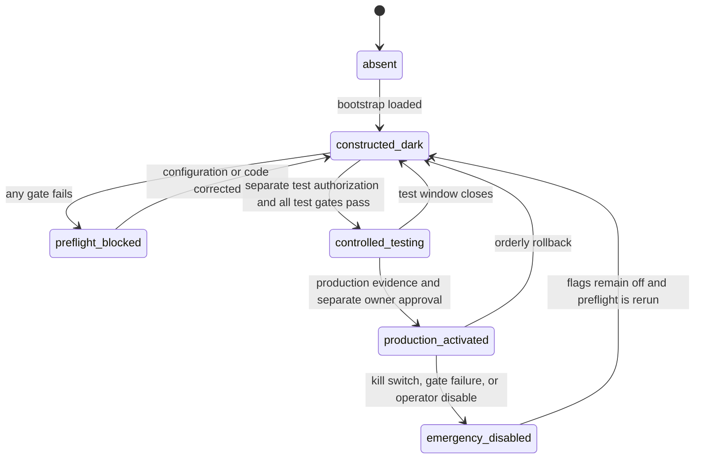
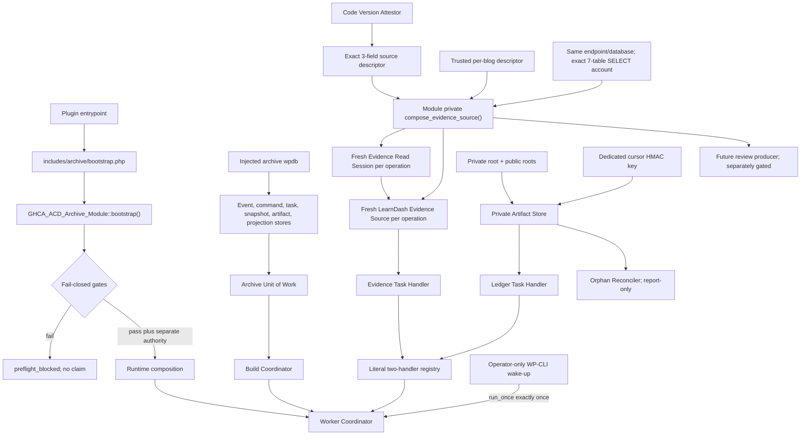

# Dual-Layer Archive Slice 1B-P3B3 Runtime-Composition Decisions Proposal

**Status:** owner-approved decision record

**Owner approval date:** 2026-07-30

**Proposal date:** 2026-07-30

**Branch:** `feature/dual-layer-archive-slice-1b-p3b3-runtime-composition`

**Proposal base / accepted parent:** `1cb3b0d5214c58023e4313066401fd34a5fb3090`

## 1. Purpose and authority boundary

This record proposes Decisions C01-C27 for composing the accepted dark archive components into a WordPress runtime without activating archive behavior. It is a proposal only. It does not authorize production PHP, tests, schema, metadata, entrypoint wiring, database access, activation, deployment, scheduling, network access, or current-site testing.

The accepted event, digest, Unit-of-Work, task, fencing, immutable-artifact, evidence-source, and failure contracts remain authoritative. P3B3 may connect those components; it may not reinterpret them.

Approval of this proposal would authorize only a later implementation inside the mechanical allowlist in C23. That implementation must initially stop at **constructed but dark**. Moving to **enabled for controlled testing** or **production activated** requires the separate evidence and owner gates stated in this record.

## 2. Mandatory preflight evidence

| Check | Result |
|---|---|
| Repository | `C:\laragon\www\Gridhouse-Healthcare-Academy\wp-content\plugins\gridhouse-admin-compliance-dashboard` |
| Branch | `feature/dual-layer-archive-slice-1b-p3b3-runtime-composition` |
| HEAD | `1cb3b0d5214c58023e4313066401fd34a5fb3090` |
| Accepted P3B2b parent | Exact HEAD; present in branch history |
| Staged files | Zero |
| Tracked changes | Zero |
| Untracked files | Only the pre-existing `.claude/` path before this proposal |
| Plugin-entrypoint archive references | Zero |
| Current-site bootstrap or database access | None |
| Docker or remote operations | None |
| `.claude/` | Not opened or modified |

The plugin entrypoint currently loads only the existing non-archive plugin classes and registers the existing legacy activation hook. There is no archive bootstrap, composition root, worker runner, archive hook, REST route, WP-CLI command, scheduler, or feature activation.

## 3. Authoritative contracts reviewed

The review covered:

- the state-machine/event-log PRD, event-sourcing technical design, development handoff, and implementation decisions;
- accepted P1 and P2 contracts and traceability;
- accepted P3A worker/storage, R1/R2, H1 cursor-authentication, and PHP 8.3 compatibility decisions and traceability;
- accepted P3B1 decisions and traceability;
- accepted P3B2a evidence-capture decisions and traceability;
- accepted P3B2b evidence-source decisions B01-B18 and traceability;
- the task catalog, Unit of Work, worker coordinator, build coordinator, evidence and ledger handlers, local private store, orphan reconciler, evidence source/read session, schema/migrator, entrypoint, boundary suite, digest suite, and permanent matrix runner.

### 3.1 Frozen contracts P3B3 must preserve

- PHP distribution floor: PHP 8.3+; mandatory binaries PHP 8.3.30 and PHP 8.5.7.
- Database support: MySQL 8.0.x, MySQL 8.4.x, and MariaDB 10.6.x.
- Source tuple: WordPress 7.0.2, LearnDash 5.1.6.1, dashboard plugin 1.2.0.
- Source adapter: `learndash-local` / `1.0.0`.
- One tenant per WordPress site/blog; archive `site_id` is the blog ID.
- Task schema version 1; maximum attempts 5.
- Lease 120 seconds, cooperative heartbeat every 30 seconds, claim batch 1, and one task per coordinator call.
- Installed task types are exactly `capture_evidence` and `materialize_ledger`.
- Retry delays are 60, 300, 900, and 3,600 seconds; attempt five has no retry.
- The evidence session is an isolated SELECT-only connection, with a read-only repeatable-read consistent snapshot, 32-statement ceiling, 2,000 ms monotonic elapsed ceiling through successful close, unconditional rollback, and closed failure tuples.
- Review and capture must use the identical adapter, descriptor, source tuple, mappings, normalization, calculation, canonical JSON, digest domain, adapter key, and adapter version.
- Production private storage requires `GHCA_ACD_ARCHIVE_PRIVATE_DIR` outside every public document root. There is no uploads-directory fallback.
- The cursor key is exactly 64 lowercase hexadecimal characters encoding 32 random bytes, has one active key, and is never reused.
- Cursor rotation invalidates in-flight cursors; callers restart with `cursor = null`.
- Artifact bytes and descriptors are immutable. Orphan reconciliation remains report-only.
- Operational, lease-loss, unknown, and unclassified failures never invent lifecycle facts.
- P3B2b success always rolls back its read-only transaction. This supersedes the older technical-design sentence that said the read transaction commits.

### 3.2 Contradictions and missing runtime components

The following are exposed rather than silently resolved:

1. The technical design names feature flags `ghca_acd_archive_enabled` and `ghca_acd_archive_reset_enabled`; the accepted migrator actually disables and verifies `ghca_acd_archive_enabled` and `ghca_acd_archive_dual_layer`. C04 proposes an explicit reconciliation.
2. The technical design proposes `GHCA_ACD_Archive_Module`, `includes/archive/bootstrap.php`, and a worker runner. None exists.
3. No production implementation of `GHCA_ACD_Archive_Clock` or `GHCA_ACD_Archive_Id_Generator` exists.
4. The P3B2b source-version descriptor is test-injected. No non-configurable production attestor exists.
5. No production source-credential provider, multisite descriptor resolver, private-root/public-root resolver, or cursor-key loader exists.
6. No review-time producer is composed, so review/capture parity is not yet executable in production.
7. B08.5 leaves calculation-time authority to P3B3.
8. D16 remains unresolved.
9. Certificate acquisition, packet materialization, verification/finalization, and their handlers do not exist.
10. Host-cron reliability and the primary worker wake-up mechanism are not proven.
11. The accepted evidence-read-session grant parser requires database-wide `SELECT`, which contradicts P3B3's same-database archive-table denial. C08 and the narrow C23 amendment replace only that parser with exact seven-table grants.

These gaps mean that P3B3 cannot safely authorize production activation merely by constructing the two installed handlers.

## 4. Runtime states and failure grammar

### 4.1 Exact states

| State | Meaning | Permitted behavior |
|---|---|---|
| `absent` | Archive bootstrap not loaded. | Existing plugin behavior only. |
| `constructed_dark` | Archive files and composition root are loaded; immutable configuration may be validated. | No current-site archive read/write, source connection, handler call, task claim, hook, schedule, controller, or network operation. |
| `preflight_blocked` | One or more mandatory gates failed. | Fixed sanitized health result only; no archive side effect. |
| `controlled_testing` | An explicitly authorized operator invokes the composed runtime for a named site after all controlled-test gates pass. | Directly run one coordinator call; no public request surface and no production claim. |
| `production_activated` | All production gates, representative evidence, and a separate owner activation approval pass. | Only the approved worker surface and installed handler registry operate. |
| `emergency_disabled` | Kill switch or startup failure disabled intake. | No new claims or lifecycle commands; retained tasks and immutable data remain untouched. |

`constructed_dark` is the only state authorized by a future C01-C27 implementation approval alone. `controlled_testing` needs a separate current-site-test authorization. `production_activated` needs the C26/C27 evidence and owner approval after every blocker is closed.

### 4.2 Activation state machine



No state transition appends a lifecycle event. Lease expiry, process death, gate failure, disablement, or rollback is never translated into `ArchiveFailed`.

### 4.3 Closed startup/runner result

Startup and runner results use one exact nine-field envelope:

```text
status
code
stage
duration_ms
claimed_count
completed_count
retry_count
dead_count
lease_lost_count
```

The key set above is exact. No key may be missing or added. Serialization uses the existing canonical JSON implementation and its existing binary key ordering; no second JSON grammar is introduced. Every count always exists, is an integer, and is either `0` or `1`. `duration_ms` is a non-negative integer computed from one monotonic `hrtime(true)` interval. Integer nanoseconds are divided by 1,000,000 with floor semantics. A negative, non-integer, or overflowing difference saturates to `PHP_INT_MAX`; it never wraps, becomes negative, or uses wall-clock time.

The exact permitted mappings and counts are:

| `status` | Exact `code` | Exact `stage` | `claimed_count` | `completed_count` | `retry_count` | `dead_count` | `lease_lost_count` |
|---|---|---|---:|---:|---:|---:|---:|
| `ready` | `archive_runtime_ready` | `activation` | 0 | 0 | 0 | 0 | 0 |
| `blocked` | `archive_runtime_load_failed` | `load` | 0 | 0 | 0 | 0 | 0 |
| `blocked` | `archive_runtime_disabled` | `flags` | 0 | 0 | 0 | 0 | 0 |
| `blocked` | `archive_runtime_schema_mismatch` | `schema` | 0 | 0 | 0 | 0 | 0 |
| `blocked` | `archive_runtime_attestation_failed` | `attestation` | 0 | 0 | 0 | 0 | 0 |
| `blocked` | `archive_runtime_tenant_invalid` | `tenant` | 0 | 0 | 0 | 0 | 0 |
| `blocked` | `archive_runtime_source_credentials_invalid` | `credentials` | 0 | 0 | 0 | 0 | 0 |
| `blocked` | `archive_runtime_storage_invalid` | `storage` | 0 | 0 | 0 | 0 | 0 |
| `blocked` | `archive_runtime_cursor_key_invalid` | `storage` | 0 | 0 | 0 | 0 | 0 |
| `blocked` | `archive_runtime_review_capture_parity_unavailable` | `parity` | 0 | 0 | 0 | 0 | 0 |
| `blocked` | `archive_runtime_calculation_policy_unapproved` | `calculation` | 0 | 0 | 0 | 0 | 0 |
| `blocked` | `archive_runtime_handler_registry_invalid` | `registry` | 0 | 0 | 0 | 0 | 0 |
| `blocked` | `archive_runtime_wakeup_unavailable` | `wakeup` | 0 | 0 | 0 | 0 | 0 |
| `blocked` | `archive_runtime_partial_retry_unresolved` | `activation` | 0 | 0 | 0 | 0 | 0 |
| `blocked` | `archive_runtime_activation_blocked` | `activation` | 0 | 0 | 0 | 0 | 0 |
| `blocked` | `archive_runtime_internal_failure` | `worker` | 0 | 0 | 0 | 0 | 0 |
| `idle` | `archive_worker_idle` | `worker` | 0 | 0 | 0 | 0 | 0 |
| `completed` | `archive_worker_completed` | `worker` | 1 | 1 | 0 | 0 | 0 |
| `retry` | `archive_worker_retry` | `worker` | 1 | 0 | 1 | 0 | 0 |
| `dead` | `archive_worker_dead` | `worker` | 1 | 0 | 0 | 1 | 0 |
| `lease_lost` | `archive_worker_lease_lost` | `worker` | 1 | 0 | 0 | 0 | 1 |

Startup and runner results are operational health values, not evidence-source exceptions, task errors, lifecycle events, or retained receipts. An underlying task ID, task reason, reason text, SQL, exception, path, URL, host, database name, table/prefix, credential, secret, PII, retained payload, or arbitrary context is never exposed. The CLI emits only this envelope and no message field. Unknown pre-claim failures map to `archive_runtime_load_failed/load`; unknown post-admission worker failures map to `archive_runtime_internal_failure/worker` without claiming a task disposition that did not occur.

## 5. Proposed decisions

Every decision below is owner-gated.

### C01 — Exact P3B3 scope and exclusions

**Recommendation**

P3B3 may implement one composition root, deterministic file loading, production clock/ID implementations, fail-closed preflight, exact code-version attestation, trusted site descriptor resolution, secret/path validation, construction of already accepted stores/coordinators/handlers, and one operator-only wake-up adapter.

P3B3 must not implement or alter:

- event, command, task, snapshot, artifact, ledger, digest, canonical JSON, source-mapping, query-plan, transaction, timeout, rollback, failure-tuple, or schema contracts; the sole exception is C08/C23's narrower grant-preflight parser;
- certificate acquisition/rendering/storage;
- packet rendering;
- verification/finalization;
- D16 lifecycle retry;
- reset, projection rebuild, destructive reconciliation, download, REST, or admin UI;
- a new service container, factory framework, event bus, queue, or scheduler dependency;
- current-site migration, activation, controlled testing, or deployment without later authority.

**Rationale:** composition should connect accepted components, not become another business slice.

**Retained-data effect:** none while dark. Later activation uses existing retained contracts only.

**Owner alternatives:** broaden P3B3 to unfinished handlers, or keep it composition-only.

**Approval:** `Approve C01 as recommended: composition only, initially constructed-dark, with every listed business and exposure surface excluded.`

### C02 — Composition root and dependency graph

**Recommendation**

Use the technical-design name `GHCA_ACD_Archive_Module` in `includes/archive/class-archive-module.php` as the only composition root. Do not add a container or general factory.

The root constructs one archive write graph on the injected current blog archive connection:

```text
archive wpdb connection
  -> event store
  -> command store
  -> task store
  -> snapshot store
  -> artifact repository
  -> projection repository -> projector
  -> Unit of Work
  -> Build Coordinator

validated private root + public roots + cursor HMAC key
  -> Private Artifact Store
  -> Ledger Materializer -> Ledger Handler
  -> Orphan Reconciler (report-only, not scheduled)

same endpoint/database + dedicated exact seven-table SELECT credentials + trusted site descriptor
  -> module private compose_evidence_source()
  -> fresh isolated source wpdb connection per operation
  -> Evidence Read Session
  -> LearnDash Evidence Source
  -> Evidence Validator + Snapshot Preparer
  -> Evidence Handler

task store + clock + random ID generator + exact handler map
  -> Worker Coordinator
```

The evidence connection is never shared with the archive graph or another invocation. Every archive store in the Unit of Work uses the same archive connection, as its accepted constructor requires.

**Rationale:** one explicit graph makes accidental credential, connection, and handler mixing reviewable.

**Retained-data effect:** none.

**Failure:** construction failure produces the applicable C04-C14 health code; an unknown pre-claim construction failure is `blocked/archive_runtime_load_failed/load`.

**Owner alternatives:** one explicit root, or a service container. The container is rejected as unnecessary.

**Approval:** `Approve C02 and the exact dependency graph as recommended.`

### C03 — Bootstrap and exact loading order

**Recommendation**

The eventual entrypoint adds exactly one archive reference:

```php
require_once __DIR__ . '/includes/archive/bootstrap.php';
```

It appears after the plugin's existing class `GHCA_Admin_Compliance_Dashboard` is declared and before its existing `init()` call, so the attestor may compare the loaded class version while archive bootstrap remains independently fail-closed.

`includes/archive/bootstrap.php` uses `require_once`; no Composer or custom autoloader is added. It contains this exact ordered 55-entry relative-file manifest:

```text
contracts/interface-archive-clock.php
contracts/interface-archive-id-generator.php
contracts/class-archive-evidence-source.php
contracts/interface-archive-artifact-store.php
contracts/interface-archive-event-store.php
infrastructure/class-archive-empty-object.php
infrastructure/class-archive-canonical-object.php
infrastructure/class-archive-canonical-json.php
infrastructure/class-archive-persistence-exception.php
infrastructure/class-archive-artifact-store-exception.php
infrastructure/class-archive-db-format.php
infrastructure/class-archive-digester.php
domain/class-archive-transition-exception.php
domain/class-archive-event-types.php
domain/class-archive-event-catalog.php
domain/class-archive-cycle.php
domain/class-archive-case-key.php
domain/class-archive-actor.php
domain/class-archive-reset-scope.php
domain/class-archive-command.php
domain/class-archive-client-intent.php
domain/class-archive-event.php
infrastructure/class-archive-event-stream-verifier.php
domain/class-archive-case.php
class-archive-schema.php
class-archive-migrator.php
infrastructure/class-wpdb-archive-event-store.php
infrastructure/class-wpdb-archive-command-store.php
infrastructure/class-wpdb-archive-task-store.php
infrastructure/class-wpdb-archive-snapshot-store.php
infrastructure/class-wpdb-archive-artifact-repository.php
infrastructure/class-wpdb-archive-projection-repository.php
infrastructure/class-archive-case-projector.php
infrastructure/class-archive-revision-projector.php
infrastructure/class-archive-reset-projector.php
infrastructure/class-archive-projector.php
application/class-archive-task-catalog.php
application/class-archive-evidence-source-exception.php
application/class-archive-evidence-result-validator.php
application/class-archive-evidence-snapshot-preparer.php
application/class-archive-ledger-materializer.php
application/class-archive-unit-of-work.php
application/class-archive-build-coordinator.php
application/class-archive-evidence-task-handler.php
application/class-archive-ledger-task-handler.php
application/class-archive-orphan-reconciler.php
application/class-archive-worker-coordinator.php
infrastructure/class-wpdb-archive-evidence-read-session.php
infrastructure/class-learndash-archive-evidence-source.php
infrastructure/class-private-archive-artifact-store.php
infrastructure/class-system-archive-clock.php
infrastructure/class-random-archive-id-generator.php
infrastructure/class-archive-code-version-attestor.php
infrastructure/class-wordpress-archive-runtime-descriptor.php
class-archive-module.php
```

The independent frozen digest is SHA-256 `d2b3b45a3e421f3565e651348acac496805a349e272eae2b64aa9bee4570b094` over the UTF-8 manifest entries joined by one LF with no final LF. Before requiring the first manifest file, bootstrap must:

1. require exactly 55 strings and the frozen manifest digest;
2. reject an empty, absolute, backslash-containing, control-containing, `.`/`..`-segment, duplicate, missing, extra, or reordered entry;
3. resolve the archive root once, reject a symlink root, and require every candidate to resolve beneath it;
4. require every candidate to exist as a regular non-symlink file;
5. retain the complete validated real-path list in memory;
6. only after every check passes, `require_once` those paths in the listed order;
7. call `GHCA_ACD_Archive_Module::bootstrap()` after the final require. An absent or invalid C04 runtime mode enters `constructed_dark` and registers no enabled surface.

`schema-manifest.php` is data loaded only by the already accepted migrator when a separately authorized migration runs; bootstrap does not execute it as a class file. Bootstrap performs no directory scan, reflection loading, Composer loading, class-name convention, optional include, or silent skip. Any manifest or filesystem failure returns `blocked/archive_runtime_load_failed/load` before partial archive initialization.

**Rationale:** this extends the proven test-bootstrap dependency order and avoids an additional loader abstraction.

**Retained-data effect:** none.

**Failure:** `blocked/archive_runtime_load_failed/load`.

**Approval:** `Approve C03, including the literal 55-file manifest, frozen digest, validate-all-before-require algorithm, one entrypoint require, and fail-closed bootstrap.`

### C04 — Feature flags and schema-version gates

**Recommendation**

Reconcile the design/migrator contradiction as follows:

- deployment constant `GHCA_ACD_ARCHIVE_RUNTIME_MODE` accepts only `controlled_testing` or `production`; absent, empty, or any other value means dark;
- `ghca_acd_archive_enabled` is the master intake/worker flag.
- `ghca_acd_archive_dual_layer` is the existing migration-safe runtime gate and must also equal string `"1"` for controlled or production execution.
- `ghca_acd_archive_reset_enabled` remains absent or string `"0"`; it does not replace `dual_layer` and no reset handler is registered.
- all flags must be non-autoloaded;
- any missing, malformed, or other value is disabled;
- `ghca_acd_archive_schema_version` must equal exact `GHCA_ACD_Archive_Schema::CURRENT_VERSION`, currently `0001_create_archive_schema_v1`;
- all 13 manifest tables and postflight checks must pass before either runtime flag can become `"1"`.

The runtime-mode constant is operational configuration and is never code-version authority. Dark loading does not read or write site flags.

After separate current-site authority, the runtime derives the exact current-blog options table from C07 and performs one prepared direct SQL read of only:

```text
ghca_acd_archive_schema_version
ghca_acd_archive_enabled
ghca_acd_archive_dual_layer
ghca_acd_archive_reset_enabled
```

The table identifier is grammar-validated and quoted; option names are bound values. Results are ordered by binary `option_name`. Schema, enabled, and dual-layer must each have exactly one row and exact `autoload = "no"`. Reset may have no row or exactly one row with `option_value = "0"` and `autoload = "no"`. Duplicate rows, extra returned rows, wrong types, cached/filter-provided values, and any other autoload/value fail closed.

`get_option()`, `get_site_option()`, option/site-option filters, object-cache values, network options, request/task fields, CLI arguments, and environment overrides are never authority for these rows. A migration always forces both implemented runtime flags to `"0"` first, exactly as the accepted migrator does. P3B3 adds no schema migration.

**Rationale:** this preserves implemented safety behavior and records how the older design's reset flag relates to it.

**Retained-data effect:** operational options only; no lifecycle or immutable-row effect.

**Failure:** `archive_runtime_disabled/flags` or `archive_runtime_schema_mismatch/schema`.

**Owner alternatives:** treat `dual_layer` as obsolete and change the migrator, or retain it. Changing the migrator is rejected in P3B3.

**Approval:** `Approve C04 as recommended, including both implemented flags, the exact schema version, and reset remaining disabled.`

### C05 — Fail-closed startup and kill switch

**Recommendation**

Default is dark. Any missing constant, option, code attestation, table/postflight check, tenant binding, credential, source descriptor, private path, public-root proof, HMAC key, handler, parity proof, calculation decision, or wake-up proof blocks task claims.

The kill switch is `ghca_acd_archive_enabled != "1"`. The module checks runtime mode, both runtime flags, and schema:

1. before source connection construction;
2. immediately before calling `run_once()`.

Disablement admits no new invocation. A process already past admission may finish its one fenced task; emergency disable therefore has a bounded 110-second process-drain expectation rather than an unsafe mid-command abort. Stopping or killing that process leaves its lease to expire under P3A rules and never creates a lifecycle event. P3B3 does not modify the coordinator or heartbeat contract merely to add a second cancellation channel.

**Rationale:** a kill switch must stop authority, not rewrite history.

**Retained-data effect:** leased operational rows may naturally expire; immutable records are untouched.

**Failure:** `archive_runtime_disabled/flags`.

**Approval:** `Approve C05 and the two admission checks plus bounded in-flight behavior as recommended.`

### C06 — Non-configurable code-version attestation

**Recommendation**

Add one concrete `GHCA_ACD_Archive_Code_Version_Attestor`; no interface or caller-supplied version descriptor. It derives its plugin root as `dirname(__DIR__, 3)` from its own file, requires the parent directory name `plugins`, requires the next parent name `wp-content`, and derives the WordPress root as the parent of that `wp-content` directory. Every path is resolved with `realpath()`, must be a regular non-symlink file, and must remain under that derived root.

It derives versions only from installed code:

- WordPress: read the canonical installed `wp-includes/version.php` code file from the WordPress root that contains the executing plugin, with a 64 KiB ceiling. Parse the bounded bytes with PHP standard-library `token_get_all()` using parse validation. Ignore whitespace, comments, doc comments, and unrelated string literals. Require exactly one real `T_VARIABLE` token whose text is `$wp_version`, followed only by ignorable tokens, the literal `=`, one `T_CONSTANT_ENCAPSED_STRING` representing exact string `7.0.2`, optional ignorable tokens, and the literal `;`. Reject another `$wp_version` variable token anywhere, concatenation, interpolation, constant/function/expression values, malformed token streams, missing semicolon, comments/string literals that merely contain assignment text, symlinks, unreadable/oversized files, and path escape. The runtime `$wp_version` global is not authority.
- LearnDash: require the canonical sibling `sfwd-lms/sfwd_lms.php`; read at most 256 KiB; require header `Version: 5.1.6.1`; require loaded code constant `LEARNDASH_VERSION` to equal `5.1.6.1`; require both code paths to resolve inside the same installed WordPress plugin root.
- dashboard: read this plugin's executing entrypoint at its code-derived path; require header `Version: 1.2.0`; require `GHCA_Admin_Compliance_Dashboard::VERSION` to equal `1.2.0`.

It constructs internally and returns exactly:

```text
wordpress_version = "7.0.2"
learndash_version = "5.1.6.1"
plugin_version = "1.2.0"
```

No option, environment value, request/task value, source row, global, filter, injected descriptor, or caller-supplied path can provide or override these values. The attestor result is passed directly to `GHCA_ACD_LearnDash_Archive_Evidence_Source`.

This attests the installed code's declared versions; it is not a cryptographic software-supply-chain signature. If the owner requires tamper-evident package provenance against a deployment manifest/signature, that is an additional activation gate and must be specified before production.

**Rationale:** it closes B03 without treating ordinary configuration as version authority and uses no new dependency.

**Retained-data effect:** the exact tuple is retained in E07. A tuple or adapter change follows B02.

**Failure:** `archive_runtime_attestation_failed/attestation`, before source credentials or queries.

**Owner alternatives:** a separately signed deployment manifest would require a new decision. The recommended and complete C01-C27 approval selects this installed-code attestor.

**Approval:** `Approve C06 as recommended: the exact installed-code attestor, including bounded token_get_all parsing and no ordinary configuration authority.`

### C07 — Trusted multisite tenant/blog/table descriptor

**Recommendation**

One blog is one tenant. The composition root receives the already bootstrapped archive `$wpdb` connection explicitly; no archive child class reads global `$wpdb`.

After separate current-site authority, the root resolves:

- current blog through unfiltered WordPress core `get_current_blog_id()`;
- `base_prefix`, `prefix`, and `get_blog_prefix(blog_id)` from the injected archive connection;
- canonical `site_id` as the positive decimal blog ID;
- immutable tenant ID from one prepared direct SQL read of `ghca_acd_archive_tenant_id` in the exact C04 current-blog options table.

The tenant option is exactly 32 lowercase hexadecimal characters, `autoload = "no"`, and site-scoped. Runtime reads never use `get_option()`, `get_site_option()`, filters, object cache, network options, request/task values, CLI arguments, or environment overrides.

Initial creation is available only in a separately authorized provisioning operation:

1. confirm the exact current-blog options table has the accepted unique `option_name` index, no tenant row, and no archive stream row for the current canonical `site_id`;
2. generate `bin2hex(random_bytes(16))`;
3. execute one prepared `INSERT` of the exact option name/value/autoload, relying on the current-blog options table's unique option-name index;
4. on duplicate-key conflict, perform a direct readback rather than update;
5. require exactly one valid row and return the winning value;
6. re-read and compare before completing provisioning.

Concurrent creators therefore converge on one immutable winner. A non-duplicate insert error fails closed. If archive streams already exist, a missing tenant option is not regenerated. On every later preflight, direct SQL must find exactly one tenant row, and `SELECT DISTINCT tenant_id FROM <archive_streams> WHERE site_id = %s ORDER BY tenant_id LIMIT 2` must return either no value or exactly that option value. A different tenant, multiple tenants, duplicate/malformed option rows, or an attempted replacement blocks activation. P3B3 exposes no tenant update or delete operation.

The root constructs the exact accepted B04 15-field descriptor and independently derives every table/key from `base_prefix`, `blog_prefix`, and blog ID. It does not accept table names, prefixes, tenant ID, site ID, or blog ID from a request, task, filter, CLI argument, environment variable, source row, or ordinary caller array. It compares the result with authoritative task/case bindings at the existing adapter boundary.

`switch_to_blog()` is not used by a running worker. Each invocation starts WordPress in the target blog context and remains bound to it.

**Rationale:** mutable caller descriptors and mid-process blog switching can cross tenant boundaries.

**Retained-data effect:** tenant ID is identity-bearing and must never change after the first acknowledged event. Blog migration requires a separate compatibility plan.

**Failure:** `archive_runtime_tenant_invalid/tenant`.

**Owner alternatives:** per-blog tenant option as recommended, or an external immutable tenant registry. The latter is not presently specified.

**Approval:** `Approve C07 as recommended, including direct option-table authority, atomic concurrent provisioning, stream binding, one blog per process, no replacement, and no switch_to_blog.`

### C08 — Evidence-source credentials and secret handling

**Recommendation**

Use five required deployment constants, defined outside the plugin and unavailable to WordPress options:

```text
GHCA_ACD_ARCHIVE_SOURCE_DB_HOST
GHCA_ACD_ARCHIVE_SOURCE_DB_NAME
GHCA_ACD_ARCHIVE_SOURCE_DB_USER
GHCA_ACD_ARCHIVE_SOURCE_DB_PASSWORD
GHCA_ACD_ARCHIVE_SOURCE_DB_ACCOUNT
```

They are configuration/secret inputs, never code-version authority. `SOURCE_DB_ACCOUNT` is the exact unquoted, 3-to-384-byte `CURRENT_USER()` result, for example `ghca_source@%`; it is not a password or a literal `SHOW GRANTS` account rendering. It must contain exactly one `@` separator, non-empty user and host components, and no control byte. The accepted expected-connection descriptor receives those same unquoted bytes as `current_user`. The root reads the constants only after C04-C07 pass and only when entering controlled testing or production.

Before opening the source connection, `SOURCE_DB_HOST` and `SOURCE_DB_NAME` must byte-equal the configured endpoint and database name of the injected authoritative archive `wpdb` connection. P3B3 does not read `wp-config.php`; it compares the already constructed archive connection's declared properties with the deployment constants. A socket/TCP syntax, port, or host alias difference is a mismatch even if it might reach the same server. The source connection therefore targets the same declared live WordPress database endpoint and database name as archive persistence, but uses a separate account and password. Mismatch fails closed before an evidence query.

The root validates bounded strings, constructs a new `wpdb`-compatible connection, disables error display, selects UTF-8 MB4 and UTC, and runs the accepted identity/schema preflight plus this amended grant preflight.

The principal receives exactly table-level `SELECT` on these seven resolved B05 physical tables in the one source database:

```text
users_table
usermeta_table
options_table
posts_table
postmeta_table
learndash_user_activity_table
learndash_user_activity_meta_table
```

The closed `SHOW GRANTS FOR CURRENT_USER()` parser accepts exactly eight rows:

1. one `GRANT USAGE ON *.* TO <exact-account>` row, permitting only MariaDB 10.6's optional exact ` IDENTIFIED BY PASSWORD '*<40 uppercase hexadecimal>'` suffix; and
2. one row for each of the seven distinct expected tables in this exact form:

   ```text
   GRANT SELECT ON `<exact-database>`.`<exact-table>` TO <exact-account>
   ```

The parser captures the separately backtick-quoted user and host components from every row. Each component must use canonical doubled-backtick escaping: the parser de-escapes doubled backticks, rejects a component whose re-escaped bytes do not reproduce the captured token exactly, and joins the decoded values as the unquoted `user@host` representation. That normalized value must byte-equal both `SOURCE_DB_ACCOUNT`, the accepted expected-connection descriptor's `current_user`, and the separately queried unquoted `CURRENT_USER()` value. The literal backtick-rendered account is never compared directly with an unquoted descriptor.

All eight rows must also contain byte-identical quoted user components and byte-identical quoted host components. Malformed or unbalanced quoting, escaped-component ambiguity, embedded control bytes, empty components, decoded `@` bytes that create duplicate separators, an unexpected account, or inconsistent account components fails closed. Identifiers must equal the validated descriptor bytes after MySQL backtick escaping. Rows are parsed into a set and compared with the seven-table expected set, so output order is irrelevant but duplicates are rejected.

Every other shape fails closed: database-wide or global SELECT, wildcard objects, an unexpected table, an archive table, an explicit `information_schema` grant, multiple privileges, INSERT/UPDATE/DELETE, DDL, SHOW VIEW, EXECUTE, FILE, PROCESS, administrative/dynamic privileges, `WITH GRANT OPTION`, PROXY, role grants, default-role statements, inherited/role-based access, an unexpected account, extra rows, or missing rows. Information-schema visibility is limited to metadata naturally visible for the seven permitted tables; no explicit information-schema grant is accepted.

This grammar is frozen for the canonical `SHOW GRANTS` output forms produced by MySQL 8.0, MySQL 8.4, and MariaDB 10.6. Tests must create the same seven table-level grants independently on all three families. They must also prove source INSERT/UPDATE/DELETE/DDL and SELECT on every archive table are denied.

The source principal is distinct from the archive connection's current user and is closed after every attempt. Secrets are never returned, logged, persisted, placed in options, task/event/snapshot/artifact data, command artifacts, URLs, or exception text. The B05 query plan, evidence mapping, transaction sequence, 32-statement/2,000 ms ceilings, unconditional rollback/close, and accepted failure tuples do not change.

Secret rotation requires flags off, active workers drained or expired, and new credentials deployed. Connection construction plus the identity, grant, and schema preflight queries are required during credential validation; that validation performs zero B05 evidence-data queries and zero mutations, and the connection is always closed. Controlled evidence reading occurs only in the separately authorized test window, after which the runtime may be re-enabled. No dual-password fallback or in-plugin key ring is added.

**Rationale:** deployment constants are the smallest available non-database secret source. They do not satisfy C06 and cannot spoof versions.

**Retained-data effect:** none.

**Failure:** construction/endpoint/secret failure is `blocked/archive_runtime_source_credentials_invalid/credentials`. A connected source identity, account, or grant mismatch preserves the accepted evidence tuple `operational_blocked/archive_source_schema_unsupported/source_preflight`; it emits no lifecycle event.

**Owner alternatives:** a named host secret-manager adapter would require a new decision. The recommended and complete C01-C27 approval selects these deployment constants and the exact table-level grant model.

**Approval:** `Approve C08 as recommended, including the five deployment constants, unquoted CURRENT_USER account representation, decoded and canonical quoted-account grant equivalence, exact endpoint/database match, seven table-level SELECT grants, closed portable SHOW GRANTS parser, denied source writes/archive reads, and rotation sequence.`

### C09 — Archive database and private-storage construction

**Recommendation**

Archive persistence uses the injected current-blog WordPress database connection and exact accepted table prefix. The composition root queries its connection identity once for the evidence-session cross-check. It does not create a second archive writer.

Private local storage requires:

```text
GHCA_ACD_ARCHIVE_PRIVATE_DIR
GHCA_ACD_ARCHIVE_PUBLIC_DOCUMENT_ROOT
```

Both are deployment constants containing absolute paths. The root resolves them without symlinks. The public root must contain the resolved WordPress code root. If the resolved WordPress content directory is outside that public root, it is added as a second public root. The private root must overlap none of them, must already exist, and must pass the accepted permissions and containment checks. No directory is silently selected or created, and no uploads fallback exists.

Changing the private root while any descriptor references the old root is prohibited. A root migration requires a separately approved copy/verification/cutover/rollback plan; descriptors remain relative and immutable.

**Rationale:** path guessing can expose or strand retained artifacts.

**Retained-data effect:** changing the adapter/path policy is operational, but moving retained bytes is a migration requiring byte-identical verification.

**Failure:** `archive_runtime_storage_invalid/storage`, preserving the store's fixed safe constructor reasons internally.

**Owner alternatives:** required constants as recommended, or a separately approved private object-store adapter.

**Approval:** `Approve C09 Option A, including explicit public-root proof and no implicit directory creation.`

### C10 — Cursor-HMAC key injection and rotation

**Recommendation**

Require deployment constant:

```text
GHCA_ACD_ARCHIVE_CURSOR_HMAC_KEY
```

It must contain exactly 64 lowercase hexadecimal characters encoding 32 CSPRNG bytes. The root passes it unchanged to the private store and then releases its local reference. It is not derived from WordPress salts, source credentials, paths, tenant IDs, or other keys.

H1 remains exact: one active key, no key ID/ring/fallback, no persisted key history, and `hash_equals()` verification before cursor fields influence behavior. Rotation occurs only with runtime flags off. Old cursors fail as `orphan_cursor_invalid` and scans restart from `null`. Missing/invalid key blocks private-store construction and therefore blocks controlled or production execution.

**Rationale:** changing the cursor format or adding a ring is unnecessary because cursors are ephemeral and restartable.

**Retained-data effect:** none; in-flight cursors are invalidated.

**Failure:** `archive_runtime_cursor_key_invalid/storage`; store reason remains `orphan_cursor_key_invalid`.

**Approval:** `Approve C10 as recommended, preserving H1 exactly.`

### C11 — Review/capture dependency parity

**Recommendation**

Review-time production and asynchronous capture run in separate WordPress processes. Each operation constructs a new source connection, evidence-read session, evidence-source instance, and validator graph; no connection or object instance is shared or reused across operations or invocations.

`GHCA_ACD_Archive_Module` owns one private method, `compose_evidence_source()`, containing the sole construction recipe. The module's future public review operation and its worker-composition path each call that private method independently. No public factory, service container, filter, duplicate recipe, caller-supplied instance, or mutable singleton is permitted.

Every independent construction uses the exact same:

- concrete `GHCA_ACD_WPDB_Archive_Evidence_Read_Session` and `GHCA_ACD_LearnDash_Archive_Evidence_Source` classes;
- C06 attested source tuple;
- C07 tenant/blog/table descriptor construction;
- C08 endpoint, account, grant, and isolated-connection contract;
- B05 query plan and source/field allowlists;
- B08 time-independent calculation;
- E07 result validator and normalization;
- canonical JSON implementation;
- E08 digest domain;
- adapter key `learndash-local`;
- adapter version `1.0.0`.

Neither path may wrap, reimplement, override, filter, or reconstruct the source document. Tests construct review and capture in separate invocations, with distinct connections and instances, and require byte-identical normalized E07 documents and E08 fingerprints from identical source state.

No production review-time producer exists. Production archive intake remains blocked until the future approved review producer enters through the module and calls the same private composition method. That producer may not receive the private method as a callback or reproduce it externally.

**Rationale:** process-local object identity is impossible across asynchronous execution; one private recipe plus independent golden parity proves the contract that matters.

**Retained-data effect:** material; parity determines the reviewed fingerprint and retained snapshot.

**Failure:** `archive_runtime_review_capture_parity_unavailable/parity`.

**Owner alternatives:** build the review producer in P3B3, or keep intake blocked. Building a controller is outside C01, so deferral is recommended.

**Approval:** `Approve C11 and keep production intake blocked until an approved review producer uses the same private composition method in a separate invocation.`

### C12 — Calculation-time authority

**Recommendation**

Approve B08.5 Option 1 for adapter v1: the production rule remains the accepted time-independent calculation. Lifespan expiry and warning windows are retained as policy evidence but are not evaluated. No wall clock or event timestamp is added to E07.

Any later time-dependent rule requires a new owner-approved command/event/UoW/source contract that creates one authoritative timestamp before review and carries it byte-identically through capture, with new golden vectors and a version change where required.

**Rationale:** this is the only option that preserves the accepted task/event/source shapes and proves review/capture parity now.

**Retained-data effect:** the calculation rule affects E07 bytes, fingerprints, snapshots, and compliance results. A later change is retained-data affecting.

**Failure:** if C12 is not approved, `archive_runtime_calculation_policy_unapproved/calculation`.

**Owner alternatives:** approve time-independent v1, or specify the complete pre-review timestamp amendment. No timestamp amendment is inferred here.

**Approval:** `Approve C12 Option 1: time-independent calculation v1 for production until a separately versioned time-authority contract is approved.`

### C13 — Worker registration, scheduling, fencing, and host-cron reliability

**Recommendation**

Do not use Action Scheduler, AJAX, browser traffic, REST, or native WP-Cron as the primary wake-up. Register one operator-only WP-CLI command only when `defined('WP_CLI') && WP_CLI`:

```text
wp --url=<canonical-site-url> ghca-acd archive-worker run
```

The `--url` value selects WordPress bootstrap context only; it does not supply tenant/table/version authority. The command calls `run_once()` exactly once and exits with one closed C19 result. It cannot accept task IDs, task types, paths, credentials, versions, flags, lease values, or handler names.

Host cron is the primary scheduler. Required production evidence:

- an owned host scheduler invokes the command at least once per minute per enabled blog;
- process timeout is 110 seconds;
- no more than five concurrent invocations per blog;
- a unique 32-lowercase-hex lease owner per process and a fresh ID-generator token per claim;
- stdout and stderr are captured separately at the host invocation boundary; only one validated C19 envelope, the process exit code, and scheduler timing may enter ordinary scheduler/application logs;
- missed-run alert after 3 minutes and a conservative backlog alert after five consecutive non-idle minutes;
- a 24-hour controlled soak demonstrates no overlaps above five, no dual ownership, and successful crash reclaim.

The coordinator remains claim batch 1 and one task per invocation. Existing 120-second lease, 30-second heartbeat, fencing, retry, and attempt-five behavior remain unchanged. A host timeout/process kill leaves the lease to expire; it does not infer a lifecycle event.

Because host-cron ownership and reliability evidence are deployment facts not present in the repository, production activation remains blocked until C26 provides them.

**Rationale:** a direct CLI invocation avoids traffic-dependent scheduling and does not duplicate the durable task table.

**Retained-data effect:** operational only.

**Failure:** `archive_runtime_wakeup_unavailable/wakeup`.

**Owner alternatives:** native WP-Cron plus a host trigger, or an owned Action Scheduler dependency. Neither is recommended because each adds a second scheduling layer without improving the task source of truth.

**Approval:** `Approve C13 Option A, the one-task WP-CLI wake-up, strict stdout/stderr host boundary, and exact host-cron requirements.`

### C14 — Exact handler registry

**Recommendation**

The production registry is a literal, closed map:

```text
capture_evidence    => GHCA_ACD_Archive_Evidence_Task_Handler
materialize_ledger  => GHCA_ACD_Archive_Ledger_Task_Handler
```

The root compares its sorted keys byte-for-byte with `GHCA_ACD_Archive_Task_Catalog::installed_types()`. No filter, option, request, CLI argument, reflection scan, class-name convention, or dynamic registration may alter it.

Disabled/uninstalled task types include:

```text
materialize_packet
verify_and_finalize
reset
integrity_check
reconcile_orphan_artifacts
rebuild_projection
```

Available-task claim and expired-lease reclaim receive only the two installed keys, preserving P3B1 filtering. Earlier deferred tasks remain untouched.

The orphan reconciler is not a task handler and remains directly callable/report-only in tests until a later operator-surface decision.

**Rationale:** claiming a retained task without a production handler can consume attempts or invent terminal state.

**Retained-data effect:** changing installed types changes operational delivery policy and requires a new decision.

**Failure:** `archive_runtime_handler_registry_invalid/registry`.

**Approval:** `Approve C14 and the exact two-entry literal registry.`

### C15 — Runtime current-site access boundaries

**Recommendation**

After separate current-site authority, allowed surfaces are:

| Connection | Read | Write |
|---|---|---|
| Archive connection | exact 13 archive tables; prepared direct reads of schema/flag/tenant rows in the current-blog options table; connection identity and declared endpoint/database | accepted Unit-of-Work/task/projection/immutable side-record operations; schema/flag/tenant writes only during separately authorized migration/provisioning/activation |
| Evidence connection | same declared endpoint/database; exact seven table-level B05 SELECT grants; exact B05 columns/options/meta; naturally visible information-schema metadata for those tables | none; transaction is read-only and always rolls back |
| Filesystem | executing code/version files, explicit public roots, validated private root | only accepted private staging/commit operations |

Prohibited:

- `wp-load.php` or `wp-config.php` self-bootstrap;
- evidence reads through archive `$wpdb`;
- `get_option()`, `get_site_option()`, option filters, object cache, network options, and caller/environment substitution as flag/schema/tenant authority;
- source writes, source locks beyond the accepted read-only snapshot, arbitrary option/meta reads, network reads, uploads, public URLs, or filesystem discovery;
- lifecycle writes outside the Unit of Work;
- immutable event/snapshot/artifact/ledger updates or deletes.

**Rationale:** the runtime should have one auditable authority table, not ambient WordPress access.

**Retained-data effect:** none beyond already accepted operations.

**Failure:** applicable C07-C10 health code before claim; accepted source failure tuples after dispatch.

**Approval:** `Approve C15 and the exact read/write surface table.`

### C16 — REST, admin, CLI, cron, and controller exposure

**Recommendation**

Approve only the C13 operator WP-CLI command. Defer:

- REST routes;
- admin pages, notices, buttons, AJAX, and controllers;
- public or private download controllers;
- native WP-Cron hooks;
- Action Scheduler;
- reset/rebuild/orphan commands;
- archive request/review controllers.

The CLI command requires an operating-system account authorized to run WP-CLI and does not implement a WordPress capability bypass for web users because there is no web surface. It prints only C19 fields and returns nonzero for blocked/retry/dead/lease-lost outcomes.

**Rationale:** one operator surface is sufficient for controlled worker wake-up.

**Retained-data effect:** none.

**Approval:** `Approve C16 as recommended: one worker CLI command only; defer every web, cron, controller, and additional CLI surface.`

### C17 — Certificate acquisition and network access

**Recommendation**

The C08 archive/source database connection is the sole approved non-filesystem infrastructure transport. It may use only the database driver's TCP or local-socket transport to the exact authoritative WordPress endpoint and database name. The source connection uses separate credentials and the seven-table grant boundary. A different declared host, socket, port, database name, or authenticated account fails closed.

Outside that database transport, explicitly defer certificate acquisition and prohibit network operations. P3B3 performs no HTTP, HTTPS, REST, loopback web request, DNS-based certificate lookup, certificate TLS transport, browser-cookie forwarding, LearnDash certificate render, remote object storage, telemetry, or other transport. Normal database-driver name resolution, if the exact declared database host requires it, does not authorize DNS resolution for any certificate, URL, or arbitrary host.

Certificate-required evidence continues to fail through the accepted P3B2a gate. The capture handler is installed for non-certificate fixtures/controlled cases only; this is a production activation blocker for any tracked course requiring a certificate.

**Rationale:** no closed producer/authentication/SSRF/determinism contract is approved.

**Retained-data effect:** none until a producer/version is approved.

**Approval:** `Approve C17 deferral, treating only the exact C08 database transport as excluded from the HTTP/network prohibition.`

### C18 — D16 partial-artifact lifecycle retry

**Recommendation**

Keep D16 unresolved and unchanged:

- `ArchiveRetryRequested` must not enqueue an installed ledger task;
- cross-attempt reuse, reuse/rebinding event, invalidation/replacement, and cancellation/replacement remain unselected;
- operational retry/reclaim and receipt replay of the original task remain supported;
- no runtime gate may turn D16 on.

Production activation of the complete archive lifecycle remains blocked until a separately approved retained-data compatibility decision resolves D16. Controlled testing may exercise only original `EvidenceSnapshotCaptured` ledger tasks.

**Rationale:** composition cannot decide lifecycle meaning.

**Retained-data effect:** any future D16 choice is retained-event/finalization affecting.

**Failure:** `archive_runtime_partial_retry_unresolved/activation` for production activation, never a lifecycle event.

**Approval:** `Approve C18 deferral and keep complete production activation blocked.`

### C19 — Error sanitization, logging, metrics, and privacy

**Recommendation**

P3B3 adds no database health table, option log, remote telemetry, general logger interface, or debug output. The operator CLI emits exactly the Section 4.3 nine-field envelope as one canonical JSON line on stdout. Section 4.3 is the sole grammar: C19 adds no status, code, stage, optional field, message, or alternate count rule. Production invocation requires `display_errors` disabled and `WP_DEBUG_DISPLAY` false. The module catches every supported runtime throwable at its boundary and emits only the applicable closed envelope.

All five count fields always exist and are integer `0` or `1` according to the exact status row. `duration_ms` uses the one monotonic, saturating Section 4.3 rule. No task/site/tenant/user/course/archive IDs are printed.

The following never enter the plugin-emitted stdout envelope or ordinary scheduler/application telemetry: names, emails, titles, source values, task payloads, evidence/snapshot/ledger bytes, SQL, table/prefix/database/host/user names, URLs, paths, versions read from files, credentials, cursor keys/HMACs, salts, cookies, nonces, exception messages, or stack traces. This contract does not claim to redact arbitrary PHP, WordPress, WP-CLI, extension, engine, or host stderr.

The host must capture stdout and stderr separately, validate that stdout contains exactly one canonical nine-field JSON line, and refuse to export raw stderr to ordinary scheduler/application logs. It records only the validated envelope, process exit code, and scheduler timing. Any separately retained diagnostic stderr requires an owner-controlled restricted incident channel and is not archive operational telemetry. A malformed stdout line, multiple stdout lines, or any unexpected stderr makes the invocation operationally blocked and unusable for telemetry without creating or inferring a lifecycle event.

Metrics derived from validated envelopes are invocation count, idle/completed/retry/dead/lease-lost count, duration, missed runs, consecutive non-idle runs, and active process count. If exact oldest-task age, persistent in-plugin metrics, or Site Health exposure is later required, it needs a separate query/storage/privacy decision.

**Rationale:** bounded CLI results satisfy the wake-up contract without adding a logging subsystem.

**Retained-data effect:** none.

**Failure:** a supported unknown throwable before task admission returns `blocked/archive_runtime_load_failed/load`; a supported unknown post-admission worker throwable returns `blocked/archive_runtime_internal_failure/worker`. Malformed or multiple stdout lines and unexpected stderr invalidate the host invocation result. None alters or invents task/lifecycle state beyond an already committed fenced task disposition.

**Approval:** `Approve C19, the exact bounded CLI stdout envelope, the strict host stdout/stderr privacy boundary, and deferral of persistent or remote observability.`

### C20 — Activation, rollback, upgrade, and emergency disable

**Recommendation**

Exact sequence:

1. deploy code with both runtime flags absent or `"0"`;
2. load `constructed_dark`; C06-C10 validation may run only under separately authorized preflight;
3. separately authorize and run existing schema migration with flags forced off;
4. postflight exact schema/engine/table checks;
5. provision immutable tenant, source principal/secret, private/public roots, cursor key, and host cron;
6. run the C24/C25 matrix and C26 sanitized deployment evidence;
7. separately authorize a controlled-test window; deploy runtime mode `controlled_testing`, set `dual_layer = "1"` then `enabled = "1"`, and invoke the CLI manually with host cron stopped;
8. close the test window, set `enabled = "0"` then `dual_layer = "0"`, and remove the controlled-testing mode;
9. obtain separate production owner approval;
10. deploy runtime mode `production`, set `dual_layer = "1"` then `enabled = "1"`, start host cron, and verify one canary blog before any next blog.

Rollback/emergency disable:

1. set `enabled = "0"` first;
2. stop host-cron invocations;
3. let live leases finish only while all gates remain valid, otherwise let them expire;
4. set `dual_layer = "0"`;
5. preserve all tasks/events/snapshots/descriptors/artifacts;
6. do not down-migrate, delete, reset, rewrite, or infer lifecycle failures.

Upgrade:

1. disable as above;
2. deploy;
3. run exact code attestation and schema postflight;
4. run compatibility/matrix/canary evidence;
5. re-enable only by a new release approval.

An absent runtime mode, `enabled != "1"`, or `dual_layer != "1"` cannot claim a task.

**Rationale:** deployment and data authority are separated.

**Retained-data effect:** no deletion or rewriting; options are operational.

**Approval:** `Approve C20 and the exact ordered activation/rollback/upgrade sequence.`

### C21 — Multisite and network activation

**Recommendation**

Network plugin activation may load archive code dark but must not:

- create tenants;
- migrate archive schema;
- provision secrets/paths;
- schedule workers;
- flip flags;
- iterate sites;
- use `switch_to_blog()`;
- claim tasks.

Each blog is provisioned, migrated, tested, approved, and enabled independently. Host cron bootstraps that exact blog URL. A process serves one blog only. Network-wide archive activation is deferred until every blog has its own descriptor, credentials/grants, path containment evidence, capacity evidence, and rollback plan.

**Rationale:** network activation is not proof of per-tenant isolation.

**Retained-data effect:** tenant/blog binding is identity-bearing and immutable after events exist.

**Failure:** `archive_runtime_tenant_invalid/tenant`.

**Approval:** `Approve C21 and per-blog activation only.`

### C22 — Performance, timeout, memory, and concurrency ceilings

**Recommendation**

Preserve the approved operating envelope:

- 100 reads per lifecycle write;
- 100 reads/second and 5 lifecycle writes/second per site validation envelope;
- at most five worker processes per site;
- one task per invocation;
- 120-second lease and 30-second heartbeat;
- host process timeout 110 seconds;
- evidence source maximum 32 statements, 10,000 rows/values per independent document limit, and 2,000 ms elapsed through close;
- snapshot canonical bytes at most 1 MiB;
- ledger bytes at most 8 MiB;
- certificate at most 16 MiB and packet at most 64 MiB, although both production paths remain disabled;
- PHP memory limit at least 256 MiB; one process may not raise it;
- lifecycle command p99 at most 1,000 ms, excluding external artifact work;
- no database transaction spans source reading, canonicalization, hashing, filesystem, network, rendering, or sleep.

The worker runner does not loop, sleep, fork, spawn, or acquire a second admission lock. Durable row fencing is authoritative. A five-process host ceiling is an operational requirement verified outside the plugin.

**Rationale:** one-task processes reuse the accepted coordinator boundary and avoid another runtime budget mechanism.

**Retained-data effect:** operational policy only.

**Failure:** startup below the memory floor or unproved host limits is `archive_runtime_activation_blocked/activation`.

**Approval:** `Approve C22 and the exact ceilings.`

### C23 — Mechanical implementation allowlist

**Recommendation**

After C01-C27 approval, a constructed-dark implementation may add only:

```text
includes/archive/bootstrap.php
includes/archive/class-archive-module.php
includes/archive/infrastructure/class-system-archive-clock.php
includes/archive/infrastructure/class-random-archive-id-generator.php
includes/archive/infrastructure/class-archive-code-version-attestor.php
includes/archive/infrastructure/class-wordpress-archive-runtime-descriptor.php
tests/archive/test-p3b3-runtime-composition.php
tests/archive/test-p3b3-activation-gates.php
tests/archive/test-p3b3-worker-runtime.php
tests/archive/test-p3b3-multisite.php
docs/superpowers/plans/2026-07-31-dual-layer-archive-slice-1b-p3b3-traceability.md
```

It may modify only:

```text
gridhouse-admin-compliance-dashboard.php
includes/archive/infrastructure/class-wpdb-archive-evidence-read-session.php
tests/archive/bootstrap.php
tests/archive/persistence-bootstrap.php
tests/archive/test-p3-boundaries.php
tests/archive/test-p3b2b-evidence-source.php
tests/archive/test-p3b2b-evidence-source-persistence.php
tests/archive/test-p3b2b-evidence-source-concurrency.php
tests/archive/test-all.ps1
docs/superpowers/plans/2026-07-30-dual-layer-archive-slice-1b-p3b3-runtime-composition-decisions-proposal.md
```

The entrypoint modification is only the one C03 require. The module owns the CLI callback; no separate controller/runner/factory/container file is authorized. The runtime descriptor class resolves C07-C10 immutable inputs and does not change B04/B03 evidence mappings. The clock uses UTC and strict accepted formatting; the ID generator uses `bin2hex(random_bytes(16))`.

The evidence-read-session and three retained P3B2b tests may change only to replace the database-wide SELECT grant parser/fixtures with C08's exact seven-table parser and denial regressions. No B05 query plan, evidence mapping, transaction statement/order, timeout, rollback/close, checkpoint, failure category/reason/context, or normalized byte may change.

No other existing event/domain/application/store/source/handler/migrator/schema/manifest/digest/canonicalizer class may change. If implementation proves one necessary, stop for a narrow owner amendment.

Controlled testing, current-site access, activation, and production enablement are not implied by this file allowlist.

**Retained-data effect:** none while dark.

**Approval:** `Approve C23 and the exact add/modify lists, including only the narrow C08 grant-parser amendment to the four P3B2b files.`

### C24 — Named regression matrix

**Recommendation**

Negative tests use a phase-aware oracle:

- **Pre-admission/gate failure:** zero database mutation and zero filesystem mutation.
- **Post-claim failure:** only the exact approved task lease, retry, completion, or dead-letter transition for that scenario may differ. The oracle compares every task field, attempt count, lease owner/token/expiry, availability, error code/text, and completion time against the named expected transition.
- **Every phase:** zero unauthorized lifecycle events or command receipts; zero snapshot, artifact-descriptor, or ledger-row additions; zero immutable-row update/delete; zero source mutation; no secret/PII/path leakage; and zero private-file residue outside the exact expected staging/committed state.
- **Crash/reclaim fixtures:** may retain only the already approved live/expired lease or exact immutable staged/committed artifact state named by that crash point. Replay must converge under the accepted fencing/idempotency contract.

The test helper deliberately injects one unexpected database or filesystem mutation and must fail, proving that the oracle is not a vacuous assertion.

#### Composition and loading

- `P3B3-BOOTSTRAP-LITERAL-55-FILE-MANIFEST-AND-DIGEST`
- `P3B3-BOOTSTRAP-VALIDATES-ALL-BEFORE-FIRST-REQUIRE`
- `P3B3-BOOTSTRAP-MISSING-EXTRA-DUPLICATE-ESCAPED-OR-REORDERED-REJECTED`
- `P3B3-BOOTSTRAP-NONREGULAR-OR-SYMLINK-FILE-REJECTED`
- `P3B3-BOOTSTRAP-NO-SCAN-REFLECTION-COMPOSER-DYNAMIC-OR-SILENT-SKIP`
- `P3B3-ENTRYPOINT-ONE-ARCHIVE-REFERENCE`
- `P3B3-LOAD-DARK-REGISTERS-NO-ACTIVE-SURFACE`
- `P3B3-DEPENDENCY-GRAPH-USES-ONE-ARCHIVE-CONNECTION`
- `P3B3-EVIDENCE-CONNECTION-DISTINCT`
- `P3B3-NO-CONTAINER-FACTORY-OR-DYNAMIC-HANDLER-REGISTRATION`
- `P3B3-SYSTEM-CLOCK-UTC-STRICT`
- `P3B3-RANDOM-ID-32-LOWER-HEX`

#### Flags, schema, and state machine

- `P3B3-DEFAULT-STATE-CONSTRUCTED-DARK`
- `P3B3-FLAGS-EXACT-STRING-VALUES`
- `P3B3-DUAL-LAYER-MIGRATOR-CONTRADICTION-RESOLVED`
- `P3B3-RESET-FLAG-ABSENT-OR-ZERO`
- `P3B3-SCHEMA-EXACT-VERSION-AND-POSTFLIGHT`
- `P3B3-FLAG-SCHEMA-DIRECT-OPTION-TABLE-READ`
- `P3B3-OPTION-FILTER-SPOOF-IGNORED`
- `P3B3-STALE-OBJECT-CACHE-VALUE-IGNORED`
- `P3B3-NETWORK-OPTION-SUBSTITUTION-IGNORED`
- `P3B3-DUPLICATE-OR-MALFORMED-AUTHORITY-ROW-REJECTED`
- `P3B3-ANY-GATE-FAILS-CLOSED-BEFORE-CLAIM`
- `P3B3-KILL-SWITCH-BEFORE-CLAIM`
- `P3B3-INFLIGHT-DISABLE-FINISH-OR-LEASE-EXPIRY-NO-LIFECYCLE-FACT`
- `P3B3-ROLLBACK-PRESERVES-RETAINED-DATA`

#### Code-version attestation

- `P3B3-ATTEST-EXACT-WP-LD-PLUGIN-TUPLE`
- `P3B3-ATTEST-DOES-NOT-READ-WP-VERSION-GLOBAL`
- `P3B3-ATTEST-TOKEN-PARSER-ACCEPTS-ONE-STATIC-ASSIGNMENT`
- `P3B3-ATTEST-REJECTS-MISSING-EXTRA-DYNAMIC-OR-DUPLICATE-WP-ASSIGNMENT`
- `P3B3-ATTEST-REJECTS-CONCATENATION-INTERPOLATION-OR-EXPRESSION`
- `P3B3-ATTEST-IGNORES-COMMENT-AND-STRING-SPOOF`
- `P3B3-ATTEST-REJECTS-MALFORMED-UNREADABLE-OR-OVERSIZED-TOKENS`
- `P3B3-ATTEST-REJECTS-HEADER-CONSTANT-MISMATCH`
- `P3B3-ATTEST-REJECTS-SYMLINK-OR-PATH-ESCAPE`
- `P3B3-ATTEST-REJECTS-ORDINARY-OPTION-ENV-REQUEST-TASK-DB-GLOBAL-FILTER-SPOOF`
- `P3B3-ATTEST-FAILS-BEFORE-SOURCE-CREDENTIALS-OR-QUERY`
- `P3B3-SOURCE-DESCRIPTOR-INTERNALLY-DERIVED-EXACT-THREE-FIELD`

#### Tenant, credentials, and paths

- `P3B3-TENANT-GENERATED-ONCE-NON-AUTOLOAD`
- `P3B3-TENANT-CONCURRENT-CREATION-ONE-IMMUTABLE-WINNER`
- `P3B3-TENANT-REPLACEMENT-OR-STREAM-MISMATCH-REJECTED`
- `P3B3-TENANT-MALFORMED-OR-CHANGED-FAILS-CLOSED`
- `P3B3-BLOG-ID-PREFIX-TABLE-DESCRIPTOR-EXACT`
- `P3B3-MIXED-BLOG-OR-SWITCHED-CONTEXT-REJECTED`
- `P3B3-TASK-CANNOT-SUPPLY-TENANT-TABLE-OR-PREFIX`
- `P3B3-SOURCE-CREDENTIALS-REQUIRED-ONLY-AFTER-GATES`
- `P3B3-SOURCE-CREDENTIALS-NEVER-LOGGED-PERSISTED-OR-RETAINED`
- `P3B3-SOURCE-ENDPOINT-AND-DATABASE-EXACT-ARCHIVE-MATCH`
- `P3B3-SOURCE-PRINCIPAL-DISTINCT-EXACT-SEVEN-TABLE-SELECT`
- `P3B3-SOURCE-GRANTS-MYSQL80-MYSQL84-MARIADB106`
- `P3B3-SOURCE-ACCOUNT-UNQUOTED-CURRENT-USER-DECODED-ESCAPED-GRANT-EQUIVALENCE-AND-REPRESENTATION-MISMATCH`
- `P3B3-SOURCE-DATABASE-WIDE-OR-WILDCARD-GRANT-REJECTED`
- `P3B3-SOURCE-ARCHIVE-TABLE-GRANT-REJECTED`
- `P3B3-SOURCE-ROLE-EXTRA-OR-UNEXPECTED-PRIVILEGE-REJECTED`
- `P3B3-SOURCE-INSERT-UPDATE-DELETE-DDL-DENIED`
- `P3B3-SOURCE-ARCHIVE-TABLE-SELECT-DENIED`
- `P3B3-PRIVATE-ROOT-OUTSIDE-ALL-PUBLIC-ROOTS`
- `P3B3-NO-UPLOADS-FALLBACK-OR-IMPLICIT-DIRECTORY`
- `P3B3-ROOT-CHANGE-WITH-REFERENCED-DESCRIPTORS-BLOCKED`

#### HMAC, parity, and calculation

- `P3B3-CURSOR-KEY-EXACT-H1-INJECTION`
- `P3B3-CURSOR-KEY-MISSING-INVALID-BLOCKS-BEFORE-CLAIM`
- `P3B3-CURSOR-ROTATION-INVALIDATES-CURSOR-AND-RESTARTS-NULL`
- `P3B3-CURSOR-KEY-NOT-REUSED-OR-EXPOSED`
- `P3B3-REVIEW-CAPTURE-INDEPENDENT-INSTANCES-AND-CONNECTIONS`
- `P3B3-REVIEW-CAPTURE-ONE-PRIVATE-COMPOSITION-RECIPE`
- `P3B3-REVIEW-CAPTURE-SEPARATE-INVOCATIONS-BYTE-IDENTICAL-E07`
- `P3B3-REVIEW-CAPTURE-SEPARATE-INVOCATIONS-IDENTICAL-E08`
- `P3B3-REVIEW-CAPTURE-PARITY-BLOCKS-PRODUCTION-INTAKE`
- `P3B3-TIME-INDEPENDENT-CALCULATION-V1-APPROVED`
- `P3B3-CALCULATION-READS-NO-CLOCK`
- `P3B3-TIME-DEPENDENT-CALCULATION-REQUIRES-VERSIONED-AMENDMENT`

#### Worker, fencing, and handlers

- `P3B3-HANDLER-REGISTRY-EXACT-CAPTURE-AND-LEDGER`
- `P3B3-INSTALLED-TYPE-AVAILABLE-CLAIM-FILTER`
- `P3B3-INSTALLED-TYPE-EXPIRED-RECLAIM-FILTER`
- `P3B3-DEFERRED-TASKS-REMAIN-UNTOUCHED`
- `P3B3-RUNNER-CALLS-RUN-ONCE-EXACTLY-ONCE`
- `P3B3-RUNNER-ACCEPTS-NO-TASK-TYPE-ID-PATH-VERSION-OR-SECRET`
- `P3B3-FIVE-PROCESS-LEASE-RACE-ONE-OWNER-PER-TASK`
- `P3B3-LIVE-LEASE-NOT-STOLEN`
- `P3B3-STALE-WORKER-CANNOT-OUTCOME-OR-COMPLETE`
- `P3B3-HOST-TIMEOUT-LEAVES-RECLAIMABLE-LEASE`
- `P3B3-D16-RETRY-TASK-NOT-CLAIMED`

#### Exposure, privacy, and activation

- `P3B3-ONLY-APPROVED-WPCLI-COMMAND-REGISTERED`
- `P3B3-NO-REST-ADMIN-AJAX-WPCRON-ACTION-SCHEDULER-OR-CONTROLLER`
- `P3B3-NO-NETWORK-OR-CERTIFICATE-ACQUISITION`
- `P3B3-NO-CURRENT-SITE-SELF-BOOTSTRAP`
- `P3B3-CLI-OUTPUT-EXACT-BOUNDED-SHAPE`
- `P3B3-C01-C27-RESULT-STATUS-CODE-STAGE-TUPLES-EXIST-IN-SECTION-4-3`
- `P3B3-RESULT-ALL-COUNTS-ALWAYS-ZERO-OR-ONE`
- `P3B3-RESULT-DURATION-MONOTONIC-AND-SATURATING`
- `P3B3-CLI-OUTPUT-CONTAINS-NO-PII-SECRET-SQL-PATH-URL-OR-ID`
- `P3B3-WORKER-INJECTED-WARNING-DOES-NOT-CONTAMINATE-STDOUT`
- `P3B3-WORKER-SUPPORTED-THROWABLE-EMITS-ONLY-CLOSED-ENVELOPE`
- `P3B3-HOST-REJECTS-MALFORMED-STDOUT`
- `P3B3-HOST-REJECTS-MULTIPLE-STDOUT-LINES`
- `P3B3-STDERR-EXCEPTION-AND-PATH-LEAKAGE-NOT-EXPORTED`
- `P3B3-NETWORK-ACTIVATION-REMAINS-DARK`
- `P3B3-PER-BLOG-CANARY-ORDER`
- `P3B3-PRODUCTION-ACTIVATION-BLOCKED-BY-CERTIFICATE-PACKET-VERIFY-D16`
- `P3B3-EMERGENCY-DISABLE-APPENDS-NO-LIFECYCLE-EVENT`
- `P3B3-NEGATIVE-ORACLE-DETECTS-UNEXPECTED-MUTATION`

#### Retained suites

- all kernel, P1, P2, P3A/H1, P3B1, P3B2a, and P3B2b suites;
- retained P3A crash/replay and two-connection lease races;
- retained P3B1 attempt-five recovery and installed-type filtering;
- retained P3B2a response-loss/fencing;
- retained P3B2b two-connection mutation, timeout, rollback, and closure tests.

**Approval:** `Approve C24 and every named regression family.`

### C25 — Mandatory verification matrix

**Recommendation**

The later implementation must run:

- PHP 8.3.30 × MySQL 8.0, MySQL 8.4, MariaDB 10.6;
- PHP 8.5.7 × MySQL 8.0, MySQL 8.4, MariaDB 10.6.

Each database cell runs schema, P1, P2, P3A, P3B1, P3B2a, P3B2b, and P3B3 suites through `tests/archive/test-all.ps1`, exactly once each. No total is frozen before tests exist; traceability reports exact suite names and counts.

On both runtimes also run:

- kernel;
- legacy baseline;
- boundaries;
- digests;
- lint for every archive production/test PHP file;
- `git diff --check`;
- scans for runtime surfaces beyond C16, current-site bootstrap, source writes, schema changes, immutable-row mutation, network calls, credentials/secrets, debug output, dynamic handler registration, and `.claude/` access.

Only disposable databases matching `^ghca_acd_archive_test_[A-Za-z0-9_]+$` and environment-supplied process-local credentials are allowed. PHP 8.4 remains optional and unavailable unless an actual CLI exists.

Proposal-only verification is limited to PHP 8.3.30/8.5.7 boundary and digest suites plus document/static checks. It does not use a database.

**Rationale:** this preserves the accepted release floor and SQL portability evidence.

**Retained-data effect:** test policy only.

**Approval:** `Approve C25 and the exact 2x3 matrix.`

### C26 — Representative sanitized evidence before real activation

**Recommendation**

Before any production activation request, provide a signed operator handoff containing no secrets, PII, paths, SQL, table prefixes, or source values, and including:

1. exact release commit and clean/staged state;
2. exact PHP/WordPress/LearnDash/plugin/database versions and C06 attestation pass codes;
3. schema version and 13-table postflight pass code;
4. per-blog tenant/descriptor validation pass code without values;
5. source-principal distinctness, exact endpoint/database match, seven table-level grants, portable `SHOW GRANTS` parsing, and denied-write/denied-archive-table tests;
6. private/public-root containment and permissions pass codes without paths;
7. cursor-key validity, same-key continuation, wrong-key rejection, rotation/restart, and non-exposure evidence;
8. review/capture independent-instance parity evidence from the one private composition method;
9. C12 calculation decision evidence;
10. six matrix cells and runtime-only suites;
11. five-process two-connection lease-race/crash-reclaim evidence;
12. production invocation evidence proving `display_errors` disabled, `WP_DEBUG_DISPLAY` false, exactly-one-line stdout validation, supported-throwable closure, separate stderr capture, no ordinary-log stderr export, and malformed/multiple stdout plus unexpected-stderr rejection;
13. 24-hour host-cron soak, missed-run alert, consecutive-non-idle backlog alert, process-timeout, and max-five evidence;
14. controlled canary with non-certificate disposable/representative data;
15. emergency-disable and rollback rehearsal;
16. explicit proof that certificate-required cases, packet/finalization, D16, reset, REST/admin/download, and network remain blocked.

Production values must be represented only as `present/valid/matched/denied`, fixed codes, counts, digests already approved for release evidence, and elapsed integers.

**Rationale:** local green tests do not prove host secrets, scheduler, grants, paths, or multisite isolation.

**Retained-data effect:** none.

**Approval:** `Approve C26 and the exact sanitized activation-evidence packet, including the stdout/stderr production-invocation evidence.`

### C27 — Owner approvals still required

**Recommendation**

Require three distinct approvals:

1. **Decision approval:** C01-C27, resolving every owner alternative.
2. **Implementation approval:** authorizes only the C23 constructed-dark implementation and its disposable test matrix.
3. **Environment/activation approval:** separately authorizes current-site preflight/controlled testing, then later production activation after C26 and all blockers are closed.

Decision/implementation approval does not authorize current-site access. Controlled-test approval does not authorize production. Production approval cannot be issued while C11 review intake, C17 certificate cases, packet/finalization handlers, C18 D16, or C13 host evidence remains blocked.

**Rationale:** code composition, environment inspection, and lifecycle activation have different risk.

**Retained-data effect:** none.

**Approval:** `Approve C27 and the three separate checkpoints.`

## 6. Exact eventual dependency diagram



## 7. Decision summary and retained-data classification

| ID | Recommended selection | Retained-data effect |
|---|---|---|
| C01 | Composition only; constructed-dark first | None |
| C02 | One explicit module/root | None |
| C03 | One entrypoint require and exact validated 55-file manifest | None |
| C04 | Direct authoritative option-table reads; exact schema and flags | Operational options |
| C05 | Fail closed and recheck kill switch | Operational task lease only |
| C06 | Installed-code attestor; no configuration authority | Source tuple is retained |
| C07 | Direct immutable per-blog tenant authority and derived B04 descriptor | Identity-bearing |
| C08 | Same endpoint/database; unquoted account identity; separate exact seven-table SELECT principal | None |
| C09 | Existing archive DB plus explicit private/public roots | Root migration is byte-sensitive |
| C10 | Exact H1 single key | Ephemeral cursors only |
| C11 | Independent instances from one private composition recipe | Fingerprint/snapshot affecting |
| C12 | Time-independent calculation v1 | Evidence/snapshot affecting |
| C13 | One-task WP-CLI + host cron with strict stdout/stderr boundary | Operational |
| C14 | Capture + ledger only | Operational claim policy |
| C15 | Closed current-site read/write surfaces | Existing accepted rows only |
| C16 | One CLI surface; defer the rest | None |
| C17 | Certificate/network deferred | None |
| C18 | D16 deferred; production blocked | Future retained lifecycle decision |
| C19 | Exact stdout envelope; restricted stderr handling; bounded metrics only | None |
| C20 | Ordered activation/rollback/upgrade | Operational options |
| C21 | Per-blog activation only | Tenant binding |
| C22 | Exact runtime ceilings | Operational |
| C23 | Mechanical file allowlist | None while dark |
| C24 | Named regressions | Test policy |
| C25 | Mandatory 2x3 matrix | Test policy |
| C26 | Sanitized deployment and invocation-boundary evidence | None |
| C27 | Three separate owner gates | None |

## 8. Unresolved activation blockers

Even if C01-C27 are approved, production activation remains blocked by:

1. lack of representative C06 installed-code attestation pass evidence on the deployed files;
2. lack of C08 deployment-secret presence, exact endpoint/database match, seven-table grants, denial, and rotation evidence;
3. absence of an approved review-time intake producer using the exact C11 private composition method;
4. lack of certificate acquisition for certificate-required evidence;
5. absence of packet materialization and verification/finalization handlers;
6. unresolved D16 lifecycle retry;
7. lack of real host-cron ownership, 24-hour reliability, concurrency, and alert evidence;
8. lack of C19/C26 production stdout validation, stderr isolation, warning/throwable containment, and restricted-incident-channel evidence;
9. lack of separate current-site preflight and controlled-test authority;
10. lack of C26 representative sanitized evidence;
11. lack of a separate production activation approval.

The proposed P3B3 implementation can therefore become **constructed but dark**. It may become **enabled for controlled testing** only under a later site-specific authorization. It cannot truthfully become **production activated** while the blockers above remain.

## 9. Exact approval wording

The owner should approve each numbered decision or identify revisions. A complete decision approval may use:

> **Approve P3B3 Decisions C01-C27 as written, including composition-only constructed-dark scope; one GHCA_ACD_Archive_Module root; the exact validated 55-file bootstrap manifest; prepared direct option-table authority for schema, flags, and tenant identity; fail-closed kill-switch checks; C06 bounded token-based installed-code attestation; atomic immutable per-blog tenant provisioning; C08 same-endpoint/database source connection with separate deployment credentials, the exact unquoted CURRENT_USER account representation, canonical decoded SHOW GRANTS account equivalence, and exactly seven table-level SELECT grants; explicit private/public roots; exact H1 cursor-key injection and rotation; independently constructed review/capture instances from one private composition recipe with byte-identical parity; time-independent calculation v1; one-task operator WP-CLI wake-up with the stated host-cron evidence and strict stdout/stderr boundary; the literal capture_evidence/materialize_ledger registry; the exact nine-field stdout result grammar, monotonic saturating duration, warning/throwable containment, host validation, and restricted diagnostic-stderr rule; closed current-site surfaces; database transport as the sole C17 network exception; deferral of REST/admin/WP-Cron/Action Scheduler/certificate/HTTP/packet/finalization/D16/reset; phase-aware negative-test oracles; ordered activation/rollback; per-blog multisite behavior; runtime ceilings; the amended C23 allowlist; C24 regressions; C25 matrix; C26 evidence; and C27's separate implementation, current-site-test, and production-activation approvals.**

This wording selects the C06 installed-code attestor and C08 deployment constants. A signed-manifest attestor or secret-manager adapter would require a new owner decision; neither remains an unresolved alternative after this approval.

Implementation must not begin until the owner separately says:

> **Authorize the C23 constructed-dark P3B3 implementation and disposable verification only. Do not access the current site or activate runtime behavior.**

Current-site testing and production activation require later, separate wording after their evidence gates are satisfied.

### 9.1 Owner approval

The owner approved Decisions C01-C27 as written after independently confirming the decision and approval counts, regression manifest, bootstrap manifest and digest, closed runtime tuples, both runtime boundary/digest suites, and the proposal-only repository boundary. This approval freezes the decisions in this record; it does not authorize controlled testing, production activation, current-site access, or deployment.

## 10. Proposal-only verification record

Completed without a database:

| Check | Result |
|---|---|
| PHP 8.3.30 boundaries | 15/15 |
| PHP 8.5.7 boundaries | 15/15 |
| PHP 8.3.30 `test-p3-digests.php` | 9/9 |
| PHP 8.5.7 `test-p3-digests.php` | 9/9 |
| Decision headings | C01-C27 exactly once and in order |
| Explicit per-decision approval clauses | 27 |
| Named P3B3 regressions | 101 unique names |
| Closed runtime tuples in C01-C27 | All 15 unique referenced `status/code/stage` tuples occur in Section 4.3; the superseded internal-failure-at-load mapping is absent |
| Source-account representation | Unquoted `CURRENT_USER()` descriptor and decoded canonical `SHOW GRANTS` account representations are distinct and consistently compared |
| Required states, diagram, gates, registry, D16, and approval wording | Present |
| Contradiction scan | Seven-table grants replace database-wide SELECT; unquoted CURRENT_USER is distinct from decoded canonical SHOW GRANTS rendering; every C01-C27 status/code/stage tuple occurs in Section 4.3; separate-instance parity replaces impossible same-instance language; one result grammar; strict stdout/stderr boundary; direct option authority; exact manifest; phase-aware oracle; database-transport exception; token attestation; real post-approval blockers; P3B2b unconditional rollback preserved |
| Changed-file allowlist | Only this proposal is in-scope untracked |
| Tracked/staged changes | Zero / zero |
| Whitespace | No trailing-whitespace error; tracked `git diff --check` passed; no-index proposal whitespace check passed |
| Encoding | Valid UTF-8; no replacement or mojibake sequence |
| Plugin entrypoint | Zero archive references |
| Production/test/schema/metadata/entrypoint changes | Zero |
| Current-site/database/Docker operations | None |
| `.claude/` | Pre-existing untracked path remained untouched and was not opened |

Final repository evidence remained:

```text
branch = feature/dual-layer-archive-slice-1b-p3b3-runtime-composition
HEAD = 1cb3b0d5214c58023e4313066401fd34a5fb3090
staged = 0
tracked changes = 0
in-scope untracked = this proposal only
```

## 11. Completion statement

This decision checkpoint changed only this proposal. It performed read-only repository/source review and no current-site bootstrap, database query, Docker mutation, implementation, hook registration, schedule registration, REST/CLI activation, deployment, or remote change.

**Status: owner-approved decision record.**
