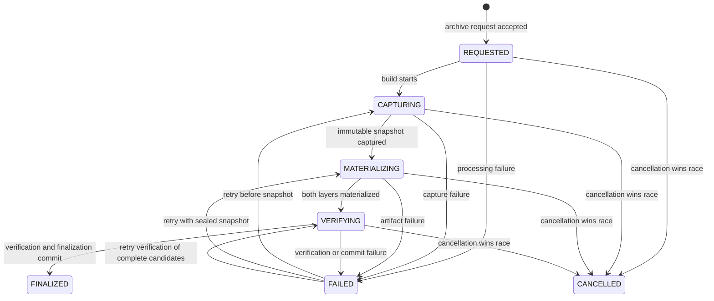

# Architecture PRD: Dual-Layer Archive State Machine and Immutable Event Log

**Status:** Draft for architecture approval  
**Date:** 2026-07-13  
**Feature:** Gridhouse Admin Compliance Dashboard — Dual-Layer Archive  
**Companion documents:** `PRD-Dual-Layer-Archive.md` and `2026-07-10-dual-layer-archive-system.md`  
**Implementation status:** No implementation is authorized by this document.

## 1. Purpose

This Architecture PRD defines only two foundations of the proposed dual-layer archive feature:

1. the compliance archive state machine; and
2. the immutable lifecycle event log.

Its purpose is to remove ambiguity before implementation. It specifies what the system is allowed to do, when it may do it, what must be recorded, and how it must recover from failure. It deliberately does not prescribe database tables, PHP classes, WordPress hooks, queue technology, PDF generation libraries, or user-interface design.

## 2. Architecture decision summary

The feature shall use one logical **Archive Case** for each employee compliance cycle. An Archive Case may contain multiple archive revisions and build attempts, plus zero or more reset operations subject to the no-second-destructive-execution rule.

The model shall keep three state dimensions separate:

- **Build lifecycle:** whether a particular archive revision is being captured, materialized, verified, finalized, failed, or cancelled.
- **Validity lifecycle:** whether a finalized archive revision is active, revoked, or superseded.
- **Reset lifecycle:** whether a particular reset operation is requested, deferred, rejected, authorized, claimed, completed, safely failed, or awaiting reconciliation.

Replayable case-level incident flags shall independently block unsafe transitions when an unprotected reset or authoritative integrity violation is unresolved.

The append-only event stream is authoritative for lifecycle facts and reset authorization. Immutable evidence snapshots and sealed archive artifacts are authoritative for archived content. Current-status fields, dashboard labels, Vault entries, lock indicators, and reset eligibility are projections that must be reproducible from those authoritative records.

The critical sequencing rule is:

> Capture one immutable evidence snapshot, build both archive layers from that same snapshot, verify both layers, finalize the archive, and only then authorize a reset.

No reset may be authorized from a partial archive, a merely captured snapshot, a failed build, a revoked archive, or an unverified artifact.

## 3. Goals

- Define a deterministic lifecycle with explicit states, transitions, guards, and terminal outcomes.
- Prevent ambiguous combinations such as “archived but still building” or “revoked but reset-authorized.”
- Ensure the human-readable packet and machine-readable ledger represent the same frozen evidence.
- Fail closed when archiving, event persistence, integrity verification, or reset authorization is uncertain.
- Make retries, duplicate requests, concurrent requests, corrections, and recovery deterministic.
- Preserve a complete, ordered, append-only history of material lifecycle decisions.
- Allow operational projections to be discarded and rebuilt without changing business truth.
- State the trust boundary of tamper evidence honestly.

## 4. Non-goals

This PRD does not define:

- the evidence fields, course-completion rules, or compliance calculations;
- PDF layout, packet branding, or machine-readable ledger format;
- physical database schema, indexes, storage paths, or serialization format;
- WordPress, LearnDash, Uncanny, or third-party reset hook selection;
- asynchronous worker, cron, queue, or locking technology;
- Vault or course-history user-interface design;
- capability names, role assignments, or approval workflow beyond required actor attribution;
- retention schedules, legal-hold policy, external timestamping, WORM storage, or evidentiary certification;
- interception of unsupported plugins, direct database writes, or manual out-of-band resets.

Those decisions may be made later, but they must conform to the state and event contracts in this document.

## 5. Terminology and boundaries

| Term | Meaning |
|---|---|
| **Archive Case** | The lifecycle aggregate for one tenant/agency, employee, compliance program or tracker, and normalized reporting cycle. |
| **Case key** | The stable business identity of an Archive Case. Its proposed components are `tenant + employee + program/tracker + cycle`; exact normalization remains an approval decision. |
| **Archive revision** | One candidate or finalized dual-layer archive within an Archive Case. A correction creates a new revision; it never rewrites the previous revision. |
| **Build attempt** | One processing attempt for an archive revision. A retry may create a new attempt while retaining the same revision and evidence snapshot. |
| **Reset operation** | One scope-bound request and execution lifecycle. An Archive Case may have another reset operation only when every prior operation is conclusively non-destructive; no operation may follow a completed or confirmed out-of-band reset. |
| **Evidence snapshot** | The immutable, canonical capture from which both archive layers are produced. |
| **Ledger** | The machine-readable archive layer. |
| **Packet** | The human-readable PDF archive layer. |
| **Finalized archive** | A revision whose snapshot, ledger, and packet have passed required completeness and integrity checks and whose finalization fact has been durably recorded. |
| **Projection** | Rebuildable current-state data used for reads, filtering, UI, and integrations. A projection is not the authoritative lifecycle history. |
| **Command** | A request to perform an action, such as “archive this cycle” or “reset progress.” A command may be rejected and is not itself proof that the action occurred. |
| **Event** | A durable, past-tense fact appended after the represented fact has occurred or a material decision has been made. |

### 5.1 Aggregate boundary

Each Archive Case shall have one ordered event stream. All state-changing decisions for that case shall be serialized against that stream.

The stream may contain multiple archive revisions and attempts, but it shall represent only one case key. Events from a different employee, tenant, program/tracker, or normalized cycle must never be mixed into the stream.

The case key shall be immutable after the first event. A mistaken key requires a separately auditable administrative remediation; it must not be silently edited.

## 6. State model

### 6.1 Why the state is multidimensional

A single `status` value cannot safely describe build progress, legal/business validity, and reset execution. Combining them produces contradictory or lossy states. The architecture therefore models three coordinated state dimensions and derives user-facing status from them.

### 6.2 Archive revision build lifecycle

| State | Meaning | Permitted next states |
|---|---|---|
| `REQUESTED` | An archive command has been accepted and assigned a revision. No evidence capture is yet confirmed. | `CAPTURING`, `CANCELLED`, `FAILED` |
| `CAPTURING` | The system is acquiring and normalizing evidence for the revision. | `MATERIALIZING`, `FAILED`, `CANCELLED` |
| `MATERIALIZING` | A canonical snapshot is sealed; the ledger and packet are being built only from that snapshot. | `VERIFYING`, `FAILED`, `CANCELLED` |
| `VERIFYING` | Both layers exist as candidate artifacts and are being checked for completeness, identity, snapshot agreement, and integrity. | `FINALIZED`, `FAILED`, `CANCELLED` |
| `FAILED` | The attempt failed before finalization. The revision is not an official archive and cannot authorize reset. | `CAPTURING`, `MATERIALIZING`, `VERIFYING`, `CANCELLED` |
| `FINALIZED` | The revision passed all required checks and finalization was durably committed. | Terminal for build lifecycle |
| `CANCELLED` | The candidate revision was explicitly abandoned before finalization. | Terminal for build lifecycle |

Conceptually:

`FAILED` records the outcome of a build attempt, not permission to alter the evidence snapshot. A retry resumes from the earliest safe phase supported by durable facts already recorded.

### 6.3 Archive revision validity lifecycle

Validity applies only to a `FINALIZED` archive revision.

| State | Meaning | Permitted next states |
|---|---|---|
| `NOT_APPLICABLE` | The revision is not finalized, so validity has not begun. | `ACTIVE` upon finalization |
| `ACTIVE` | The finalized revision is the current valid archive for the case. | `REVOKED` |
| `REVOKED` | The archive remains preserved and readable but is no longer valid for reset authorization or current-history representation. | `SUPERSEDED` after a replacement finalizes |
| `SUPERSEDED` | A replacement revision has finalized and become active. The prior revision remains immutable historical evidence. | Terminal |

Revocation is irreversible. A revoked revision must never return to `ACTIVE`. If the concern was mistaken, the remedy is a new archive revision with an explicit relationship to the revoked one.

Only one archive revision in an Archive Case may be `ACTIVE` at a time.

### 6.4 Reset lifecycle

| State | Meaning | Permitted next states |
|---|---|---|
| `NONE` | No reset operation exists for this Archive Case. | `REQUESTED` |
| `REQUESTED` | A reset was requested and must be evaluated against the exact archive and cycle. | `DEFERRED`, `REJECTED`, `INVALIDATED`, `CANCELLED`, `AUTHORIZED` |
| `DEFERRED` | Eligibility may become true later without changing the request identity; no destructive work may start. | `AUTHORIZED`, `REJECTED`, `INVALIDATED`, `CANCELLED` |
| `REJECTED` | The request was terminally denied. | Terminal for this reset operation |
| `CANCELLED` | The request or unused authorization was explicitly withdrawn. | Terminal for this reset operation |
| `AUTHORIZED` | A bounded authorization is bound to one active finalized revision, snapshot, employee, cycle, and reset scope. It has not been consumed. | `CLAIMED`, `EXPIRED`, `INVALIDATED`, `CANCELLED` |
| `EXPIRED` | The unused authorization passed its approved lifetime or bounded-use condition. | Terminal for this reset operation |
| `INVALIDATED` | An intervening authoritative change, such as correction, revocation, source drift, or incident, made the pre-claim request or unused authorization unsafe. | Terminal for this reset operation |
| `CLAIMED` | Execution was durably claimed and the authorization atomically consumed **before** any destructive side effect. | `COMPLETED`, `FAILED_SAFE`, `OUTCOME_UNKNOWN` |
| `COMPLETED` | The intended reset scope was verified as complete. | Terminal; no later reset operation for this case |
| `FAILED_SAFE` | The attempt conclusively produced no destructive side effect. | Terminal for this operation; a new request may be considered after full re-evaluation |
| `OUTCOME_UNKNOWN` | The system cannot prove whether reset made zero, partial, or complete changes. | `COMPLETED`, `FAILED_SAFE`, `REMEDIATION_REQUIRED` through reconciliation |
| `REMEDIATION_REQUIRED` | Reconciliation proved partial, conflicting, or otherwise unsafe effects requiring controlled remediation. | `COMPLETED` or `REMEDIATED_RESTORED` only after verified remediation |
| `REMEDIATED_RESTORED` | Partial or conflicting effects did occur, but verified remediation restored the approved pre-reset source state. | Terminal for this reset operation |

Only one reset operation may be non-terminal for an Archive Case. A `COMPLETED` or `REMEDIATED_RESTORED` reset permanently prevents another reset for that case because destructive effects occurred. A rejected, cancelled, expired, invalidated, or safely failed operation does not automatically authorize a new request; all archive, evidence, incident, and concurrency guards must be evaluated again.

`DEFERRED` is permitted only when the requester explicitly opted into bounded reevaluation and the event records the condition and validity window. Otherwise an ineligible request is `REJECTED`. A condition becoming true does not silently authorize reset; a new authoritative eligibility decision must append `ResetAuthorized` while the original consent remains valid.

`CLAIMED` consumes the authorization once. Repeated calls may resume the same logical operation only through an integration-level idempotency contract bound to the same reset-operation identifier; they are not new uses of the authorization. If the integration cannot prove idempotent recovery, it must not resume: authoritative state remains `CLAIMED` until `ResetOutcomeBecameUncertain` is appended, then remains `OUTCOME_UNKNOWN` until reconciled.

A reset problem does not by itself invalidate the archive. It does block unsafe editing, correction, and further reset activity until the outcome is conclusive.

### 6.5 Replayable blocking incident flags

Incident flags are derived from immutable events and are orthogonal to the three lifecycle dimensions.

**Unprotected-reset incident**

- `NONE`: no incident has been recorded.
- `OPEN`: `UnprotectedResetDetected` was appended and the outcome is unresolved. Archive finalization, correction, editing, and reset are blocked.
- `DISMISSED_NO_RESET`: independent reconciliation proved no reset occurred. Normal guards may be evaluated again; the historical incident remains visible.
- `CONFIRMED_RESET`: an out-of-band reset was confirmed. No authorization is fabricated, no later reset is allowed for the case, and post-reset archival amendment requires a separately approved workflow.

**Authoritative-integrity incident**

- `NONE`: no authoritative integrity incident is open.
- `OPEN`: an event stream, snapshot, finalized artifact, digest, or checkpoint failed authoritative verification. Archive finalization, correction, editing, and reset are blocked.
- `DISPOSITION_RECORDED`: an authorized independent review recorded whether the alert was a false positive, a verified restoration, or a confirmed compromise. Only an approved false-positive or verified-restoration disposition may remove the operational block; a confirmed compromise remains disclosed and fail-closed.

Ordinary projection lag, duplicate delivery, or replay failure is operational telemetry, not an authoritative-integrity incident. It becomes a lifecycle incident only if authoritative records are implicated or an unsafe business action relied on the faulty projection.

**Source-drift condition**

- `NONE`: the current source fingerprint matches the accepted review request or finalized snapshot, as applicable, or no comparison is yet required.
- `OPEN`: current source state differs from the accepted review request or finalized snapshot without an authorized new baseline. The condition is scoped to the affected request/revision and blocks its capture or finalization plus all reset authorization/execution for the case. A finalized archive remains preserved.
- `RESOLVED`: an attributable transition either proved exact restoration of the old fingerprint or atomically accepted a newly reviewed fingerprint and re-scoped the work to a new revision. The original drift event remains visible.

Pre-finalization drift shall atomically append `SourceDriftDetected` and `ArchiveFailed` for the affected candidate. Recovery then follows exactly one path:

1. exact restoration is verified, `SourceDriftResolved` is appended, and the same revision may retry against its original reviewed fingerprint; or
2. the failed candidate is cancelled and, in the same serialized decision as `SourceDriftResolved`, a new reviewed fingerprint is accepted through a new archive or replacement request.

An open drift condition cannot be silently cleared. It does not block capture of the explicitly approved new revision after the rebase decision commits.

### 6.6 Derived edit-lock state

Editability is derived; it is not a fourth independently mutable status.

- The target cycle is locked as soon as `ArchiveRequested` or `ReplacementArchiveRequested` commits and remains locked through `REQUESTED`, `CAPTURING`, `MATERIALIZING`, `VERIFYING`, and `FAILED`. This closes the review-to-capture race and prevents retrying against silently changed evidence.
- A `FINALIZED + ACTIVE` revision locks the archived cycle.
- `REVOKED` opens only a controlled correction path for that same cycle; it does not erase the old archive and does not make reset eligible.
- `SUPERSEDED` keeps the old revision read-only while the replacement becomes the active archived truth.
- `CANCELLED` may release the pre-finalization lock only when no finalized revision, non-terminal reset operation, or open incident independently requires it.
- `AUTHORIZED`, `CLAIMED`, `OUTCOME_UNKNOWN`, and `REMEDIATION_REQUIRED` lock the affected reset scope against edits, correction, replacement, or another reset. A `REQUESTED` or `DEFERRED` operation also retains any source lock required by its bound archive request.
- An open source-drift condition, unprotected-reset incident, or authoritative-integrity incident locks the affected scope until its permitted resolution transition occurs.
- A successful reset may open a new cycle under a new case key. It must not make the archived cycle editable or globally lock the employee forever.
- If current state cannot be determined reliably, editing and reset both fail closed.

## 7. Commands, transitions, and guards

### 7.1 Archive request

“Mark Reviewed” or an equivalent action shall request archiving; it shall not immediately assert that the cycle is archived, immutable, or reset-safe.

An archive request may be accepted only when:

- the actor is identified and authorized by the eventual authorization policy;
- the case key and cycle boundaries are valid and stable;
- no active build exists for the same Archive Case;
- no active finalized revision already satisfies the same command;
- no revoked revision requires the request to enter through the explicit replacement path;
- no completed or confirmed out-of-band reset exists for the case;
- no open unprotected-reset or authoritative-integrity incident exists;
- the command has a stable idempotency key; and
- the event stream can accept the decision durably.

Acceptance appends `ArchiveRequested` with the source version or canonical fingerprint the actor reviewed, and immediately establishes the source lock for the target cycle. `ReplacementArchiveRequested` has the same reviewed-fingerprint requirement. When a revoked revision awaits correction, a generic archive command must be rejected; only `ReplacementArchiveRequested` naming that revision is valid. Any rejection must return a deterministic reason and must not create a partially initialized revision.

### 7.2 Evidence capture

The transition from `CAPTURING` to `MATERIALIZING` requires one complete canonical evidence snapshot with:

- stable subject, tenant, program/tracker, and cycle identity;
- normalized cycle boundaries and timezone;
- a unique snapshot identifier;
- a content digest over a canonical representation;
- a reset-relevant source version or canonical fingerprint sufficient to detect post-snapshot drift;
- capture time and evidence-source metadata; and
- the required completeness result.

The captured source version or fingerprint must equal the one recorded by the accepted archive or replacement request. A mismatch means the reviewed evidence drifted: capture fails closed, `SourceDriftDetected` is appended, and a new review/request is required unless an attributable verification restores the exact approved source state.

Once `EvidenceSnapshotCaptured` is appended, that snapshot is immutable. Both the ledger and packet must be generated only from it. Live course data must not be re-read to fill one layer or a later retry of the same revision.

If new source data must be captured, the system must create a new archive revision rather than silently replacing the snapshot.

### 7.3 Materialization

The transition to `VERIFYING` requires both candidate layers to exist and be durably associated with the same archive revision and snapshot identifier.

Materialization of one layer does not make the archive partially official. Until finalization, candidate artifacts must not be presented as the authoritative archive or used to authorize reset.

### 7.4 Verification and finalization

The transition from `VERIFYING` to `FINALIZED` requires all of the following:

- the canonical snapshot is present and its digest verifies;
- the ledger is present, complete, readable, and bound to the snapshot digest;
- the packet is present, complete, readable, and bound to the same snapshot digest;
- the expected employee, tenant, program/tracker, and cycle identifiers agree across all layers;
- required artifact digests verify;
- no conflicting active revision exists;
- the current source fingerprint still matches the reviewed request and sealed snapshot, and no source-drift condition is open for this candidate;
- no cancellation, candidate invalidation, or conflicting case-head transition has won the concurrency race;
- for a replacement, the named predecessor is still the expected `REVOKED` revision; and
- the finalization event can be durably appended.

Finalization and activation are one unconditional state decision committed by `ArchiveFinalized`. A conflict prevents that event from being appended; a persisted `ArchiveFinalized` event always means the revision is `FINALIZED + ACTIVE`.

For a replacement revision, the same event shall name the revoked predecessor and atomically derive that predecessor's transition to `SUPERSEDED`. There must be no crash window in which the successor is active but its predecessor relationship is undecided.

Finalization is the commit boundary. If the system cannot prove that `ArchiveFinalized` was durably appended, it must not report success or authorize reset.

### 7.5 Reset authorization

Reset authorization is a business decision recorded before destructive work begins. It may be issued only when:

- the referenced archive revision is `FINALIZED + ACTIVE`;
- the ledger and packet both passed verification against the same snapshot;
- the requested employee, tenant, program/tracker, cycle, and reset scope exactly match that archive;
- the current reset-relevant source version or canonical fingerprint still matches the finalized snapshot;
- no correction, revocation, replacement build, reset, or unresolved integrity incident blocks the case;
- the reset path is system-controlled or an explicitly supported integration;
- the authorization has a unique identifier, expiration or bounded-use rule, and idempotency key; and
- `ResetAuthorized` can be durably appended before reset starts.

The authorization is single-use and scope-bound. It cannot authorize another employee, cycle, archive revision, or broader reset operation.

The archive remains valid if reset is blocked or fails. Reset status and archive validity must not be conflated.

### 7.6 Reset execution claim and recovery

Before invoking any destructive reset integration, the system shall atomically:

1. re-read the authoritative stream at the expected version;
2. revalidate that the bound revision is still `FINALIZED + ACTIVE`;
3. revalidate that the current reset-relevant source fingerprint still matches the finalized snapshot;
4. confirm that no correction, revocation, replacement, competing reset, expiry, completed reset, or open incident intervened;
5. append `ResetExecutionClaimed`; and
6. consume the authorization by transitioning the operation to `CLAIMED`.

Only after that commit may destructive work be invoked. Fingerprint equality is required through this claim. Source changes causally attributable to the claimed reset operation are evaluated as reset outcome, not as source drift; after `COMPLETED`, comparison moves to the new cycle.

A worker crash does not change authoritative state by inference. The operation remains `CLAIMED` and fail-closed until an idempotent continuation records an outcome or a watchdog/reconciler appends `ResetOutcomeBecameUncertain`, which transitions it to `OUTCOME_UNKNOWN`. The original authorization is never made unused again.

If correction, revocation, source drift, or a blocking incident occurs before execution is claimed, every `REQUESTED`, `DEFERRED`, or `AUTHORIZED` reset operation must be atomically `INVALIDATED` in the same serialized decision, or the intervening action must be rejected. Any reset against a replacement archive requires a new request. Once reset execution is `CLAIMED`, ordinary live-source correction is blocked until the reset outcome is conclusive. After a completed reset, correction of the historical archive requires a separate preserved-evidence amendment workflow and must not recapture reset source data as though it were the original cycle.

### 7.7 Invalid transitions

Invalid or stale commands shall not mutate state. Examples include:

- finalizing before both layers verify;
- authorizing reset against a `FAILED`, `CANCELLED`, `REVOKED`, or non-finalized revision;
- revoking a non-finalized candidate instead of cancelling it;
- superseding a revision before the replacement finalizes;
- retrying a `FINALIZED` or `CANCELLED` revision;
- treating `DEFERRED` as terminal rejection or `REJECTED` as reevaluable;
- invoking reset before `ResetExecutionClaimed` commits;
- reusing an already consumed reset authorization;
- requesting ordinary correction after reset was claimed or completed;
- creating a generic archive revision when a replacement lineage is required; and
- appending an event with an unexpected stream version.

The caller shall receive a stable rejection category suitable for user messaging and operational diagnosis.

## 8. Failure, retry, cancellation, and concurrency semantics

### 8.1 Fail-closed behavior

Any uncertainty about evidence completeness, artifact integrity, event persistence, current revision, authorization scope, or reset outcome shall block subsequent destructive actions.

An archive failure must not make a reset eligible. An event-log outage must prevent lifecycle advancement. A projection outage may reduce availability, but it must not cause the system to invent or bypass authoritative state.

### 8.2 Retry rules

- Every retry is explicit and attributable; it appends `ArchiveRetryRequested` before a new attempt begins.
- A retry before snapshot capture may capture current evidence.
- A retry after snapshot capture must reuse the recorded immutable snapshot.
- A retry may reuse a candidate artifact only after its identity, snapshot binding, and digest are verified.
- A new snapshot always means a new archive revision.
- Attempt number may increase; archive revision identity and snapshot identity must not be silently replaced.
- Duplicate retry commands with the same idempotency key must return the existing outcome.

### 8.3 Cancellation rules

Cancellation is allowed only before `FINALIZED` and before reset execution starts. It is an explicit decision with actor and reason.

Cancellation and finalization may race, but only one may commit at the expected stream version. If finalization wins, cancellation is rejected and correction requires revocation. If cancellation wins, finalization is rejected and the candidate remains non-authoritative.

Captured snapshots and candidate artifacts from a cancelled revision remain immutable while retained; their eventual disposition follows the separately approved retention policy. Cancellation must not rewrite them or make them appear finalized.

### 8.4 Concurrency control

Every append shall use optimistic concurrency against the expected stream version, or an equivalent mechanism with the same guarantee. A decision requiring multiple events, such as correction entry plus authorization invalidation and revocation, shall append them as one atomic case-stream commit; readers must never observe only part of that committed decision.

This must prevent:

- two simultaneous active archive revisions for one case;
- finalization after a winning cancellation or revocation;
- two reset authorizations for the same case and scope;
- consuming one reset authorization twice; and
- supersession chains that fork or form cycles.

When concurrent commands conflict, one deterministic append may succeed and the others must re-read authoritative state before deciding whether to return the same result or reject.

### 8.5 Response loss and idempotency

A client may lose the response after a command succeeds. Retrying the same command must not create a second business action.

Idempotency shall apply at minimum to archive requests, retries, cancellation, correction requests, revocation, reset requests, reset authorization, and reset completion reporting. The same idempotency key with different command content must be rejected.

## 9. Correction, revocation, and supersession

Corrections preserve history; they do not edit finalized evidence in place. Ordinary correction against live source evidence is permitted before reset execution is claimed, or after `FAILED_SAFE` independently verifies that the exact source remained unchanged. A claimed, uncertain, remediating, completed, or confirmed out-of-band reset blocks this correction path because the source may no longer represent the archived cycle.

The required sequence is:

1. using the expected case-stream version, atomically invalidate every pre-claim reset operation and append `CorrectionRequested` plus `ArchiveRevoked`, with actor, time, reason, and the affected active revision;
2. create a new revision through `ReplacementArchiveRequested`, explicitly referencing the revoked revision;
3. capture a new snapshot and run the full build and verification lifecycle; and
4. append `ArchiveFinalized` for the replacement, which atomically makes it `FINALIZED + ACTIVE` and derives the named predecessor's transition to `SUPERSEDED`.

If the atomic correction-entry decision cannot invalidate all pre-claim reset activity or revoke the active revision, none of its events commit. Revocation is not conditional once that decision commits.

After a case has a revoked correction target, generic `ArchiveRequested` is invalid. Replacement lineage cannot be bypassed.

While the replacement is incomplete or failed:

- the old archive remains preserved and `REVOKED`;
- there is no active archive for the case;
- reset remains blocked; and
- the dashboard must disclose that correction is pending rather than presenting the old or partial replacement as current.

Supersession relationships shall be explicit, acyclic, and limited to the same Archive Case. The replacement finalization event shall carry the predecessor identity needed to derive both transitions atomically. A replacement cannot silently change the employee, tenant, program/tracker, or cycle identity.

Post-reset amendments based on preserved evidence are a separate policy and workflow decision. They must never be implemented by recapturing mutated live progress under the old cycle identity.

## 10. Immutable lifecycle event log

### 10.1 Authority model

The event stream is authoritative for:

- accepted lifecycle decisions and their order;
- build, validity, and reset state transitions;
- actor attribution, reasons, correlation, and causation;
- archive-revision and supersession relationships;
- reset authorization and consumption; and
- recorded integrity and out-of-band-reset incidents.

The immutable evidence snapshot and finalized artifacts are authoritative for archived content. Events reference their identities and digests; events do not need to duplicate all evidence content.

Current-state projections may be repaired, rebuilt, or replaced. They must never be edited as a substitute for appending the required event.

### 10.2 Event-writing rules

- Events are append-only. No supported application path may update or delete an existing event.
- Events use specific past-tense names and describe facts, not intentions.
- For authoritative decisions and execution claims, the successful event append **is** the durability and state-transition commit; no second mutable decision store may precede it.
- For observed facts such as captured snapshots, materialized artifacts, and verified reset outcomes, the referenced fact must be durable before its event is appended.
- A non-idempotent external side effect requires a durable claim event before invocation and a separate observed-outcome event afterward.
- A generic event such as `StatusUpdated` is prohibited because it hides business meaning.
- Events shall contain business identifiers and digests, not mutable display text as their only identity.
- Sensitive evidence and secrets should not be copied into event payloads when stable references and approved metadata are sufficient.
- Event schema evolution must be versioned and backward-readable for replay.
- A failed or rejected command is not falsely recorded as a completed fact. Material business denials such as reset blocking may have explicit decision events.

### 10.3 Minimum event catalog

| Event | Required meaning |
|---|---|
| `ArchiveRequested` | An archive command was accepted and a revision was created. |
| `ArchiveBuildStarted` | A specific build attempt began at a defined phase. |
| `EvidenceSnapshotCaptured` | The canonical immutable snapshot was durably captured and identified by digest. |
| `LedgerMaterialized` | A candidate machine-readable layer was durably produced from the named snapshot. |
| `PacketMaterialized` | A candidate human-readable layer was durably produced from the named snapshot. |
| `ArchiveVerified` | Required cross-layer, identity, completeness, and integrity checks passed. |
| `ArchiveFinalized` | Finalization and activation committed unconditionally. For a replacement, the event names the revoked predecessor and also derives its supersession. A conflict prevents this event from being appended. |
| `ArchiveFailed` | A build attempt failed at a named phase with a stable failure category. |
| `ArchiveRetryRequested` | An attributable retry was accepted for a failed revision. |
| `ArchiveCancelled` | A non-finalized candidate was explicitly abandoned. |
| `CorrectionRequested` | A correction workflow was requested against a finalized revision. |
| `ArchiveRevoked` | An active finalized archive was irreversibly declared invalid for current reliance and reset authorization. |
| `ReplacementArchiveRequested` | A new revision was created to replace a named revoked revision. |
| `ResetRequested` | A reset command was accepted for eligibility evaluation. |
| `ResetDeferred` | A request that explicitly opted into bounded reevaluation may be reconsidered later under the recorded condition and validity window. No destructive work is authorized. |
| `ResetRejected` | The reset request was terminally denied; later eligibility requires a new request. |
| `ResetCancelled` | A pending request or unused authorization was explicitly withdrawn. |
| `ResetAuthorized` | A single-use, scope-bound authorization was durably issued against an exact active archive. |
| `ResetAuthorizationExpired` | The unused authorization reached its approved expiry or bounded-use limit. |
| `ResetOperationInvalidated` | A requested, deferred, or authorized pre-claim reset operation became unsafe because authoritative case state changed. |
| `ResetExecutionClaimed` | Execution was durably claimed and the authorization consumed before any destructive call. |
| `ResetCompleted` | The authorized reset scope was verified as complete. |
| `ResetFailedSafe` | The claimed operation conclusively produced no destructive side effect. |
| `ResetOutcomeBecameUncertain` | The claimed operation may have produced zero, partial, or complete side effects and must be reconciled. |
| `ResetReconciledAsCompleted` | Independent reconciliation proved the intended reset scope completed. |
| `ResetReconciledAsNoChange` | Independent reconciliation proved no destructive change occurred. |
| `ResetRemediationRequired` | Reconciliation proved partial, conflicting, or otherwise unsafe effects requiring controlled remediation. |
| `ResetRemediatedRestored` | Verified remediation restored the approved source state while preserving the fact that partial effects had occurred. |
| `SourceDriftDetected` | Source state no longer matched the accepted review fingerprint or finalized snapshot, as applicable. |
| `SourceDriftResolved` | Attributable verification or replacement finalization resolved the blocking drift condition. |
| `UnprotectedResetDetected` | An out-of-band reset not protected by this state machine was detected. |
| `UnprotectedResetDismissed` | Independent reconciliation proved that the suspected out-of-band reset did not occur. |
| `UnprotectedResetConfirmed` | Independent reconciliation confirmed an out-of-band reset without fabricating prior authorization. |
| `IntegrityViolationDetected` | An authoritative event, snapshot, artifact, digest chain, checkpoint, or identity verification failed. |
| `IntegrityIncidentDispositionRecorded` | An independent authorized review recorded the evidence and disposition of an integrity incident without deleting its history. |

The catalog may be extended with equally specific events. Implementers must not collapse these meanings into mutable status rows or generic audit messages.

### 10.4 Required event envelope

Every event shall include, directly or through immutable stream context:

| Field | Requirement |
|---|---|
| Event identity | Globally unique `event_id`. |
| Event semantics | `event_type` and `event_schema_version`. |
| Ordering | Stream identifier and strictly increasing stream sequence/version. |
| Aggregate identity | Archive Case key and its constituent tenant, employee, program/tracker, and cycle identifiers. |
| Revision identity | `archive_revision_id` when applicable; `build_attempt_id` when applicable. |
| Time | Server-recorded event time; business-effective time only when distinct and justified. |
| Cycle definition | Normalized start, end, and timezone or a reference to their immutable definition. |
| Actor and authority | Authenticated actor type and stable identifier; source channel; initiating principal; acting-on-behalf-of or delegation context; and the effective authorization decision/reference where applicable. Authentication secrets and raw tokens are prohibited. |
| Traceability | Correlation identifier, causation event identifier, originating `command_id`, and upstream operation identifier when applicable. |
| Idempotency | For every command-originated event: idempotency key, explicit uniqueness scope, and digest of the canonical command content. Reusing a key with different content is invalid. |
| Reason | Stable reason code and optional human explanation where the event requires a reason. |
| Evidence linkage | Snapshot and artifact identifiers and digests when relevant. |
| Integrity linkage | Canonical-event format version, current `event_digest`, and predecessor event digest. |
| Payload | Versioned event-specific facts sufficient to replay the state transition. |

Client-supplied timestamps or actor labels must not replace server-recorded time and authenticated actor identity.

### 10.5 Ordering and replay

- Stream sequence is the authoritative order within an Archive Case; wall-clock timestamps are not sufficient for ordering.
- A projection shall process events in stream order and checkpoint the last applied sequence.
- Reapplying the same event shall be idempotent.
- Missing, duplicated, or out-of-order sequence handling shall stop or quarantine the affected projection rather than guess.
- Rebuilding all projections from the authoritative stream and immutable evidence references must reproduce the same build, validity, reset, lock, and current-revision state.
- Projection lag must not be mistaken for authoritative state during a destructive decision. Reset authorization must read a concurrency-safe authoritative view.

### 10.6 Immutability and tamper evidence

“Immutable” means the supported application contract permits appends only. Corrections occur through new events and new archive revisions.

Each event digest shall cover a canonical serialization of every immutable envelope field **except `event_digest` itself**, plus the immutable payload, including stream identifier, sequence, event type, schema version, and predecessor digest. The computed result is then stored as `event_digest`. A checkpoint, when used, shall bind at minimum the stream identifier, head sequence, and head event digest; its authenticity mechanism and coverage period must be documented.

Integrity verification shall check sequence continuity, event-digest recomputation, predecessor-digest continuity, checkpoint authenticity where applicable, legal state transitions, and referenced snapshot/artifact digests. A gap, reorder, invalid transition, or digest mismatch fails closed for the affected case.

Event predecessor digests, artifact digests, and checkpoints can make unauthorized alteration detectable. If the event store, checkpoint or signing material, and verifier share the same administrative trust boundary, those controls are **tamper-evident within that documented boundary**; they are not independent proof that an administrator with full control could never rewrite history.

Claims such as “undeniable,” “permanent,” or “legally immutable” require separately approved controls such as external timestamping, independent signing custody, WORM retention, or third-party attestation and are outside this PRD.

### 10.7 Event-store and projection failures

- If an event append fails, the associated transition has not committed and must not be reported as successful.
- If an event append succeeds but the caller loses the response, idempotent retry returns the committed outcome.
- If artifact creation succeeds but its event does not commit, the artifact is orphaned candidate data: it is not authoritative, not user-visible as finalized, and must be reconciled safely.
- If finalization commits but a read projection fails, the projection is repaired by replay; the finalized event is not duplicated or rewritten.
- If a projection contradicts the event stream or immutable artifact references, authoritative state wins and the projection is quarantined and rebuilt. Ordinary lag or replay failure remains operational telemetry; `IntegrityViolationDetected` is appended only when authoritative records are implicated or an unsafe action relied on the faulty projection.
- If reset side effects may have occurred but completion cannot be recorded, authoritative state remains `CLAIMED` until a watchdog or reconciler appends `ResetOutcomeBecameUncertain`; only then is it `OUTCOME_UNKNOWN`. The system must not fabricate success or begin a new reset before reconciliation.

## 11. Architectural invariants

The implementation and tests must preserve all of the following:

| ID | Invariant |
|---|---|
| `INV-01` | One event stream represents exactly one immutable Archive Case key. |
| `INV-02` | At most one archive revision is `ACTIVE` for an Archive Case. |
| `INV-03` | Both archive layers are generated from the same immutable snapshot. |
| `INV-04` | A new snapshot always creates a new archive revision. |
| `INV-05` | No revision reaches `FINALIZED` until snapshot, ledger, and packet completeness and integrity checks pass. |
| `INV-06` | Candidate or partial artifacts never authorize reset and are never presented as the official archive. |
| `INV-07` | Reset authorization references exactly one `FINALIZED + ACTIVE` revision and one bounded reset scope. |
| `INV-08` | A reset authorization is single-use and cannot be broadened or rebound. |
| `INV-09` | A revoked revision never becomes active again. |
| `INV-10` | Replacement finalization atomically makes the successor active and the explicitly referenced predecessor superseded. |
| `INV-11` | Correction never updates or deletes prior snapshots, artifacts, or lifecycle events. |
| `INV-12` | Supersession relationships stay within one case and are acyclic. |
| `INV-13` | Every state-changing append enforces expected stream version or an equivalent serialization guarantee. |
| `INV-14` | Duplicate commands with the same identity produce one business outcome. |
| `INV-15` | An event-log, integrity, or authorization uncertainty fails closed for editing and reset. |
| `INV-16` | Current-state projections can be rebuilt from authoritative events and immutable evidence references. |
| `INV-17` | A failed reset does not mutate archive validity and cannot silently permit a second reset. |
| `INV-18` | An unsupported or out-of-band reset is never retroactively represented as if it had been authorized. |
| `INV-19` | The accepted archive request records the reviewed source fingerprint, and snapshot capture must match it. |
| `INV-20` | Reset authorization and execution claim both verify current source agreement with the finalized snapshot. |
| `INV-21` | `ResetExecutionClaimed` commits and consumes the authorization before the first destructive side effect. |
| `INV-22` | Correction, revocation, source drift, or a blocking incident atomically invalidates every `REQUESTED`, `DEFERRED`, or `AUTHORIZED` pre-claim reset operation or is rejected. |
| `INV-23` | At most one reset operation is non-terminal, and no reset operation follows a completed, remediated-restored, or confirmed out-of-band reset for the same case. |
| `INV-24` | An uncertain reset is never destructively retried until reconciliation determines its exact safe outcome or an idempotent continuation of the same operation is proven. |
| `INV-25` | Open unprotected-reset, source-drift, and authoritative-integrity conditions fail closed for affected archive and reset transitions. |
| `INV-26` | Command idempotency records scope and canonical command digest so conflicting reuse cannot masquerade as a retry. |
| `INV-27` | A remediated partial reset ends as `REMEDIATED_RESTORED`, never as the factually false `FAILED_SAFE`. |
| `INV-28` | No state transition is inferred from elapsed time or worker failure; the event that records the decision must exist for replay to derive it. |

## 12. Acceptance scenarios

These scenarios are architecture-level acceptance criteria. Implementation-specific tests may add detail but may not weaken them.

### `AC-01` Happy-path archive and reset

**Given** a valid open cycle with complete evidence  
**When** archiving is requested, one snapshot is captured, both layers are built from it, verification passes, and finalization commits  
**Then** exactly one revision is `FINALIZED + ACTIVE`, the archived cycle is locked, and only a correctly scoped reset may be authorized.

### `AC-02` Duplicate archive request

**Given** an archive request already committed  
**When** the same idempotency key is retried after response loss  
**Then** the existing revision and outcome are returned and no second revision or duplicate event sequence is created.

### `AC-03` Concurrent archive requests

**Given** no active build for a case  
**When** two different archive requests race  
**Then** expected-version enforcement permits one active build and deterministically rejects or resolves the other without creating two active revisions.

### `AC-04` Failure before snapshot capture

**Given** capture has not completed  
**When** the attempt fails and is retried  
**Then** the revision may restart capture, remains non-finalized, and reset remains blocked.

### `AC-05` Failure after snapshot capture

**Given** the snapshot was durably captured  
**When** packet or ledger materialization fails  
**Then** retry uses that exact snapshot; it does not re-read live evidence or silently replace the snapshot.

### `AC-06` Verification failure

**Given** both candidate layers exist  
**When** identity, completeness, readability, snapshot binding, or digest verification fails  
**Then** the revision becomes `FAILED`, neither layer is official, and reset cannot be authorized.

### `AC-07` Cancellation/finalization race

**Given** a revision is verifying  
**When** cancellation and finalization race  
**Then** only the event that commits at the expected stream version succeeds; the losing command cannot overwrite the result.

### `AC-08` Reset too early

**Given** an archive is requested, capturing, materializing, verifying, failed, or cancelled  
**When** reset is requested  
**Then** reset is explicitly deferred or terminally rejected with a stable reason, according to policy, and no destructive reset begins.

### `AC-09` Reset authorization binding

**Given** a reset authorization for one active archive and bounded scope  
**When** it is presented for another cycle, revision, employee, scope, or a second use  
**Then** it is rejected and no reset starts.

### `AC-10` Failed reset reconciliation

**Given** reset execution was claimed but its side-effect outcome is uncertain  
**When** a new reset is requested  
**Then** it is blocked until reconciliation records `COMPLETED`, `FAILED_SAFE`, or `REMEDIATION_REQUIRED`; archive validity remains unchanged and only a conclusively safe no-change result may permit a newly evaluated reset operation.

### `AC-11` Correction with failed replacement

**Given** an active archive is revoked for correction  
**When** its replacement fails before finalization  
**Then** the old revision remains preserved and revoked, no archive is active, correction is shown as pending, and reset is blocked.

### `AC-12` Correction with successful replacement

**Given** a revoked archive and a replacement revision  
**When** the replacement finalizes  
**Then** the replacement becomes the sole active revision, the old revision becomes superseded, and the relationship is explicit and immutable.

### `AC-13` Projection rebuild

**Given** all rebuildable current-state records are removed in a test environment  
**When** authoritative event streams are replayed in order  
**Then** build state, validity, reset state, lock state, active revision, and supersession relationships match the pre-removal state.

### `AC-14` Event-log outage

**Given** a lifecycle fact cannot be durably appended  
**When** archive finalization or reset authorization is attempted  
**Then** the operation fails closed and the caller is not told that it succeeded.

### `AC-15` Unprotected reset detection

**Given** an unsupported or out-of-band reset changes source progress  
**When** the discrepancy is detected  
**Then** `UnprotectedResetDetected` opens a replayable blocking incident, all affected transitions fail closed, and reconciliation may dismiss or confirm the reset without fabricating a prior archive or authorization.

### `AC-16` Historical tampering detection

**Given** an existing event, snapshot, ledger, or packet is altered without a valid append-only workflow  
**When** integrity verification or replay encounters it  
**Then** the affected case fails closed, an integrity incident is recorded where possible, and the altered material is not silently trusted.

### `AC-17` Evidence changes after review request

**Given** an archive request recorded the evidence version or fingerprint the actor reviewed  
**When** supported or out-of-band source changes occur before snapshot capture  
**Then** the source lock prevents the supported change, or fingerprint mismatch fails capture closed and requires attributable restoration or a new review/request.

### `AC-18` Source drift after finalization

**Given** a finalized active archive  
**When** current reset-relevant source no longer matches its snapshot  
**Then** reset authorization and execution claim are blocked, `SourceDriftDetected` records the condition, and explicit correction/revocation or verified restoration is required.

### `AC-19` Authorization expiry or invalidation

**Given** a `REQUESTED`, `DEFERRED`, or `AUTHORIZED` pre-claim reset operation  
**When** an authorization expires, or correction, revocation, source drift, or a blocking incident intervenes  
**Then** the authorization becomes `EXPIRED` or the operation becomes `INVALIDATED`, can never be claimed, and any later eligible reset requires a new request and complete re-evaluation.

### `AC-20` Crash after reset execution claim

**Given** `ResetExecutionClaimed` committed and consumed the authorization  
**When** the worker crashes before the first mutation or before recording an outcome  
**Then** authoritative state remains `CLAIMED` and fail-closed until idempotent continuation records an outcome or a watchdog/reconciler appends `ResetOutcomeBecameUncertain`; the authorization is not reusable.

### `AC-21` Partial reset reconciliation

**Given** reconciliation finds that only part of the claimed reset scope changed  
**When** the outcome is recorded  
**Then** the operation becomes `REMEDIATION_REQUIRED`, editing and further reset remain blocked, and success is not fabricated. If later remediation restores the original approved state, the terminal outcome is `REMEDIATED_RESTORED`, not `FAILED_SAFE`.

### `AC-22` Revocation races with reset claim

**Given** an active archive with an unused reset authorization  
**When** correction/revocation and reset execution claim race  
**Then** expected-version serialization permits exactly one decision: revocation invalidates the unused authorization, or the winning claim blocks ordinary correction until its outcome is conclusive.

### `AC-23` Atomic replacement finalization

**Given** a revoked archive and verified replacement  
**When** replacement finalization commits or the process crashes  
**Then** replay observes either the pre-commit state or both successor activation and predecessor supersession; it never observes a committed half-transition.

### `AC-24` Cancellation lock release

**Given** a non-finalized revision with no independent lock condition  
**When** cancellation commits  
**Then** the candidate-build lock is released, retained candidates remain immutable while retained, and no candidate appears finalized.

### `AC-25` Conflicting idempotency-key reuse

**Given** an idempotency key already recorded within its uniqueness scope  
**When** the key is reused with different canonical command content  
**Then** the command is rejected as a conflict and no new business event is appended.

### `AC-26` Sequence gap or out-of-order replay

**Given** a projection encounters a missing, duplicate, or out-of-order stream sequence  
**When** replay runs  
**Then** the projection quarantines the case instead of guessing, destructive decisions use authoritative state, and normal projection failure is not mislabeled as evidence tampering.

### `AC-27` Second reset after completion

**Given** a reset operation is `COMPLETED` or `REMEDIATED_RESTORED`, or an out-of-band reset is confirmed  
**When** another reset is requested for the same Archive Case  
**Then** it is terminally rejected and no authorization is created.

### `AC-28` Concurrent build attempts

**Given** one build attempt is active for an archive revision  
**When** another worker attempts to claim the same or a conflicting phase  
**Then** stream concurrency and attempt identity permit one active claimant and prevent duplicate materialization from advancing state twice.

## 13. Observability requirements within this scope

Operational telemetry must make the state machine diagnosable without changing its truth. At minimum, operators must be able to correlate:

- command, case, revision, attempt, snapshot, artifact, and reset-authorization identifiers;
- current authoritative stream version and projection checkpoint;
- time spent in each non-terminal build and reset state;
- stable failure or blocking category;
- retry count and last safe resume phase;
- projection lag or replay failure; and
- integrity, unprotected-reset, and uncertain-reset incidents.

Logs and metrics are supplementary. They do not replace required lifecycle events.

## 14. Decisions required before implementation

Implementation must not begin until the product and engineering owners approve or resolve the following:

1. **Case key:** the exact program/tracker component and rules for normalizing cycle identity.
2. **Cycle boundaries:** authoritative start/end semantics, inclusivity, and timezone.
3. **Evidence completeness:** the minimum conditions required before snapshot capture can succeed.
4. **Correction authority:** who may request correction and who may revoke an active archive.
5. **Reason taxonomy:** required structured reasons for cancellation, failure, reset blocking, correction, revocation, and reconciliation.
6. **Reset coverage:** the exact system-controlled and explicitly supported reset paths covered by the guarantee.
7. **Authorization lifetime:** the expiry or bounded-use rules for reset authorization.
8. **Trust boundary:** which administrators and systems can modify the event store, artifacts, digests, and verification keys.
9. **Integrity strength:** whether in-boundary tamper evidence is sufficient or independent timestamping/signing/WORM controls are required.
10. **Retention dependency:** the approved retention and legal-hold policy to which events, snapshots, candidates, and finalized artifacts will later conform.
11. **Operational objectives:** archive-completion target, stuck-state thresholds, event-store durability/availability, and recovery-point and recovery-time objectives.
12. **Load and concurrency model:** expected case volume, archive/reset concurrency, artifact sizes, and replay volume against which serialization and recovery are validated.
13. **Data classification:** classification and handling requirements for event metadata, actor/authority context, reasons, digests, snapshots, and artifacts.
14. **Ownership:** named product owner for transition policy and named engineering/operations owners for event integrity, replay, reconciliation, and incident disposition.

## 15. Approval gate

This Architecture PRD is ready for implementation planning only when:

- the three-dimensional state model is accepted;
- all transition guards and invariants are accepted;
- reset-after-finalization is confirmed as the safety boundary;
- correction is confirmed as revoke-and-replace, never in-place mutation;
- the event stream is accepted as the authoritative lifecycle record;
- the trust-boundary wording is accepted without overstating cryptographic assurance;
- the decisions in Section 14 are resolved or explicitly assigned with blocking status; and
- the parent PRD and implementation plan are amended to conform to this document.

Until then, this document is a design proposal and no code or data migration should be written against it.
